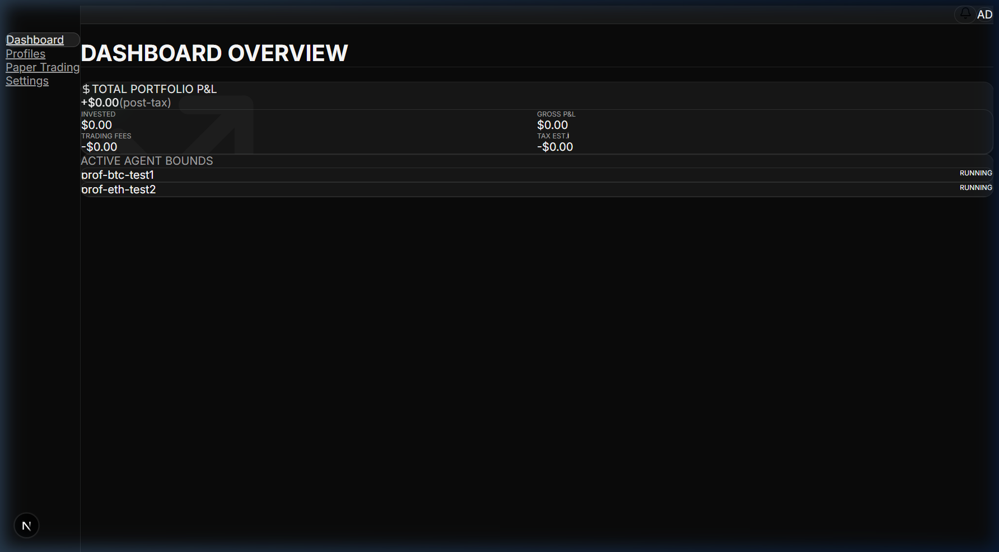
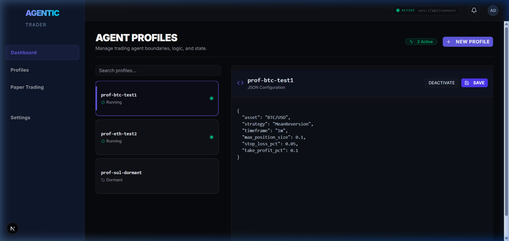
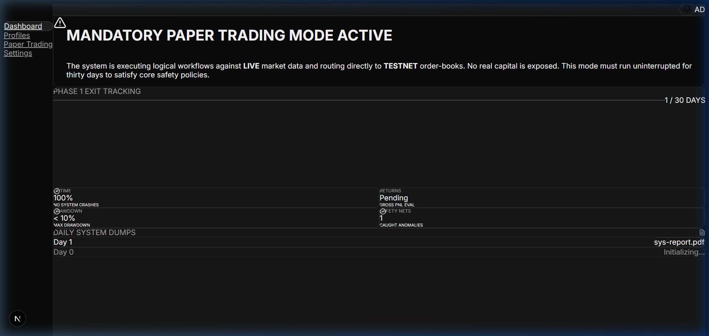

# Agentic Trading Platform - Phase 1 & 1.5

This document provides a high-level technical overview of the Agentic Trading Platform, detailing its capabilities, the development process, the future roadmap, and local setup instructions.

---

## 1. What the System Does

The Agentic Trading Platform is a high-performance, deterministic algorithmic trading engine. It evaluates incoming real-time market data against user-defined trading rules (Profiles) and executes orders with strict latency constraints.

### Core Capabilities
*   **Latency-Optimized Hot Path**: Evaluates signals and executes orders within a 50ms absolute deadline.
*   **Decoupled Microservices**: The system is split horizontally into independent, single-responsibility Python microservices communicating asynchronously over Redis.
*   **Dual-Layer Validation**: 
    1.  **Fast-Gate Validation (Sync)**: A 35ms network-bound safety check before any order hits an exchange.
    2.  **Audit Validation (Async)**: Post-trade LLM-based hallucination and bias checks.
*   **Strict Safety Tracking (Paper Trading Mode)**: The system supports a mandatory 30-day "dry run" against LIVE market data but routing to TESTNET order-books, tracked and monitored via the dashboard.
*   **Premium Control Plane**: A Next.js 14+ frontend featuring a bespoke dark mode institutional design system.

---

## 2. The Development Journey Thus Far

We have currently completed **Phase 1** and **Phase 1.5** of the development lifecycle.

### Phase 1: The Core Backend Engine
The foundational work was broken down into 7 hyper-focused sprints to establish the execution mechanics without ML/RL models:
1.  **Sprint 0 (Foundation)**: Initialized the monorepo structure, established robust `libs/` for shared domain models, configured `docker-compose` for the Redis/TimescaleDB infrastructure.
2.  **Sprint 1 (Data Pipeline)**: Built the HTTP/WebSocket exchange adapters and the `ingestion/` agent to pump raw market data onto a Redis stream.
3.  **Sprint 2 (Trading Engine)**: The heart of the system. Implemented the `hot-path/` processor to eagerly evaluate JSON-based trading profiles against arriving ticks, routing signals to the `execution/` agent.
4.  **Sprint 3 (Safety)**: Implemented the `validation/` agent to ensure no rogue agents could drain capital.
5.  **Sprint 4 (Financials)**: Developed the asynchronous `pnl/` and `tax/` calculators, streaming results to TimescaleDB.
6.  **Sprint 5 (Presentation Layer)**: Spun up the Next.js `frontend/` and connected it to the backend via a FastAPI `api-gateway/`.
7.  **Sprint 6 (Hardening)**: Wrote rigorous integration/contract tests and finalized Paper Trading safety constraints.

*All services rely heavily on `pydantic` schemas for message validation and `asyncio` to prevent I/O blocking.*

### Notable Fixes & Technical Debt Paid (Phase 1)
Getting the microservice architecture running smoothly locally required resolving several integration bugs:
*   **Port Collision Resolution**: Manually re-assigned network ports across the services (e.g., moving the Validation Agent from 8080 to 8081) to prevent conflicts during local `docker-compose` health checks.
*   **Dependency Pruning**: Removed conflicting and redundant `numpy` imports from non-essential services to dramatically speed up installation and prevent environment clashes.
*   **Docker-Compose Stability**: Resolved early warnings regarding volume mounting and database migration scripts.

### Phase 1.5: UI/UX Refinement
Recognizing that the control plane needed to look institutional, we overhauled the Next.js frontend:
*   Upgraded from raw styling to a holistic **Dark Mode System (Deep Slate & Electric Violet)**.
*   Integrated **shadcn/ui** and **Tailwind CSS v4** to build premium components (Cards, Badges, Toasts).
*   Refactored the core `/dashboard`, built a split-pane `/profiles` JSON editor, and visually enhanced the `/paper-trading` policy tracker.

**Frontend Fixes Implemented:**
*   **Tailwind CSS v4 Compilation**: Addressed a difficult bug where dark mode CSS rules wouldn't apply by purging legacy `@tailwind` directives from `globals.css` and implementing the modern `@import "tailwindcss";` mechanics.
*   **React Server Components (RSC) Boundaries**: Fixed several crashes regarding the `AlertTray` state by properly isolating `"use client"` directives for global notification hooks.

## UI Previews (Phase 1.5 Frontend)

Below are screenshots showcasing the recent Phase 1.5 UI/UX overhaul featuring a bespoke design system built on top of `shadcn/ui` and `Tailwind CSS v4`.

### Dashboard View


### Profile Management


### Paper Trading Monitoring


---

## 3. What is Next: Phase 2 Road Map

Now that we have a highly performant backend and a beautiful frontend, we are shifting focus to multi-tenancy and live exchange functionality.

### Phase 2: User Onboarding & Live Connections
*   **User Authentication**: Implementing OAuth (via NextAuth.js or Supabase) to restrict dashboard access.
*   **Multi-tenant Database Logic**: Updating profile and order schemas to ensure users can only ever access their own data and capital.
*   **Secure Exchange Connections**: 
    *   Implementing a secure flow to connect live Binance/Coinbase API keys.
    *   Transitioning from plaintext configuration to a robust Secrets Manager (e.g., HashiCorp Vault or GCP Secret Manager) to encrypt API keys at rest.
*   **Guided Onboarding**: Replacing the static configurations with an interactive UI flow: Auth -> Connect Keys -> Create First Agent Profile -> Launch Dashboard.

Once Phase 2 is complete, we will move into Phase 3, which fundamentally introduces the true ML/RL predictive models into the system logic.

---

## Architecture & Tech Stack

### Backend (Python/Docker)
- **Language:** Python 3.11+
- **Database/Cache:** Redis (State) & TimescaleDB (Metrics)
- **Message Bus:** Redis Pub/Sub

### Frontend (Next.js)
- **Framework:** Next.js 15 (App Router)
- **Styling:** Tailwind CSS v4 + OKLCH Color Space
- **Components:** shadcn/ui + Radix UI Primitives
- **Icons:** Lucide React

---

## Setup Instructions

### Prerequisites
- Python 3.11+
- Poetry
- Docker and Docker Compose
- Node.js 20+

### Initialization (Backend)
```bash
# 1. Install Python dependencies
make install

# 2. Setup environment variables (Requires manual configuration for the actual .env file)
cp config/.env.example .env

# 3. Start local infrastructure (Redis + TimescaleDB + Services)
make run-local
```

### Initialization (Frontend)
Open a new terminal and start the Next.js UI:
```bash
cd frontend
npm install
npm run dev
```
Open [http://localhost:3000](http://localhost:3000) with your browser to see the dashboard.

### Development
```bash
# Linting & Type Checking (Backend)
make lint

# Running tests (Backend)
make test-unit
make test-integration
```

*Refer to the respective service directories for detailed interface definitions.*
