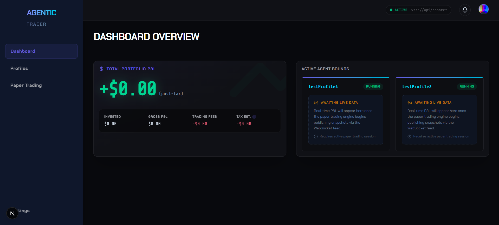
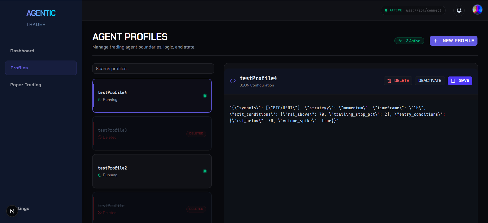
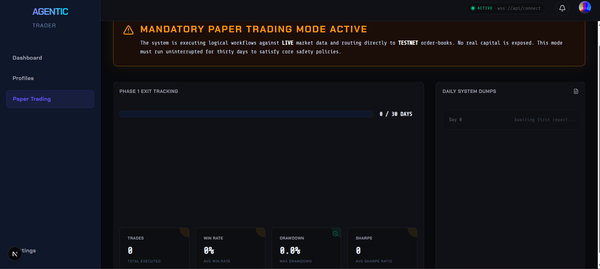

# Agentic Trading Platform - Phase 2

This document provides a high-level technical overview of the Agentic Trading Platform, detailing its capabilities, the development process, the future roadmap, and local setup instructions.

---

## 1. What the System Does

The Agentic Trading Platform is a high-performance, deterministic algorithmic trading engine. It evaluates incoming real-time market data against user-defined trading rules (Profiles) and executes orders with strict latency constraints.

### Core Capabilities
*   **Latency-Optimized Hot Path**: Evaluates signals and executes orders within a 50ms absolute deadline.
*   **Decoupled Microservices**: The system is split horizontally into independent, single-responsibility Python microservices communicating asynchronously over Redis.
*   **Dual-Layer Validation**: 
    1.  **Fast-Gate Validation (Sync)**: A 35ms network-bound safety check before any order hits an exchange.
    2.  **Audit Validation (Async)**: Post-trade LLM-based hallucination and bias checks.
*   **Strict Safety Tracking (Paper Trading Mode)**: The system supports a mandatory 30-day "dry run" against LIVE market data but routing to TESTNET order-books, tracked and monitored via the dashboard.
*   **Premium Control Plane**: A Next.js 14+ frontend featuring a bespoke dark mode institutional design system.

---

## 2. The Development Journey Thus Far

We have currently completed **Phase 1** and **Phase 1.5** of the development lifecycle.

### Phase 1: The Core Backend Engine
The foundational work was broken down into 7 hyper-focused sprints to establish the execution mechanics without ML/RL models:
1.  **Sprint 0 (Foundation)**: Initialized the monorepo structure, established robust `libs/` for shared domain models, configured `docker-compose` for the Redis/TimescaleDB infrastructure.
2.  **Sprint 1 (Data Pipeline)**: Built the HTTP/WebSocket exchange adapters and the `ingestion/` agent to pump raw market data onto a Redis stream.
3.  **Sprint 2 (Trading Engine)**: The heart of the system. Implemented the `hot-path/` processor to eagerly evaluate JSON-based trading profiles against arriving ticks, routing signals to the `execution/` agent.
4.  **Sprint 3 (Safety)**: Implemented the `validation/` agent to ensure no rogue agents could drain capital.
5.  **Sprint 4 (Financials)**: Developed the asynchronous `pnl/` and `tax/` calculators, streaming results to TimescaleDB.
6.  **Sprint 5 (Presentation Layer)**: Spun up the Next.js `frontend/` and connected it to the backend via a FastAPI `api-gateway/`.
7.  **Sprint 6 (Hardening)**: Wrote rigorous integration/contract tests and finalized Paper Trading safety constraints.

*All services rely heavily on `pydantic` schemas for message validation and `asyncio` to prevent I/O blocking.*

### Notable Fixes & Technical Debt Paid (Phase 1)
Getting the microservice architecture running smoothly locally required resolving several integration bugs:
*   **Port Collision Resolution**: Manually re-assigned network ports across the services (e.g., moving the Validation Agent from 8080 to 8081) to prevent conflicts during local `docker-compose` health checks.
*   **Dependency Pruning**: Removed conflicting and redundant `numpy` imports from non-essential services to dramatically speed up installation and prevent environment clashes.
*   **Docker-Compose Stability**: Resolved early warnings regarding volume mounting and database migration scripts.

### Phase 1.5: UI/UX Refinement
Recognizing that the control plane needed to look institutional, we overhauled the Next.js frontend:
*   Upgraded from raw styling to a holistic **Dark Mode System (Deep Slate & Electric Violet)**.
*   Integrated **shadcn/ui** and **Tailwind CSS v4** to build premium components (Cards, Badges, Toasts).
*   Refactored the core `/dashboard`, built a split-pane `/profiles` JSON editor, and visually enhanced the `/paper-trading` policy tracker.

**Frontend Fixes Implemented:**
*   **Tailwind CSS v4 Compilation**: Addressed a difficult bug where dark mode CSS rules wouldn't apply by purging legacy `@tailwind` directives from `globals.css` and implementing the modern `@import "tailwindcss";` mechanics.
*   **React Server Components (RSC) Boundaries**: Fixed several crashes regarding the `AlertTray` state by properly isolating `"use client"` directives for global notification hooks.

## UI Previews (Phase 2 Frontend)

Below are placeholders for the new UI/UX screenshots featuring the bespoke design system built on top of `shadcn/ui` and `Tailwind CSS v4`.

### Dashboard View


### Profile Management


### Settings & Exchange Keys


---

## 3. Implemented User Flows

The platform currently supports the following end-to-end user flows across the full stack:

1. **Secure Authentication & Session Management**:
   - OAuth login via Google or GitHub.
   - Secure server-side validation and issue of internal JWTs.
   - User dropdown menu with sign-out functionality.

2. **Exchange Key Security**:
   - Add/Remove exchange API keys safely from the Settings page.
   - Secure verification of API keys via `ccxt` prior to database storage.
   - Keys are encrypted dynamically out-of-band via Google Cloud Secret Manager.

3. **Trading Profile Operations**:
   - **Create**: Add new algorithmic trading profiles with custom JSON rule schemas and allocation sizes.
   - **List**: View all active profiles mapped to their corresponding ticker symbols.
   - **Delete (Soft)**: Remove profiles defensively, hiding them from the unified execution engine without permanently destroying metric history.

4. **Paper Trading Controls**:
   - Dashboard indicators for live WebSocket feed statuses.
   - "Awaiting Data" and contextual placeholders when data ingestion pauses.
   - Comprehensive system toggles for enabling Paper Tracking metrics.

---

## 4. What is Next: Phase 3 Road Map

We have successfully built a highly performant backend and a premium frontend. The system fully supports secure **Phase 2** auth and key storage functionality.

### Phase 3: ML Engine & Risk Management (Upcoming)
*   **Agent Integration**: Injecting predictive ML/RL models (TA-Agent, Sentiment, Regime HMM) into the signal valuation pipeline.
*   **Advanced Analytics**: Portfolio-level execution VaR limits, cross-asset correlation analysis, and slippage monitoring.
*   **Tax Jurisdiction Modules**: Live streaming PnL routing for diverse multi-jurisdictional compliance capabilities.

---

## Architecture & Tech Stack

### Backend (Python/Docker)
- **Language:** Python 3.11+
- **Database/Cache:** Redis (State) & TimescaleDB (Metrics)
- **Message Bus:** Redis Pub/Sub

### Frontend (Next.js)
- **Framework:** Next.js 16 (App Router)
- **Auth:** NextAuth.js v4 (Google & GitHub OAuth)
- **Styling:** Tailwind CSS v4 + OKLCH Color Space
- **Components:** shadcn/ui + Radix UI Primitives
- **Icons:** Lucide React

---

## Setup Instructions

### Prerequisites
- Python 3.11+
- Docker Desktop (must be running)
- Node.js 20+
- Google OAuth credentials (for authentication)

### Step 1: Start Infrastructure (Redis + TimescaleDB)
```bash
# Start Docker containers (Redis on :6379, TimescaleDB on :5432)
docker compose -f deploy/docker-compose.yml up --build -d
```

### Step 2: Start the Backend API
Open a new terminal:
```bash
# Install Python dependencies
pip install fastapi uvicorn pydantic pydantic-settings redis asyncpg structlog pyjwt "passlib[bcrypt]" cryptography bcrypt msgpack numpy

# Start the FastAPI server (port 8000)
# On Windows (PowerShell):
$env:PYTHONPATH = "."; python -m uvicorn services.api_gateway.src.main:app --host 0.0.0.0 --port 8000 --reload

# On macOS/Linux:
PYTHONPATH=. python -m uvicorn services.api_gateway.src.main:app --host 0.0.0.0 --port 8000 --reload
```
Verify: `curl http://localhost:8000/health` should return `{"status": "healthy"}`

### Step 3: Start the Frontend
Open a new terminal:
```bash
cd frontend
npm install

# Copy the env template and fill in your OAuth credentials
cp .env.local.example .env.local
```

Edit `frontend/.env.local` with your credentials:
```env
NEXTAUTH_URL=http://localhost:3000
NEXTAUTH_SECRET=<generate-a-random-string>
GOOGLE_CLIENT_ID=<your-google-client-id>
GOOGLE_CLIENT_SECRET=<your-google-client-secret>
NEXT_PUBLIC_API_URL=http://localhost:8000
```

Then start the dev server:
```bash
npm run dev
```
Open [http://localhost:3000](http://localhost:3000) — you will be redirected to the login page.

### Running Services Summary

| Service | URL | Command |
|---------|-----|--------|
| TimescaleDB | `localhost:5432` | `docker compose -f deploy/docker-compose.yml up -d` |
| Redis | `localhost:6379` | (same Docker Compose) |
| Backend API | `http://localhost:8000` | `uvicorn services.api_gateway.src.main:app` |
| Frontend | `http://localhost:3000` | `npm run dev` (in `frontend/`) |

### Development
```bash
# Linting & Type Checking (Backend)
make lint

# Running tests (Backend)
make test-unit
make test-integration
```

*Refer to the respective service directories for detailed interface definitions.*
