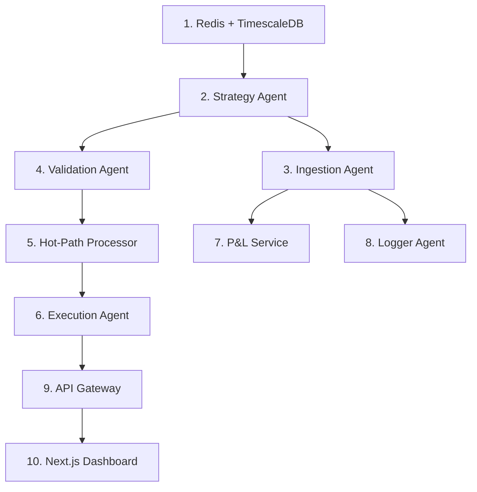
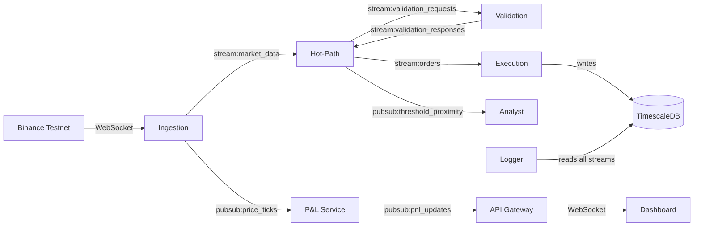

# Runtime Architecture: What Runs, When, and How

## Infrastructure (Always Running First)

These must be started before any Python service. They are containers defined in `deploy/docker-compose.yml`.

| Container | Purpose | Port |
|---|---|---|
| **Redis** | Pub/Sub, Streams, caching, rate limiting | `6379` |
| **TimescaleDB** | Orders, positions, audit logs, PnL snapshots, OHLCV candles | `5432` |

---

## One-Time Scripts (Run Manually)

| Script | When | What It Does |
|---|---|---|
| [migrate.py](file:///c:/Users/stevo/DEV/agent_trader_1/aion-trading/scripts/migrate.py) | After DB starts, before services | Applies all SQL migrations (`001` → `005`) creating tables |
| [daily_report.py](file:///c:/Users/stevo/DEV/agent_trader_1/aion-trading/scripts/daily_report.py) | Once daily (cron) during paper trading | Writes performance metrics to `paper_trading_reports` table |

---

## Service Startup Order

Services must boot in a specific sequence. Each service is a **FastAPI app** running via `uvicorn` (except Strategy which is a plain `asyncio.run()` loop).

---

## Phase-by-Phase: What Each Service Does At Runtime

### Phase 1 — Strategy Agent (pre-warm)

| | |
|---|---|
| **File** | [services/strategy/src/main.py](file:///c:/Users/stevo/DEV/agent_trader_1/aion-trading/services/strategy/src/main.py) |
| **Run** | `python -m poetry run python -m services.strategy.src.main` |
| **Type** | Plain `asyncio.run()` — no FastAPI |

**On startup:**
1. Connects to TimescaleDB and Redis
2. Loads all trading profiles from `trading_profiles` table via `ProfileRepository`
3. For each profile, fetches the last 200 candles from `market_data_ohlcv`
4. Primes indicator states (RSI, EMA, MACD, ATR) into Redis via `IndicatorHydrator`
5. Sets `hydration:{profile_id}:status = "complete"` in Redis
6. Enters an idle loop (polls for profile updates every 60s)

**Key files used:** [hydrator.py](file:///c:/Users/stevo/DEV/agent_trader_1/aion-trading/services/strategy/src/hydrator.py), [compiler.py](file:///c:/Users/stevo/DEV/agent_trader_1/aion-trading/services/strategy/src/compiler.py), [rule_validator.py](file:///c:/Users/stevo/DEV/agent_trader_1/aion-trading/services/strategy/src/rule_validator.py)

---

### Phase 2 — Ingestion Agent (data source)

| | |
|---|---|
| **File** | [services/ingestion/src/main.py](file:///c:/Users/stevo/DEV/agent_trader_1/aion-trading/services/ingestion/src/main.py) |
| **Run** | `python -m poetry run python -m services.ingestion.src.main` |
| **Port** | `8080` (`/health`, `/ready`) |

**On startup:**
1. Connects to Redis and TimescaleDB
2. Creates exchange adapters (Binance testnet via `ccxt.pro`)
3. `WebSocketManager` opens WebSocket connections for `BTC/USDT`, `ETH/USDT`

**Continuous loop:**
1. Receives raw ticks from Binance WebSocket
2. For each tick, creates a `MarketTickEvent` and simultaneously:
   - Publishes to Redis Stream `stream:market_data` (consumers: Hot-Path)
   - Publishes to Redis Pub/Sub `pubsub:price_ticks` (consumers: P&L Service)
3. `DataRouter` aggregates ticks into 1-minute OHLCV candles → writes to TimescaleDB

**Key files used:** [ws_manager.py](file:///c:/Users/stevo/DEV/agent_trader_1/aion-trading/services/ingestion/src/ws_manager.py), [data_router.py](file:///c:/Users/stevo/DEV/agent_trader_1/aion-trading/services/ingestion/src/data_router.py)

---

### Phase 3 — Validation Agent (safety gate)

| | |
|---|---|
| **File** | [services/validation/src/main.py](file:///c:/Users/stevo/DEV/agent_trader_1/aion-trading/services/validation/src/main.py) |
| **Run** | `python -m poetry run python -m services.validation.src.main` |
| **Port** | `8080` (`/health`) |

**Starts 3 background loops:**

1. **Fast Gate Loop** — consumes `stream:validation_requests`, runs Check 1 (Strategy recheck) + Check 6 (Risk level), responds to `stream:validation_responses` within **35ms**
2. **Async Audit Loop** — runs Checks 2-5 post-execution (Hallucination, Bias, Drift, Escalation), writes findings to `validation_events` table
3. **Learning Loop** — hourly scan of audit results, generates backtesting jobs for detected anomalies

**Key files used:** [fast_gate.py](file:///c:/Users/stevo/DEV/agent_trader_1/aion-trading/services/validation/src/fast_gate.py), [async_audit.py](file:///c:/Users/stevo/DEV/agent_trader_1/aion-trading/services/validation/src/async_audit.py), [learning_loop.py](file:///c:/Users/stevo/DEV/agent_trader_1/aion-trading/services/validation/src/learning_loop.py)

---

### Phase 4 — Hot-Path Processor (decision engine)

| | |
|---|---|
| **File** | [services/hot_path/src/main.py](file:///c:/Users/stevo/DEV/agent_trader_1/aion-trading/services/hot_path/src/main.py) |
| **Run** | `python -m poetry run python -m services.hot_path.src.main` |
| **Port** | `8080` (`/health`) |

**On startup:**
1. Waits for Strategy Agent hydration to complete (checks `hydration:*:status` keys)
2. Optionally verifies Validation Agent health (`/health` → 200)
3. Creates `HotPathProcessor` and starts its background loop

**Continuous loop (for each market tick from `stream:market_data`):**
1. Updates incremental indicators (RSI, EMA, MACD, ATR) in `ProfileStateCache`
2. Evaluates compiled strategy rules via `StrategyEvaluator`
3. If a rule fires → runs this check sequence:
   - `AbstentionChecker` — should we skip?
   - `RegimeDampener` — multiply confidence by regime factor
   - `CircuitBreaker` — has daily loss exceeded threshold?
   - `BlacklistChecker` — is this asset blocked?
   - `RiskGate` — position sizing OK?
   - `ValidationClient` — sends `ValidationRequestEvent` to stream, waits max 50ms for response
4. **If all pass** → publishes `OrderApprovedEvent` to `stream:orders`
5. **If near threshold** → publishes `ThresholdProximityEvent` via Pub/Sub (triggers Analyst Agent)

**Key files used:** [processor.py](file:///c:/Users/stevo/DEV/agent_trader_1/aion-trading/services/hot_path/src/processor.py), [state.py](file:///c:/Users/stevo/DEV/agent_trader_1/aion-trading/services/hot_path/src/state.py), [validation_client.py](file:///c:/Users/stevo/DEV/agent_trader_1/aion-trading/services/hot_path/src/validation_client.py)

---

### Phase 5 — Execution Agent (order placement)

| | |
|---|---|
| **File** | [services/execution/src/main.py](file:///c:/Users/stevo/DEV/agent_trader_1/aion-trading/services/execution/src/main.py) |
| **Run** | `python -m poetry run python -m services.execution.src.main` |
| **Port** | `8080` (`/health`) |

**Starts 2 background loops:**

1. **Executor Loop** — consumes `stream:orders`, for each `OrderApprovedEvent`:
   - Records PENDING in `OptimisticLedger`
   - Sends order to exchange (Binance testnet via adapter)
   - On confirmation → writes `Position` to DB, updates ledger to CONFIRMED
   - On failure → rolls back ledger
2. **Reconciler Cron** — periodically checks ledger vs exchange balances

**Key files used:** [executor.py](file:///c:/Users/stevo/DEV/agent_trader_1/aion-trading/services/execution/src/executor.py), [ledger.py](file:///c:/Users/stevo/DEV/agent_trader_1/aion-trading/services/execution/src/ledger.py)

---

### Phase 6 — Support Services (non-blocking)

#### P&L Service
| | |
|---|---|
| **File** | [services/pnl/src/main.py](file:///c:/Users/stevo/DEV/agent_trader_1/aion-trading/services/pnl/src/main.py) |
| **Listens to** | Pub/Sub `pubsub:price_ticks` |
| **Outputs** | Pub/Sub `pubsub:pnl_updates` + Redis cache + TimescaleDB snapshots |

For each price tick, recalculates P&L for all open positions on that symbol, including fees and US tax estimates.

#### Logger Agent
| | |
|---|---|
| **File** | [services/logger/src/main.py](file:///c:/Users/stevo/DEV/agent_trader_1/aion-trading/services/logger/src/main.py) |
| **Listens to** | All Redis Streams + Pub/Sub channels |
| **Outputs** | Writes every event to `audit_log` table, dispatches critical alerts |

---

### Phase 7 — Presentation Layer

#### API Gateway
| | |
|---|---|
| **File** | [services/api_gateway/src/main.py](file:///c:/Users/stevo/DEV/agent_trader_1/aion-trading/services/api_gateway/src/main.py) |
| **Port** | `8000` |
| **Endpoints** | `/auth/*`, `/profiles/*`, `/orders/*`, `/pnl/*`, `/commands/*`, `/ws` |

Handles JWT authentication, REST CRUD, and a WebSocket endpoint that subscribes to Redis Pub/Sub and pushes real-time data to the dashboard.

#### Next.js Dashboard
| | |
|---|---|
| **Directory** | [frontend/](file:///c:/Users/stevo/DEV/agent_trader_1/aion-trading/frontend) |
| **Port** | `3000` |
| **Run** | `cd frontend && npm run dev` |

Connects to the API Gateway's WebSocket at `ws://localhost:8000/ws`, receives P&L updates and validation alerts, renders them via Zustand stores.

---

## Data Flow Summary

## Redis Channels Reference

| Channel | Type | Producer | Consumer(s) |
|---|---|---|---|
| `stream:market_data` | Stream | Ingestion | Hot-Path |
| `stream:orders` | Stream | Hot-Path | Execution |
| `stream:validation_requests` | Stream | Hot-Path | Validation |
| `stream:validation_responses` | Stream | Validation | Hot-Path |
| `pubsub:price_ticks` | Pub/Sub | Ingestion | P&L, Logger |
| `pubsub:pnl_updates` | Pub/Sub | P&L | API Gateway → Dashboard |
| `pubsub:threshold_proximity` | Pub/Sub | Hot-Path | Analyst |
| `pubsub:system_alerts` | Pub/Sub | Validation | API Gateway → Dashboard |
