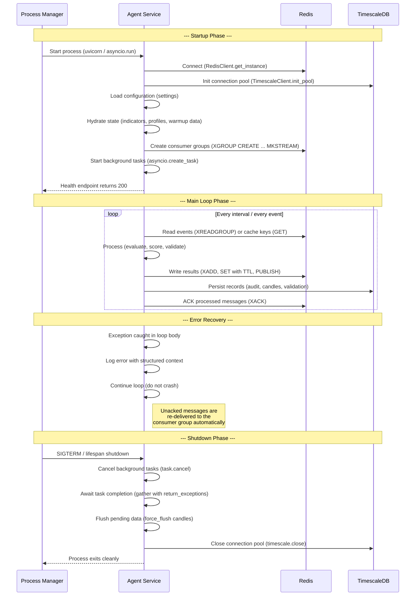
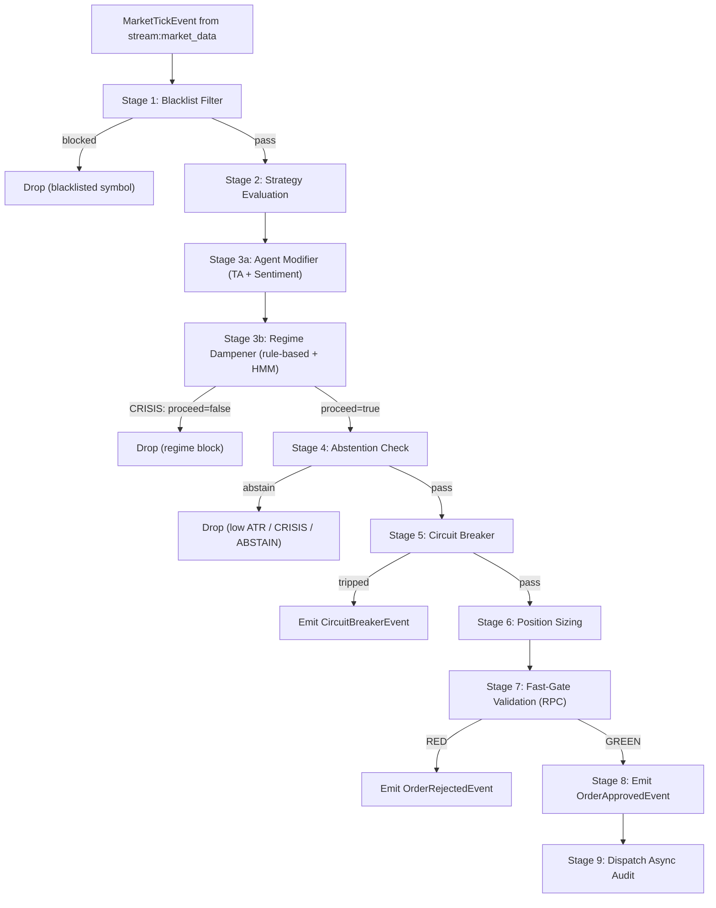

# Agent Architecture

> How autonomous agents in Praxis coordinate to turn raw market data into validated, risk-checked trading decisions.

Praxis is built around **15 single-responsibility agents** that communicate through Redis Streams, Pub/Sub, and cache-aside reads. No agent calls another directly. Every interaction flows through a well-defined messaging channel, making each agent independently deployable and testable.

---

## Table of Contents

- [Agent Catalog](#agent-catalog)
  - [Scoring Agents](#scoring-agents)
  - [Orchestration Agents](#orchestration-agents)
  - [Execution Agents](#execution-agents)
  - [Auxiliary Agents](#auxiliary-agents)
- [Agent Lifecycle](#agent-lifecycle)
- [Inter-Agent Communication](#inter-agent-communication)
  - [Communication Patterns](#communication-patterns)
  - [Message Schemas](#message-schemas)
  - [Ordering Guarantees](#ordering-guarantees)
- [Orchestration Model](#orchestration-model)
  - [Hot-Path Pipeline](#hot-path-pipeline)
  - [Confidence Multiplier System](#confidence-multiplier-system)
  - [Regime Dampener](#regime-dampener)
  - [Abstention Logic](#abstention-logic)
  - [Circuit Breaker](#circuit-breaker)
- [Agent Configuration](#agent-configuration)

---

## Agent Catalog

### Scoring Agents

Scoring agents run as background loops. They compute analytical signals independently and write results to Redis with a TTL. The Hot-Path reads these values on demand. If a cache key expires or is missing, the Hot-Path proceeds without it (graceful degradation).

#### 1. TA Confluence Agent

| Property | Value |
|---|---|
| **Service** | `services/ta_agent` |
| **Loop interval** | 60 seconds |
| **Cache key** | `agent:ta_score:{symbol}` |
| **Cache TTL** | 120 seconds |
| **Responsibility** | Compute cross-timeframe technical analysis confluence scores |

**Inputs:**
- Historical candle data from TimescaleDB (via `MarketDataRepository`)
- Timeframes: `1m`, `5m`, `15m`, `1h`
- 150 candles per timeframe per cycle (covers MACD warmup of 35 candles)

**Outputs:**
- A single `score` value in the range `[-1.0, +1.0]` written to Redis as JSON: `{"score": <float>}`
- `-1.0` = strong bearish confluence, `+1.0` = strong bullish confluence

**Decision logic:**
1. For each timeframe, compute RSI signal and MACD histogram signal independently.
2. RSI signal: `(50 - rsi_value) / 50`, clamped to `[-1, 1]`. RSI below 50 is bullish, above 50 is bearish.
3. MACD signal: `histogram / abs(macd_line)`, clamped to `[-1, 1]`. Positive histogram is bullish.
4. Weight timeframes by importance: 1m (0.1), 5m (0.2), 15m (0.3), 1h (0.4). Longer timeframes carry more weight.
5. Final score = `(weighted_rsi_avg + weighted_macd_avg) / 2`.
6. Returns `None` (no cache write) if any timeframe's indicators are still priming.
7. Scorer is re-initialized each cycle to avoid stale indicator state accumulation.

**Source:** `services/ta_agent/src/confluence.py`, `services/ta_agent/src/main.py`

---

#### 2. Sentiment Agent

| Property | Value |
|---|---|
| **Service** | `services/sentiment` |
| **Loop interval** | 300 seconds |
| **Cache key** | `sentiment:{symbol}:latest` |
| **Cache TTL** | 900 seconds |
| **Responsibility** | Score market sentiment from news headlines using an LLM |

**Inputs:**
- News headlines for each traded symbol (up to 5 headlines, each truncated to 200 characters)

**Outputs:**
- JSON to Redis: `{"score": <float>, "confidence": <float>, "source": "<string>"}`
- `score`: `-1.0` (bearish) to `+1.0` (bullish)
- `confidence`: `0.0` to `1.0`
- `source`: one of `"llm"`, `"cache"`, `"fallback"`, `"no_key_fallback"`, `"llm_error"`

**Decision logic:**
1. Check Redis cache first. If a cached result exists and has not expired, return it immediately.
2. If no headlines are available, return neutral (`score=0.0, confidence=1.0`).
3. Try backends in order based on `PRAXIS_LLM_BACKEND` setting:
   - `"local"`: `LocalLLMBackend` calls the SLM inference service (`POST /v1/completions`).
   - `"cloud"`: `CloudLLMBackend` calls Claude claude-haiku-4-5-20251001 via Anthropic API.
   - `"auto"`: Try local first, fall back to cloud on failure.
4. Parse the LLM response using direct JSON parse, with regex fallback for malformed output.
5. Clamp score to `[-1, 1]` and confidence to `[0, 1]`.
6. Cloud backend retries up to 2 times on failure. Rate limited to one call every 2 seconds.
7. On total failure (all backends), return neutral with `confidence=0.5` and `source="llm_error"`.

The scorer uses an `LLMBackend` protocol (`async def complete(prompt: str) -> Optional[str]`) enabling pluggable backends. The `create_backend()` factory produces an ordered list of backends based on configuration.

**Source:** `services/sentiment/src/scorer.py`

---

#### 3. Regime HMM Agent

| Property | Value |
|---|---|
| **Service** | `services/regime_hmm` |
| **Loop interval** | 300 seconds |
| **Cache key** | `agent:regime_hmm:{symbol}` |
| **Cache TTL** | 600 seconds |
| **Responsibility** | Classify market regime using a Hidden Markov Model |

**Inputs:**
- 500 recent 1-hour candle close prices from TimescaleDB

**Outputs:**
- JSON to Redis: `{"regime": "<Regime enum value>"}`
- One of: `TRENDING_UP`, `TRENDING_DOWN`, `RANGE_BOUND`, `HIGH_VOLATILITY`, `CRISIS`

**Decision logic:**
1. Build a 2-feature observation matrix: `[log_return, rolling_volatility]` with a rolling window of 20 periods.
2. Fit a 5-state Gaussian HMM (`hmmlearn.GaussianHMM`, full covariance, 100 iterations, seed 42).
3. Requires a minimum of 100 observations after feature engineering.
4. Predict the current hidden state (0-4) from the observation sequence.
5. Map the state index to a `Regime` enum using the fitted model's emission parameters:
   - Volatility in top 20% of the state range: `CRISIS`
   - Volatility in top 40%: `HIGH_VOLATILITY`
   - Remaining states with positive mean return: `TRENDING_UP`
   - Remaining states with negative mean return: `TRENDING_DOWN`
   - Near-zero return, low volatility: `RANGE_BOUND`

**Source:** `services/regime_hmm/src/hmm_model.py`, `services/regime_hmm/src/regime_mapper.py`

---

#### 4. Debate Agent

| Property | Value |
|---|---|
| **Service** | `services/debate` |
| **Loop interval** | 300 seconds |
| **Cache key** | `agent:debate:{symbol}` |
| **Cache TTL** | 600 seconds |
| **Responsibility** | Adversarial bull/bear debate producing consensus score |

**Inputs:**
- Market context from Redis: TA score, sentiment score, regime, indicator values
- LLM backend (same as Sentiment Agent — local or cloud)

**Outputs:**
- `agent:debate:{symbol}` Redis key with `{score, confidence, reasoning, num_rounds, latency_ms}`

**Decision logic:**
1. For each tracked symbol, gather current market context from Redis (indicators, TA score, sentiment, regime).
2. Run 2 debate rounds:
   - **Bull agent**: Argues the strongest case for a LONG position using indicator data.
   - **Bear agent**: Argues the strongest case for a SHORT position using indicator data.
   - Each agent produces an argument and a conviction score (0-1).
3. **Judge agent**: Evaluates both sides' arguments and produces a final score (-1.0 bearish to +1.0 bullish) with confidence and reasoning.
4. If the judge fails to produce valid JSON, falls back to conviction-difference calculation (bull_avg - bear_avg) with reduced confidence (0.3).
5. Score is clamped to [-1, 1], confidence to [0, 1].
6. Result written to Redis with 10-minute TTL.

**Prompt templates:** `prompts/debate/bull.txt`, `prompts/debate/bear.txt`, `prompts/debate/judge.txt`

**Source:** `services/debate/src/engine.py`, `services/debate/src/main.py`

---

#### 5. SLM Inference Service

| Property | Value |
|---|---|
| **Service** | `services/slm_inference` |
| **Type** | Always-on HTTP API (not a loop) |
| **Responsibility** | Host quantized GGUF model for local LLM inference |

**Endpoints:**
- `POST /v1/completions` — OpenAI-compatible text completion
- `POST /v1/sentiment` — Structured sentiment analysis returning `{score, confidence}`
- `GET /health` — Health check with model load status and GPU memory metrics

**Details:**
- Loads a GGUF model at startup via `llama-cpp-python` (e.g., Phi-3-mini-4k Q4, ~2.3GB VRAM).
- Model path configured via `PRAXIS_SLM_MODEL_PATH`.
- Returns mock responses when no model is loaded (development mode).
- GPU layer offloading configurable via `PRAXIS_SLM_GPU_LAYERS` (-1 = all).

**Source:** `services/slm_inference/src/main.py`

---

#### 6. Analyst Agent (Weight Engine)

| Property | Value |
|---|---|
| **Service** | `services/analyst` |
| **Loop interval** | 300 seconds |
| **Responsibility** | Compute dynamic agent weights from closed position outcomes |

**Inputs:**
- Closed position outcomes from `agent:closed:{symbol}` Redis stream (written by PnL closer)
- Agent score snapshots from `agent:position_scores:{position_id}` Redis keys (written by Execution service)

**Outputs:**
- `agent:weights:{symbol}` Redis hash: `{ta: 0.22, sentiment: 0.18, debate: 0.25}`
- `agent:tracker:{symbol}:{agent}` Redis hash: `{ewma_accuracy, sample_count, last_updated}`

**Decision logic:**
1. Every 5 minutes, for each traded symbol:
2. Read recent closed position outcomes (last 500).
3. For each agent, compute EWMA accuracy: `ewma = alpha * hit + (1 - alpha) * ewma` where `hit = 1.0` for wins, `0.0` for losses (alpha = 0.1).
4. If sample_count >= 10 (MIN_SAMPLES), map accuracy to weight: `weight = default * (ewma / 0.5)`.
5. Clamp weight to [0.05, 1.0].
6. If sample_count < MIN_SAMPLES, use default weights (TA=0.20, sentiment=0.15, debate=0.25).
7. Write computed weights to Redis hash with 15-minute TTL.

**Source:** `libs/core/agent_registry.py`, `services/analyst/src/main.py`

---

### Orchestration Agents

#### 7. Hot-Path Processor

| Property | Value |
|---|---|
| **Service** | `services/hot_path` |
| **Trigger** | Every market tick from `stream:market_data` |
| **Output channels** | `stream:orders`, `stream:validation` |
| **Responsibility** | Run the 9-stage decision pipeline per profile, per tick |

**Inputs:**
- `MarketTickEvent` from `stream:market_data` (via consumer group)
- Scoring agent caches from Redis (`agent:ta_score:{symbol}`, `sentiment:{symbol}:latest`, `agent:regime_hmm:{symbol}`)
- Per-profile state: compiled rules, risk limits, blacklist, indicator set, regime

**Outputs:**
- `OrderApprovedEvent` to `stream:orders`
- `ValidationRequestEvent` to `stream:validation`
- `OrderRejectedEvent` to `stream:orders` (on rejection)
- `CircuitBreakerEvent` to `stream:orders` (on circuit break)
- `AlertEvent` to `pubsub:alerts` (on regime disagreement)

**9-Stage Pipeline (per profile, per tick):**

| Stage | Name | Action |
|---|---|---|
| 1 | Blacklist filter | Skip if `tick.symbol` is in `state.blacklist` |
| 2 | Strategy evaluation | Evaluate compiled rule set against current indicators; produce `SignalResult(direction, confidence, rule_matched)` |
| 3a | Agent modifier | Adjust confidence additively using TA and sentiment scores from Redis (see [Confidence Multiplier System](#confidence-multiplier-system)) |
| 3b | Regime dampener | Dual-regime check (rule-based + HMM); may block signal or reduce confidence (see [Regime Dampener](#regime-dampener)) |
| 4 | Abstention check | Block if ATR < 0.3% of price, regime is CRISIS, or signal direction is ABSTAIN |
| 5 | Circuit breaker | Block if daily realized P&L loss exceeds `circuit_breaker_daily_loss_pct`; auto-resets at midnight UTC |
| 6 | Position sizing | Calculate order quantity based on confidence, risk limits, and current allocation |
| 7 | Fast-gate validation | Synchronous RPC to Validation Agent (CHECK_1 + CHECK_6, target < 50ms) |
| 8 | Order emission | Emit `OrderApprovedEvent` to `stream:orders` |
| 9 | Async audit dispatch | Emit `ValidationRequestEvent` to `stream:validation` for background checks (CHECK_2 through CHECK_5) |

**Source:** `services/hot_path/src/agent_modifier.py`, `services/hot_path/src/regime_dampener.py`, `services/hot_path/src/abstention.py`, `services/hot_path/src/circuit_breaker.py`, `services/hot_path/src/state.py`

---

#### 5. Validation Agent

| Property | Value |
|---|---|
| **Service** | `services/validation` |
| **Trigger** | RPC requests (fast gate) + `stream:validation` (async audit) + hourly timer (learning loop) |
| **Output channels** | RPC response lists, `auto_backtest_queue` |
| **Responsibility** | Multi-layer signal validation: fast synchronous gate, asynchronous audit, and self-improving learning loop |

**Three operational modes:**

**Fast Gate (synchronous, < 50ms target):**
- Receives `ValidationRequestEvent` via per-request Redis list (BLPOP pattern).
- Runs CHECK_1 (strategy recheck) and CHECK_6 (risk level recheck) in parallel using `asyncio.gather`.
- Returns `ValidationResponseEvent` with verdict `GREEN` or `RED`.
- Logs a warning if response time exceeds 35ms.

**Async Audit (background consumer):**
- Consumes from `stream:validation` using consumer group `async_val_group`.
- Processes in batches of up to 50 events.
- Runs CHECK_2 (hallucination detection), CHECK_3 (bias detection), CHECK_4 (drift detection) sequentially per event.
- Failed checks are escalated via CHECK_5 (escalation handler) with severity level (`AMBER` or `RED`).
- Results are persisted to `validation_events` table in TimescaleDB.
- Messages are ACKed after all checks and persistence complete.

**Learning Loop (hourly):**
- Scans `validation_events` for RED/AMBER verdicts from the past hour across all check types.
- Auto-generates backtest jobs based on failure patterns:
  - Drift RED: `"what_if_halted"` job
  - Hallucination: `"zero_sentiment_backtest"` job
  - Bias: `"neutral_bias_backtest"` job
- Publishes jobs to `auto_backtest_queue`.

**Source:** `services/validation/src/fast_gate.py`, `services/validation/src/async_audit.py`, `services/validation/src/learning_loop.py`

---

#### 6. Strategy Agent

| Property | Value |
|---|---|
| **Service** | `services/strategy` |
| **Trigger** | Startup (full hydration) + 60-second poll |
| **Responsibility** | Hydrate and maintain indicator state for all trading profiles |

**Inputs:**
- Trading profile configurations from the database
- Historical candle data for indicator warmup

**Outputs:**
- `ProfileState` objects in `ProfileStateCache` (in-memory, consumed by Hot-Path)
- Compiled rule sets (`CompiledRuleSet`) for strategy evaluation

---

### Execution Agents

#### 7. Execution Agent

| Property | Value |
|---|---|
| **Service** | `services/execution` |
| **Input channel** | `stream:orders` (consumer group) |
| **Responsibility** | Execute approved orders against exchanges; manage the optimistic ledger |

**Inputs:**
- `OrderApprovedEvent` from `stream:orders`

**Outputs:**
- `OrderExecutedEvent` to `stream:orders` (on fill confirmation)
- `OrderRejectedEvent` to `stream:orders` (on exchange rejection)
- Optimistic ledger updates (position tracking before exchange confirmation)

---

#### 8. Ingestion Agent

| Property | Value |
|---|---|
| **Service** | `services/ingestion` |
| **Trigger** | Continuous WebSocket connections to exchanges |
| **Output channels** | `stream:market_data`, `pubsub:price_ticks` |
| **Responsibility** | Ingest real-time market data from Binance and Coinbase; normalize and distribute |

**Inputs:**
- Raw WebSocket tick data from exchange adapters (Binance, Coinbase)

**Outputs:**
- `MarketTickEvent` to `stream:market_data` (ordered, persistent -- consumed by Hot-Path)
- `NormalisedTick` to `pubsub:price_ticks` (broadcast -- consumed by PnL Agent)
- 1-minute OHLCV candles flushed to TimescaleDB (via `DataRouter`)

**Resilience:**
- Each exchange adapter runs in its own `asyncio.Task` so one exchange crash does not affect the other.
- Exponential backoff on reconnection: `min(2^retry_count, 30)` seconds.
- Maximum 10 retries per adapter before emitting a `SYSTEM_ALERT` and stopping.
- Health check exposes `is_healthy()` (all connected) and `is_partially_healthy()` (at least one connected).

**Data routing:**
- `DataRouter` aggregates raw ticks into 1-minute candle buckets by flooring the tick timestamp to the nearest minute.
- When a new minute bucket starts, the previous candle is asynchronously flushed to TimescaleDB.
- `force_flush()` is available for graceful shutdown to persist the current in-progress candle.

**Source:** `services/ingestion/src/ws_manager.py`, `services/ingestion/src/data_router.py`

---

### Auxiliary Agents

#### 9. PnL Agent

| Property | Value |
|---|---|
| **Service** | `services/pnl` |
| **Input channel** | `pubsub:price_ticks` |
| **Output channel** | `pubsub:pnl_updates` |
| **Responsibility** | Calculate unrealized P&L and tax implications per profile |

**Inputs:**
- `NormalisedTick` from `pubsub:price_ticks`

**Outputs:**
- `PnlUpdateEvent` to `pubsub:pnl_updates` (broadcast to WebSocket layer for frontend display)

---

#### 10. Logger Agent

| Property | Value |
|---|---|
| **Service** | `services/logger` |
| **Input channels** | `stream:market_data`, `stream:orders`, `stream:validation`, `pubsub:system_alerts` |
| **Responsibility** | Write audit records for all system events; trigger alerts on critical events |

**Stream consumption:**
- Consumes from all three primary streams using consumer group `logger_group` with consumer name `global_auditor`.
- Reads up to 100 events per stream per iteration with a 5ms block timeout.
- Writes every event to the audit repository with stream metadata.
- Triggers alerts on `OrderRejectedEvent` and `ReconciliationDriftError` event types.

**Pub/Sub consumption:**
- Subscribes to `pubsub:system_alerts`.
- RED-level alerts are dispatched to the external alerter (e.g., Slack, PagerDuty).
- All pub/sub messages are written to the audit log regardless of level.

**Source:** `services/logger/src/event_subscriber.py`

---

#### 11. Backtesting Agent

| Property | Value |
|---|---|
| **Service** | `services/backtesting` |
| **Input** | Backtest job queue (`auto_backtest_queue` from Learning Loop, or manual submission) |
| **Responsibility** | Simulate trading strategies against historical data |

---

#### 12. Archiver Agent

| Property | Value |
|---|---|
| **Service** | `services/archiver` |
| **Trigger** | Daily cron |
| **Responsibility** | Migrate aged data from TimescaleDB to Google Cloud Storage for long-term retention |

---

## Agent Lifecycle

The following diagram shows the standard lifecycle shared by all agents, from startup through normal operation to shutdown and error recovery.



**Key lifecycle properties:**

- **Consumer group auto-creation:** `StreamConsumer._ensure_group` calls `XGROUP CREATE` with `mkstream=True` idempotently. If the group already exists (`BUSYGROUP` error), the error is silently ignored. This means agents can start in any order.
- **Graceful degradation:** Scoring agent cache misses (expired TTL, Redis down) result in zero adjustments, not failures. The Hot-Path always proceeds.
- **No message loss on crash:** Redis Streams deliver unacknowledged messages to other consumers in the group, or back to the same consumer on restart (pending entries list).
- **Task isolation:** Each background loop runs in its own `asyncio.Task`. An exception in one loop is caught and logged without affecting others.

---

## Inter-Agent Communication

### Communication Patterns

Praxis uses four distinct communication patterns, each chosen for specific delivery and latency requirements.

#### 1. Redis Streams (ordered, persistent, consumer groups)

Used for the primary data pipeline where **at-least-once delivery** and **message ordering** are required.

| Stream | Publisher | Consumer(s) | Consumer Group |
|---|---|---|---|
| `stream:market_data` | Ingestion Agent | Hot-Path Processor, Logger Agent | `hot_path_group`, `logger_group` |
| `stream:orders` | Hot-Path Processor, Execution Agent | Execution Agent, Logger Agent | `execution_group`, `logger_group` |
| `stream:validation` | Hot-Path Processor | Validation Agent (async audit) | `async_val_group` |
| `stream:validation_response` | Validation Agent | Hot-Path Processor | `hot_path_val_group` |
| `stream:dlq` | Any agent (on processing failure) | Ops tooling (manual replay) | -- |

**Mechanics (from `libs/messaging/_streams.py`):**
- `StreamPublisher.publish`: calls `XADD` with msgpack-encoded payload.
- `StreamConsumer.consume`: calls `XREADGROUP` with configurable `count` and `block_ms`.
- `StreamConsumer.ack`: calls `XACK` to remove messages from the pending entries list.
- Consumer groups are created lazily on first consume call with `MKSTREAM` flag.

#### 2. Redis Pub/Sub (broadcast, fire-and-forget)

Used for real-time fan-out where **at-most-once delivery** is acceptable and multiple subscribers need the same data.

| Channel | Publisher | Subscriber(s) |
|---|---|---|
| `pubsub:price_ticks` | Ingestion Agent | PnL Agent |
| `pubsub:pnl_updates` | PnL Agent | WebSocket gateway (frontend) |
| `pubsub:alerts` | Hot-Path Processor (regime disagreement) | Alerting infrastructure |
| `pubsub:system_alerts` | Ingestion Agent (max retries), various | Logger Agent, alerting infrastructure |
| `pubsub:threshold_proximity` | Hot-Path Processor | WebSocket gateway (frontend) |

**Mechanics (from `libs/messaging/_pubsub.py`):**
- `PubSubBroadcaster.publish`: msgpack-encodes the event, then calls `PUBLISH`.
- `PubSubSubscriber.subscribe`: loops on `get_message` with 100ms timeout, 10ms sleep between empty polls.
- **No persistence.** If a subscriber is disconnected when a message is published, that message is lost.

#### 3. RPC via Redis Lists (synchronous request-response)

Used exclusively for the **fast-gate validation** path where the Hot-Path needs a synchronous response within a strict latency budget.

```
Hot-Path                          Validation Agent
   |                                    |
   |--- LPUSH request to per-request ---|
   |    key (e.g. val:req:{uuid})       |
   |                                    |
   |    BLPOP on val:req:{uuid}    <----|
   |                                    |
   |--- (processes CHECK_1 + CHECK_6) --|
   |                                    |
   |    LPUSH response to val:res:{uuid}|
   |                              ----->|
   |    BLPOP on val:res:{uuid}         |
   |<-----------------------------------|
   |                                    |
   |    Keys expire after 5s TTL        |
```

- **Timeout:** BLPOP with 5-second timeout. If the Validation Agent does not respond, the Hot-Path treats the request as timed out.
- **Cleanup:** Request and response keys have a 5-second TTL to prevent key leaks.

#### 4. Cache-Aside (write-through with TTL)

Used for scoring agent results where the Hot-Path reads on demand and tolerates stale or missing data.

| Cache Key Pattern | Writer | Reader | TTL |
|---|---|---|---|
| `agent:ta_score:{symbol}` | TA Confluence Agent | Hot-Path (Agent Modifier) | 120s |
| `sentiment:{symbol}:latest` | Sentiment Agent | Hot-Path (Agent Modifier) | 900s |
| `agent:regime_hmm:{symbol}` | Regime HMM Agent | Hot-Path (Regime Dampener) | 600s |

- **Read pattern:** Hot-Path pipelines both `agent:ta_score` and `agent:sentiment` reads into a single Redis round trip.
- **Miss behavior:** Returns `0.0` adjustment (no effect on confidence).
- **In-process cache:** The Regime Dampener maintains a 1-second in-process cache to avoid redundant Redis reads when processing multiple profiles for the same symbol within the same tick.

### Message Schemas

All events extend `BaseEvent` and are serialized with msgpack. See [event-system.md](event-system.md) for the complete schema catalog with field-level definitions and example payloads.

### Ordering Guarantees

| Pattern | Ordering | Guarantee |
|---|---|---|
| Redis Streams | Total order per stream (XADD returns monotonic IDs) | At-least-once within a consumer group. Unacknowledged messages are re-delivered. |
| Redis Pub/Sub | Delivery order matches publish order per channel | At-most-once. No persistence, no replay. |
| RPC (Redis Lists) | Single request-response pair per key | Exactly-once per request (bounded by TTL). Timeout = no response. |
| Cache-Aside | Last-write-wins (SET with TTL) | Eventual consistency. Readers tolerate stale data by design. |

---

## Orchestration Model

### Hot-Path Pipeline

The Hot-Path Processor is the central orchestrator. It consumes every market tick and fans out processing across all active profiles. The pipeline is deliberately sequential per profile to maintain deterministic ordering and simplify reasoning about state mutations.



### Confidence Multiplier System

The confidence value starts from the strategy evaluator and passes through two additive modification stages before being used for position sizing.

**Stage 3a -- Agent Modifier (from `services/hot_path/src/agent_modifier.py`):**

The modifier applies additive adjustments. This avoids multiplicative compounding that can drive confidence toward zero when multiple agents mildly disagree.

| Source | Redis Key | Adjustment Range | Calculation |
|---|---|---|---|
| TA Confluence | `agent:ta_score:{symbol}` | +/-20 percentage points | `ta_score * 0.20` (aligned with direction) |
| Sentiment | `sentiment:{symbol}:latest` | +/-15 percentage points | `score * confidence * 0.15` (aligned with direction) |

- For BUY signals: positive TA score adds confidence, negative subtracts.
- For SELL signals: the sign is inverted (negative TA score adds confidence).
- Both adjustments are independently clamped to their respective ranges before summing.
- Final confidence is clamped to `[0.0, 1.0]`.
- If a Redis key is missing or unparseable, the adjustment for that source is `0.0`.

**Example:**

```
Strategy confidence:  0.65
TA score:             0.80  -> adjustment = 0.80 * 0.20 = +0.16
Sentiment score:      0.60, confidence: 0.70  -> adjustment = 0.60 * 0.70 * 0.15 = +0.063
                                                 (clamped to 0.063)
New confidence:       0.65 + 0.16 + 0.063 = 0.873
```

**Stage 3b -- Regime Dampener multiplier (applied after agent modifier):**

| Resolved Regime | Multiplier | Proceed? |
|---|---|---|
| `CRISIS` | 0.0 | No (signal dropped) |
| `HIGH_VOLATILITY` | 0.7 | Yes |
| `TRENDING_UP` | 1.0 | Yes |
| `TRENDING_DOWN` | 1.0 | Yes |
| `RANGE_BOUND` | 1.0 | Yes |

### Regime Dampener

The dampener runs a **dual-regime** system that combines a rule-based regime detector (from the profile's indicator set, using price and ATR) with the HMM-based regime classification from Redis.

**Resolution logic (from `services/hot_path/src/regime_dampener.py`):**

1. Compute the rule-based regime from the profile's indicator set.
2. Read the HMM regime from Redis (with 1-second in-process cache).
3. If either source returns `None`, use the other.
4. If both are `None`, no regime is applied.
5. If either says `CRISIS`, the resolved regime is `CRISIS`.
6. Otherwise, use the more conservative regime (higher severity).

**Severity ordering:**

```
RANGE_BOUND (0) < TRENDING_UP (1) < TRENDING_DOWN (2) < HIGH_VOLATILITY (3) < CRISIS (4)
```

**Disagreement detection:**
When the rule-based and HMM regimes disagree, an `AlertEvent` with level `AMBER` is published to `pubsub:alerts`. The resolved regime is still used (the more conservative one), but operators are notified.

### Abstention Logic

The abstention checker (from `services/hot_path/src/abstention.py`) blocks signals under three conditions:

1. **Whipsaw protection:** ATR is less than 0.3% of the current price (`inds.atr < price * 0.003`). Low ATR indicates a tight, choppy market where signals are unreliable.
2. **Crisis regime:** The resolved regime is `CRISIS` (this is redundant with the dampener but acts as a safety net).
3. **Explicit abstention:** The strategy evaluator returned `SignalDirection.ABSTAIN`.

### Circuit Breaker

The circuit breaker (from `services/hot_path/src/circuit_breaker.py`) halts trading for a profile when daily realized losses exceed the configured threshold.

- **Threshold:** `state.risk_limits.circuit_breaker_daily_loss_pct` (per-profile configuration).
- **Calculation:** `loss_pct = -state.daily_realised_pnl_pct`. Trips when `loss_pct > threshold`.
- **Daily reset:** Automatically resets `daily_realised_pnl_pct` to `0.0` at midnight UTC.
- **Scope:** Per-profile. One profile's circuit breaker does not affect others.

---

## Agent Configuration

### Per-Agent Tunables

#### TA Confluence Agent

| Parameter | Default | Description |
|---|---|---|
| `SCORE_INTERVAL_S` | `60` | Seconds between scoring cycles |
| `SCORE_TTL_S` | `120` | Redis cache TTL for TA scores |
| `CANDLE_LIMIT` | `150` | Number of candles fetched per timeframe per cycle |
| `TRADING_SYMBOLS` | From `settings` | List of symbols to score; re-read each cycle |
| Timeframe weights | `[0.1, 0.2, 0.3, 0.4]` | Weights for 1m, 5m, 15m, 1h (hardcoded) |

#### Sentiment Agent

| Parameter | Default | Description |
|---|---|---|
| Loop interval | `300` | Seconds between scoring cycles |
| `cache_ttl` | `900` | Redis cache TTL for sentiment scores |
| `MAX_RETRIES` | `2` | LLM call retry count |
| `MIN_CALL_INTERVAL_S` | `2.0` | Minimum seconds between LLM API calls |
| LLM model | `claude-haiku-4-5-20251001` | Anthropic model for sentiment analysis |
| Max headlines | `5` | Headlines sent per LLM call |
| Headline truncation | `200` chars | Max characters per headline |

#### Regime HMM Agent

| Parameter | Default | Description |
|---|---|---|
| Loop interval | `300` | Seconds between model refit and prediction |
| Cache TTL | `600` | Redis cache TTL for regime classification |
| `N_STATES` | `5` | Number of HMM hidden states |
| `ROLLING_WINDOW` | `20` | Rolling window for volatility feature |
| `MIN_OBSERVATIONS` | `100` | Minimum observations required for fitting |
| Candle count | `500` | 1h candles fetched for model training |

#### Hot-Path Processor

| Parameter | Default | Description |
|---|---|---|
| TA adjustment range | `[-0.20, +0.20]` | Max additive confidence change from TA |
| Sentiment adjustment range | `[-0.15, +0.15]` | Max additive confidence change from sentiment |
| Regime cache TTL (in-process) | `1.0s` | In-memory HMM regime cache per symbol |
| Abstention ATR threshold | `0.3%` of price | Minimum ATR for signal acceptance |
| Fast-gate timeout | `5s` | BLPOP timeout for validation RPC |

#### Validation Agent

| Parameter | Default | Description |
|---|---|---|
| Fast-gate deadline warning | `35ms` | Log warning if fast gate exceeds this |
| Async audit batch size | `50` | Events consumed per XREADGROUP call |
| Learning loop interval | `3600s` | Seconds between hourly scans |
| Learning loop lookback | `1 hour` | Time window for RED/AMBER event scan |

#### Ingestion Agent

| Parameter | Default | Description |
|---|---|---|
| Max retries per adapter | `10` | Reconnection attempts before SYSTEM_ALERT |
| Backoff formula | `min(2^n, 30)` | Exponential backoff ceiling (seconds) |
| Candle bucket size | `1 minute` | OHLCV aggregation window |

#### Logger Agent

| Parameter | Default | Description |
|---|---|---|
| Stream batch size | `100` | Events consumed per stream per iteration |
| Stream block timeout | `5ms` | XREADGROUP block duration |
| Pub/Sub poll timeout | `100ms` | `get_message` timeout |
| Pub/Sub poll sleep | `10ms` | Sleep between empty pub/sub polls |

#### Profile State (per-profile, from `services/hot_path/src/state.py`)

| Field | Type | Description |
|---|---|---|
| `profile_id` | `str` | Unique profile identifier |
| `compiled_rules` | `CompiledRuleSet` | Pre-compiled strategy rules |
| `risk_limits` | `RiskLimits` | Includes `circuit_breaker_daily_loss_pct` and other limits |
| `blacklist` | `frozenset` | Symbols this profile must not trade |
| `indicators` | `IndicatorSet` | Live indicator state (RSI, MACD, ATR, regime detector) |
| `regime` | `Regime` or `None` | Current resolved regime |
| `daily_realised_pnl_pct` | `float` | Running daily P&L (reset at midnight UTC) |
| `current_drawdown_pct` | `float` | Current drawdown from peak |
| `current_allocation_pct` | `float` | Current portfolio allocation |
| `is_active` | `bool` | Whether the profile is active for trading |
