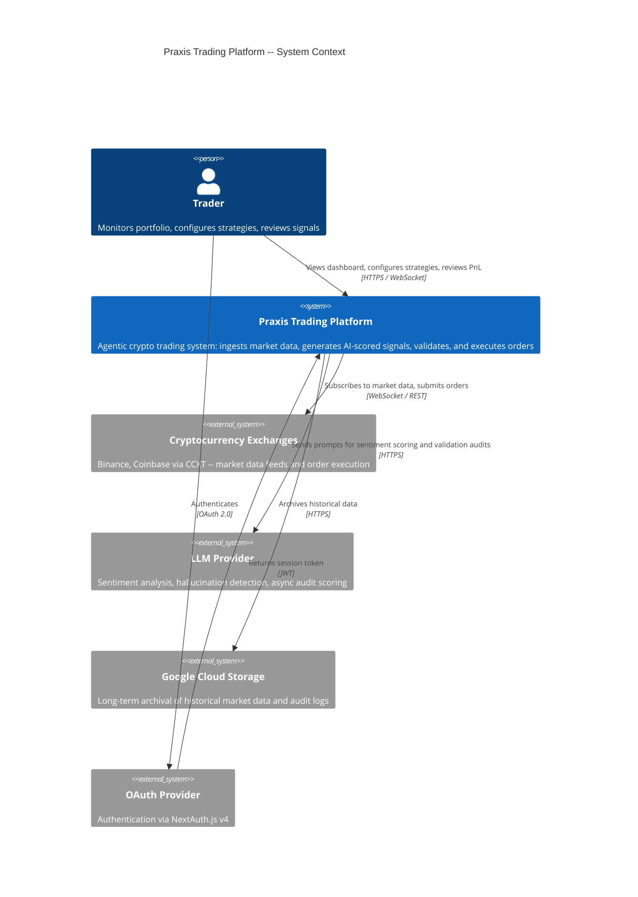
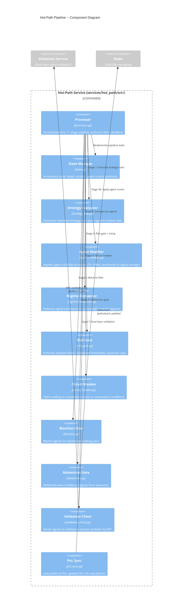
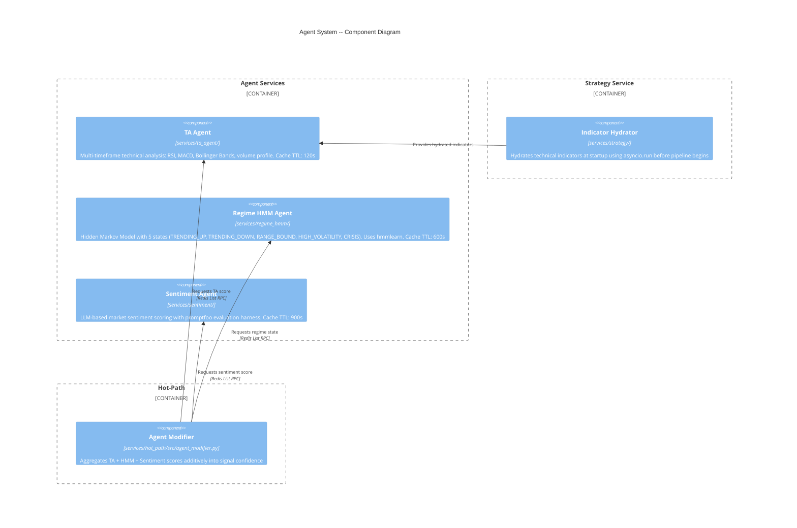

# Praxis Trading Platform -- Architecture Overview

> Agentic cryptocurrency trading platform that combines multi-agent AI analysis
> with a latency-optimized execution pipeline to generate, validate, and execute
> trading signals across multiple exchanges.

**Last updated**: 2026-04-16 | **Phase**: 3 | **Platform version**: Python 3.11+ / Next.js 16

---

## Table of Contents

- [System Context (C4 Level 1)](#system-context-c4-level-1)
- [Container Diagram (C4 Level 2)](#container-diagram-c4-level-2)
- [Component Diagram (C4 Level 3)](#component-diagram-c4-level-3)
  - [Trading Engine (Hot-Path Pipeline)](#trading-engine-hot-path-pipeline)
  - [Agent System](#agent-system)
- [Phase Boundary](#phase-boundary)
- [Technology Stack](#technology-stack)
- [Architecture Decision Records](#architecture-decision-records)
- [Cross-Cutting Concerns](#cross-cutting-concerns)
- [Service Catalog](#service-catalog)
- [Startup Order](#startup-order)
- [Redis Channel Map](#redis-channel-map)

---

## System Context (C4 Level 1)

This diagram shows Praxis as a single system and its relationships to external actors
and third-party systems.



**Source files**: `services/api_gateway/` (trader-facing), `libs/exchange/` (exchange integration), `services/sentiment/` (LLM calls), `services/archiver/` (GCS), `frontend/` (dashboard)

---

## Deployment Topology

The platform supports a split deployment: frontend on Vercel, backend services running locally, connected via a Cloudflare Tunnel.

```
                          Internet
                             │
              ┌──────────────┼──────────────┐
              │              │              │
     ┌────────▼───────┐     │     ┌────────▼────────┐
     │  Vercel (CDN)  │     │     │  OAuth Provider  │
     │  Next.js 16    │     │     │  Google/GitHub   │
     │  frontend      │     │     └─────────────────┘
     └───────┬────────┘     │
             │ HTTPS + WSS  │
     ┌───────▼────────┐     │
     │  Cloudflare    │     │
     │  Tunnel        │     │
     └───────┬────────┘     │
             │ localhost     │
     ┌───────▼──────────────▼───────────────┐
     │  Local Machine / Server              │
     │  ┌──────────────────────────────┐    │
     │  │  API Gateway (:8000)         │    │
     │  │  REST + WebSocket + HITL     │    │
     │  └──────────┬───────────────────┘    │
     │             │ Redis                  │
     │  ┌──────────▼───────────────────┐    │
     │  │  19 Microservices            │    │
     │  │  Hot-Path, Execution, PnL,   │    │
     │  │  TA Agent, Sentiment, etc.   │    │
     │  └──────────────────────────────┘    │
     │  ┌─────────────┐ ┌─────────────┐    │
     │  │ TimescaleDB  │ │   Redis 7   │    │
     │  │ (Docker)     │ │  (Docker)   │    │
     │  └─────────────┘ └─────────────┘    │
     └──────────────────────────────────────┘
```

**Data flow**: Vercel frontend → Cloudflare Tunnel → API Gateway → Redis → Microservices → TimescaleDB

**WebSocket path**: `wss://tunnel-url/ws?token=JWT` → Cloudflare Tunnel → `ws://localhost:8000/ws` → Redis Pub/Sub → Frontend stores (portfolio, alerts, HITL, telemetry)

**Connection resilience**: The frontend's `connectionStore` tracks backend reachability. After 3 consecutive API failures, the UI shows a "Backend Offline" banner. Reconnects automatically when the backend returns.

See `docs/configuration.md` for Vercel deployment setup steps.

---

## Container Diagram (C4 Level 2)

This diagram decomposes Praxis into its 19 services, two data stores, and the frontend.
All backend services communicate through Redis 7 (streams, pub/sub, and list-based RPC).

```mermaid
C4Container
    title Praxis Trading Platform -- Container Diagram

    Person(trader, "Trader")

    System_Boundary(praxis, "Praxis Trading Platform") {

        Container(frontend, "Frontend", "Next.js 16, React 19, Zustand, Tailwind CSS 4", "Dashboard: portfolio, PnL charts, signal feed, strategy config")
        Container(gateway, "API Gateway", "FastAPI :8000", "REST API + WebSocket hub, JWT auth, rate limiting middleware")

        Container(ingestion, "Ingestion", "FastAPI :8080", "Exchange WebSocket subscriber, normalises candles to stream:market_data")
        Container(validation, "Validation", "FastAPI :8081", "Dual-layer: sync fast-gate (50ms) + async LLM audit with 6 checks")
        Container(hot_path, "Hot-Path", "FastAPI :8082", "11-stage signal pipeline with 50ms deadline")
        Container(execution, "Execution", "FastAPI :8083", "Optimistic order ledger, exchange routing via CCXT")
        Container(pnl, "PnL", "FastAPI :8084", "Real-time profit/loss calculation, broadcasts snapshots")
        Container(logger_svc, "Logger", "FastAPI :8085", "Immutable audit trail to TimescaleDB")
        Container(backtesting, "Backtesting", "FastAPI :8086", "Strategy replay against historical data")

        Container(ta_agent, "TA Agent", "FastAPI :8090", "Multi-timeframe technical analysis confluence scoring")
        Container(regime_hmm, "Regime HMM", "FastAPI :8091", "Hidden Markov Model for market regime detection")
        Container(sentiment, "Sentiment", "FastAPI :8092", "LLM-based sentiment scoring with prompt evaluation")

        Container(strategy, "Strategy Agent", "asyncio (no server)", "Indicator hydration at startup, strategy parameter management")
        Container(risk, "Risk", "FastAPI :8093", "Position sizing, drawdown limits, exposure checks (5-layer validation)")
        Container(rate_limiter, "Rate Limiter", "FastAPI :8094", "Exchange rate limit quota service; enforcement via Redis sliding window in RateLimiterClient")

        Container(analyst, "Analyst", "FastAPI :8087", "Dynamic agent weight recomputation via EWMA accuracy tracking")
        Container(tax, "Tax", "FastAPI :8089", "US tax calculation (FIFO, wash sale detection)")
        Container(archiver, "Archiver", "FastAPI :8088", "Redis cleanup + TimescaleDB archiving; GCS export deferred")
        Container(slm_inference, "SLM Inference", "FastAPI :8095", "Local GGUF model inference (optional llama-cpp-python); mock fallback")
        Container(debate, "Debate", "FastAPI :8096", "Adversarial bull/bear debate consensus via LLM backend")

        ContainerDb(timescale, "TimescaleDB", "PostgreSQL 15 + TimescaleDB 2.13.1", "Hypertables: orders, audit_log, validation_events, pnl_snapshots, market_data_ohlcv")
        ContainerDb(redis, "Redis", "Redis 7 (256MB, password-protected)", "Streams, pub/sub, caching, list-based RPC, rate limiting")
    }

    Rel(trader, frontend, "Uses", "HTTPS :3000")
    Rel(frontend, gateway, "Calls API, subscribes to WebSocket", "HTTPS / WSS :8000")

    Rel(gateway, hot_path, "Forwards commands", "Redis Streams")
    Rel(ingestion, redis, "Publishes candles", "stream:market_data")
    Rel(hot_path, validation, "Sends signals for validation", "Redis Lists (RPC)")
    Rel(hot_path, execution, "Emits validated orders", "stream:orders")
    Rel(hot_path, ta_agent, "Requests TA scores", "Redis Lists (RPC)")
    Rel(hot_path, regime_hmm, "Requests regime state", "Redis Lists (RPC)")
    Rel(hot_path, sentiment, "Requests sentiment scores", "Redis Lists (RPC)")
    Rel(execution, redis, "Publishes fills", "stream:orders")
    Rel(pnl, redis, "Broadcasts PnL snapshots", "pubsub:pnl_updates")
    Rel(logger_svc, timescale, "Writes audit records", "asyncpg")
    Rel(execution, timescale, "Persists orders", "asyncpg")
    Rel(pnl, timescale, "Persists PnL snapshots", "asyncpg")
    System_Ext(gcs, "Google Cloud Storage", "Long-term archival")

    Rel(archiver, gcs, "Uploads archives", "HTTPS")
```



**Source files**: Each container maps to a directory under `services/<name>/` or `libs/<name>/`. The frontend lives at `frontend/`. Infrastructure definitions are in `deploy/docker-compose.yml` and `deploy/k8s/`.

---

## Component Diagram (C4 Level 3)

### Trading Engine (Hot-Path Pipeline)

The hot-path service implements an 11-stage pipeline that processes each incoming market
data tick. The entire pipeline targets a 50ms end-to-end deadline. Each stage is a
discrete module in `services/hot_path/src/`.



### Agent System

Three specialist agents provide independent confidence scores that the hot-path
aggregates using an additive model (prevents multiplicative compounding to zero).



**Source files**: Agent scores are cached in Redis with per-agent TTLs defined in `libs/config/settings.py`. The additive confidence model is implemented in `services/hot_path/src/agent_modifier.py`. Prompt evaluation configs live in `promptfooconfig.yaml`, `promptfoo-sentiment.yaml`, and `promptfoo-risk-assessor.yaml`.

---

## Phase Boundary

Features are grouped into implementation phases. This table tracks what is implemented,
what is scaffolded (directory and config exist, logic is incomplete), and what remains
to be built.

| Feature | Phase | Status | Source Reference |
|---------|-------|--------|------------------|
| Hot-path 11-stage pipeline | 1 | Implemented | `services/hot_path/src/processor.py` |
| Strategy indicator hydration | 1 | Implemented | `services/strategy/` |
| Exchange connectors (Binance, Coinbase) | 1 | Implemented | `libs/exchange/_binance.py`, `_coinbase.py` |
| Execution engine + optimistic ledger | 1 | Implemented | `services/execution/src/ledger.py`, `executor.py` |
| PnL calculation + broadcasting | 1 | Implemented | `services/pnl/` |
| Circuit breaker | 1 | Implemented | `services/hot_path/src/circuit_breaker.py` |
| Risk gate | 1 | Implemented | `services/hot_path/src/risk_gate.py` |
| Blacklist filter | 1 | Implemented | `services/hot_path/src/blacklist.py` |
| Abstention gate | 1 | Implemented | `services/hot_path/src/abstention.py` |
| Regime dampener | 1 | Implemented | `services/hot_path/src/regime_dampener.py` |
| Agent modifier (additive confidence) | 1 | Implemented | `services/hot_path/src/agent_modifier.py` |
| Validation: CHECK_1 Strategy | 1 | Implemented | `services/validation/src/check_1_strategy.py` |
| Validation: CHECK_2 Hallucination | 1 | Implemented | `services/validation/src/check_2_hallucination.py` |
| Validation: CHECK_4 Drift | 1 | Implemented | `services/validation/src/check_4_drift.py` |
| Validation: CHECK_5 Escalation | 1 | Implemented | `services/validation/src/check_5_escalation.py` |
| Validation: CHECK_6 Risk Level | 1 | Implemented | `services/validation/src/check_6_risk_level.py` |
| Validation: Sync fast-gate | 1 | Implemented | `services/validation/src/fast_gate.py` |
| Validation: Async LLM audit | 1 | Implemented | `services/validation/src/async_audit.py` |
| TA Agent (multi-timeframe) | 2 | Implemented | `services/ta_agent/` |
| Regime HMM Agent | 2 | Implemented | `services/regime_hmm/` |
| Sentiment Agent (LLM) | 2 | Implemented | `services/sentiment/` |
| Backtesting engine | 2 | Implemented | `services/backtesting/` |
| Paper trading mode | 2 | Implemented | `services/api_gateway/src/routes/paper_trading.py` |
| Frontend dashboard | 2 | Implemented | `frontend/` |
| OAuth authentication | 2 | Implemented | `services/api_gateway/src/routes/auth.py` |
| Exchange key encryption | 2 | Implemented | `services/api_gateway/src/routes/exchange_keys.py` |
| Tax calculation (US) | 2 | Implemented | `services/tax/` |
| Reconciliation | 2 | Implemented | `services/execution/src/reconciler.py` |
| Archiver (Redis cleanup + TimescaleDB archiving) | 2 | Partial | `services/archiver/` (GCS export deferred — logs but does not upload) |
| Learning loop | 2 | Implemented | `services/validation/src/learning_loop.py` |
| CI/CD pipeline | 2 | Implemented | `.github/` (assumed), `deploy/docker-compose.yml` |
| Promptfoo LLM evaluations | 2 | Implemented | `promptfooconfig.yaml`, `promptfoo-redteam.yaml` |
| Kubernetes (Kustomize) | 3 | Scaffolded | `deploy/k8s/base/`, `deploy/k8s/overlays/` |
| Terraform modules | 3 | Empty | `deploy/terraform/` |
| Validation: CHECK_3 Bias | 1 | Implemented | `services/validation/src/check_3_bias.py` (rolling z-score, resolved 2026-03-27) |
| Rate limiter service | 1 | Implemented | `services/rate_limiter/`, `libs/exchange/_rate_limiter_client.py` (Redis sliding window, resolved 2026-03-27) |
| Kill switch (emergency halt) | 1 | Implemented | `KillSwitch` in hot-path, Redis-backed, API-toggleable, fails safe |
| Position-level stop-loss | 1 | Implemented | `StopLossMonitor` in PnL service, per-tick enforcement against `stop_loss_pct` |

---

## Technology Stack

### Backend

| Technology | Version | Purpose | Source Reference |
|------------|---------|---------|------------------|
| Python | 3.11+ | Primary backend language | `pyproject.toml` |
| FastAPI | ^0.110.0 | HTTP framework for all services | `pyproject.toml` |
| Uvicorn | ^0.27.0 | ASGI server | `pyproject.toml` |
| Pydantic | ^2.6.0 | Data validation and settings | `pyproject.toml` |
| Pydantic Settings | ^2.2.0 | Environment-based configuration | `libs/config/settings.py` |
| asyncpg | ^0.29.0 | Async PostgreSQL/TimescaleDB driver | `pyproject.toml` |
| Redis (redis-py) | ^5.0.0 | Async Redis client | `libs/storage/_redis_client.py` |
| msgpack | ^1.0.0 | Binary serialization for hot-path | `libs/messaging/_serialisation.py` |
| CCXT | ^4.2.0 | Unified exchange abstraction (100+ exchanges) | `libs/exchange/_base.py` |
| NumPy | ^1.26.0 | Numerical computation for indicators | `pyproject.toml` |
| hmmlearn | ^0.3.0 | Hidden Markov Model implementation | `services/regime_hmm/` |
| structlog | ^24.1.0 | Structured JSON logging | `libs/observability/_logger.py` |
| PyJWT | ^2.8.0 | JWT token handling | `pyproject.toml` |
| passlib + bcrypt | ^1.7.4 / ^4.0.0 | Password hashing | `pyproject.toml` |
| cryptography | ^46.0.0 | Exchange key encryption at rest | `libs/core/secrets.py` |
| httpx | ^0.27.0 | Async HTTP client for LLM calls | `pyproject.toml` |

### Frontend

| Technology | Version | Purpose | Source Reference |
|------------|---------|---------|------------------|
| Next.js | 16 | React framework with App Router | `frontend/package.json` |
| React | 19 | UI library | `frontend/package.json` |
| Zustand | -- | Client-side state management | `frontend/package.json` |
| Tailwind CSS | 4 | Utility-first styling | `frontend/postcss.config.mjs` |
| Recharts | -- | Portfolio and PnL charting | `frontend/package.json` |
| NextAuth.js | v4 | OAuth authentication | `frontend/` |
| Shadcn UI | -- | Component library | `frontend/components.json` |

### Infrastructure

| Technology | Version | Purpose | Source Reference |
|------------|---------|---------|------------------|
| TimescaleDB | 2.13.1-pg15 | Time-series hypertables on PostgreSQL 15 | `deploy/docker-compose.yml` |
| Redis | 7 (pinned) | Streams, pub/sub, caching, RPC, rate limiting | `deploy/docker-compose.yml` |
| Docker Compose | -- | Local development environment | `deploy/docker-compose.yml` |
| Kubernetes | -- | Production orchestration (Kustomize) | `deploy/k8s/` |
| Terraform | -- | Cloud provisioning (empty, planned) | `deploy/terraform/` |
| GitHub Actions | -- | CI: lint, test, security scan, docker build | `.github/` |
| Promptfoo | -- | LLM evaluation harness (40 tests + red team) | `promptfooconfig.yaml` |

---

## Architecture Decision Records

### ADR-001: Redis Streams + Pub/Sub as Event Bus

**Status**: Accepted

**Context**: The platform needs ordered, durable inter-service messaging for the trading
pipeline and broadcast channels for real-time updates (PnL, alerts, price ticks). Kafka
and RabbitMQ were evaluated as alternatives.

**Decision**: Use Redis Streams for ordered, consumer-group-based messaging and Redis
Pub/Sub for fire-and-forget broadcasts. Use Redis Lists (BLPOP/LPUSH) for synchronous
per-request RPC between the hot-path and agents/validation.

**Consequences**:
- *Positive*: Single infrastructure dependency for caching, messaging, and RPC. Lower
  operational complexity for a small team. Sub-millisecond latency for pub/sub. Redis
  Streams provide consumer groups with at-least-once delivery and message persistence.
- *Negative*: Redis is single-threaded; throughput ceiling is lower than Kafka for
  extreme volumes. No built-in schema registry. If Redis goes down, all messaging
  stops (mitigated by Redis Sentinel/Cluster in production).
- *Tradeoff*: Accepted reduced throughput ceiling in exchange for operational simplicity
  and latency characteristics that align with the 50ms hot-path deadline.

**Source files**: `libs/messaging/_streams.py`, `libs/messaging/_pubsub.py`, `libs/messaging/channels.py`

---

### ADR-002: CCXT for Exchange Abstraction

**Status**: Accepted

**Context**: The platform must connect to multiple cryptocurrency exchanges (initially
Binance and Coinbase) for market data ingestion and order execution. Each exchange has
a different API, authentication scheme, and rate limit policy.

**Decision**: Use CCXT as a unified exchange abstraction layer, wrapped by a custom base
class that adds normalisation, rate limiting, and error handling.

**Consequences**:
- *Positive*: Unified interface for 100+ exchanges. New exchange support requires only
  a thin adapter. CCXT handles WebSocket reconnection, order book normalisation, and
  authentication.
- *Negative*: CCXT is a large dependency. Some exchange-specific features require
  dropping to raw API calls. CCXT updates can introduce breaking changes.

**Source files**: `libs/exchange/_base.py`, `libs/exchange/_binance.py`, `libs/exchange/_coinbase.py`, `libs/exchange/_normaliser.py`

---

### ADR-003: Dual-Layer Validation

**Status**: Accepted

**Context**: Every trading signal must be validated before execution, but validation
thoroughness conflicts with latency requirements. A deep LLM-based audit takes seconds;
the hot-path pipeline has a 50ms budget.

**Decision**: Implement a two-layer validation system:
1. **Sync fast-gate** (50ms budget): Runs deterministic checks (CHECK_1 strategy
   compliance, CHECK_4 drift, CHECK_5 escalation, CHECK_6 risk level) synchronously
   in the hot path.
2. **Async LLM audit**: Runs non-deterministic checks (CHECK_2 hallucination,
   CHECK_3 bias) asynchronously after signal execution. Failed audits trigger
   learning loop feedback and can flag signals for review.

**Consequences**:
- *Positive*: Critical safety checks execute within the latency budget. LLM-powered
  analysis still catches subtle issues without blocking trades. The learning loop
  improves future fast-gate accuracy over time.
- *Negative*: Async audit results arrive after execution, so some trades may execute
  before a validation concern is raised. Requires careful monitoring of async audit
  failure rates.

**Source files**: `services/validation/src/fast_gate.py`, `services/validation/src/async_audit.py`, `services/validation/src/learning_loop.py`

---

### ADR-004: TimescaleDB for Time-Series Persistence

**Status**: Accepted

**Context**: The platform generates high-frequency time-series data (OHLCV candles,
PnL snapshots, audit events, order history) that requires efficient time-range queries,
automatic partitioning, and retention policies.

**Decision**: Use TimescaleDB (PostgreSQL 15 extension) with hypertables for all
time-series tables instead of plain PostgreSQL or a dedicated time-series database
like InfluxDB.

**Consequences**:
- *Positive*: Full PostgreSQL compatibility (joins, transactions, indexes) plus
  automatic chunk-based partitioning. Compression policies reduce storage costs.
  Continuous aggregates enable materialised rollups for dashboard queries. asyncpg
  driver provides high-performance async access.
- *Negative*: Requires TimescaleDB extension, adding a deployment dependency. Schema
  migrations must account for hypertable constraints.

**Source files**: `libs/storage/_timescale_client.py`, `libs/storage/repositories/`, `migrations/versions/`

---

### ADR-005: Monotonic IDs in the Hot Path

**Status**: Accepted

**Context**: The hot-path pipeline has a 50ms deadline. Profiling revealed that
`uuid4()` calls introduced syscall overhead (reading from `/dev/urandom`) that
consumed a measurable portion of the latency budget.

**Decision**: Replace `uuid4()` with monotonic ID generation (counter-based, no
syscalls) for all identifiers generated within the hot-path pipeline.

**Consequences**:
- *Positive*: Eliminates syscall overhead. IDs are naturally ordered, which simplifies
  debugging and log correlation.
- *Negative*: Monotonic IDs are not globally unique across service restarts without
  additional coordination. Acceptable for hot-path-scoped identifiers; external-facing
  IDs still use UUIDs.

**Source files**: `libs/core/types.py`

---

### ADR-006: msgpack Serialization in the Hot Path

**Status**: Accepted

**Context**: The hot-path pipeline serializes and deserializes data at every stage
boundary when communicating via Redis. JSON serialization through Pydantic's
`.model_dump_json()` was measured as a significant contributor to pipeline latency.

**Decision**: Use msgpack for all hot-path serialization, replacing JSON/Pydantic
serialization on the critical path.

**Consequences**:
- *Positive*: msgpack is 2-5x faster than JSON for serialization/deserialization.
  Compact binary format reduces Redis memory usage and network bandwidth.
- *Negative*: Binary format is not human-readable, making Redis inspection harder
  during debugging. Requires explicit schema management since msgpack has no schema.

**Source files**: `libs/messaging/_serialisation.py`

---

### ADR-007: Additive Confidence Model

**Status**: Accepted

**Context**: Three agents (TA, HMM, Sentiment) each produce a confidence score for
every trading signal. The scores must be combined into a single signal strength value.
A multiplicative model (multiply all scores together) was considered first.

**Decision**: Use an additive weighted model to aggregate agent scores instead of
multiplicative combination.

**Consequences**:
- *Positive*: Prevents multiplicative compounding to zero. A single low-confidence
  agent does not veto an otherwise strong signal. Weights can be tuned per-agent.
- *Negative*: Additive model can mask genuine disagreement between agents. Mitigated
  by the abstention gate, which blocks signals below a minimum combined threshold.

**Source files**: `services/hot_path/src/agent_modifier.py`, `services/hot_path/src/abstention.py`

---

### ADR-008: Per-Request RPC via Redis Lists

**Status**: Accepted

**Context**: The hot-path needs synchronous request-response communication with agent
services and the validation service. Redis Streams provide ordered messaging but are
designed for consumer-group patterns, not point-to-point RPC. Using streams for RPC
would require complex fan-out and correlation logic.

**Decision**: Implement per-request RPC using Redis Lists. The caller pushes a request
to a known list key (LPUSH) and blocks on a unique response key (BLPOP with timeout).
The callee pops from the request list, processes, and pushes the response to the
caller's response key.

**Consequences**:
- *Positive*: Simple, low-latency RPC that reuses the existing Redis infrastructure.
  No fan-out complexity. Natural timeout via BLPOP.
- *Negative*: No built-in retry or dead-letter handling (must be implemented in
  application code). Response keys accumulate if callers time out before reading.
  Mitigated by TTL on response keys.

**Source files**: `libs/messaging/_streams.py`, `services/hot_path/src/validation_client.py`

---

## Cross-Cutting Concerns

### Logging

All services use **structlog** for structured JSON logging. Log entries include
correlation IDs, service name, and timestamps. The logging module is centralised in
`libs/observability/_logger.py` so that formatting and field enrichment are consistent
across all services.

### Metrics

A `MetricsCollector` class provides:
- Counter increments for business events (signals generated, orders executed, validation failures)
- Timer context managers for latency measurement (pipeline stage durations, agent response times)

**Source**: `libs/observability/_metrics.py`

### Tracing

Tracing hooks are implemented in `libs/observability/_tracing.py` and attach to the
request lifecycle in each FastAPI service. Traces propagate correlation IDs through
Redis message headers.

### Error Handling

A custom exception hierarchy rooted at `PraxisBaseError` maps domain exceptions to
HTTP status codes. Key exceptions include `CircuitBreakerTriggeredError` (503),
validation failures (422), and exchange communication errors (502).

**Source**: `libs/core/exceptions.py`

### Caching

Redis cache-aside pattern with per-agent TTLs:

| Cache Key | TTL | Purpose |
|-----------|-----|---------|
| TA Agent scores | 120s | Multi-timeframe analysis is compute-heavy |
| Sentiment scores | 900s | LLM calls are slow and expensive |
| HMM regime state | 600s | Regime transitions are infrequent |

**Source**: `libs/storage/_redis_client.py`, `libs/config/settings.py`

### Retry and Backoff

Exchange WebSocket connections use exponential backoff on disconnection:
- Initial delay: 1 second
- Maximum delay: 30 seconds
- Multiplier: 2x per attempt

**Source**: `libs/exchange/_base.py`

### Rate Limiting

Rate limiting uses a sliding window algorithm implemented over Redis. The gateway
applies rate limits via middleware (`services/api_gateway/src/middleware/rate_limit.py`).
The `RateLimiterClient` (`libs/exchange/_rate_limiter_client.py`) enforces per-exchange
quotas (Binance: 1200 req/min, Coinbase: 300 req/min) via Redis sorted-set sliding
windows. The standalone rate limiter service (`services/rate_limiter/` on port 8094)
exposes quota metrics via `GET /quotas`.

### Authentication and Authorization

- **Frontend**: OAuth via NextAuth.js v4 with JWT session tokens
- **API Gateway**: JWT validation middleware (`services/api_gateway/src/middleware/auth.py`)
- **Exchange keys**: Encrypted at rest using the `cryptography` library (`libs/core/secrets.py`)

### Dead Letter Queue

Failed messages that exhaust retry attempts are routed to `stream:dlq` for manual
inspection and replay.

**Source**: `libs/messaging/_dlq.py`

---

## Service Catalog

| Service | Port | Directory | Transport | Database Tables |
|---------|------|-----------|-----------|-----------------|
| API Gateway | 8000 | `services/api_gateway/` | REST + WebSocket | -- (stateless) |
| Ingestion | 8080 | `services/ingestion/` | Exchange WS -> Redis Stream | market_data_ohlcv |
| Validation | 8081 | `services/validation/` | Redis List RPC | validation_events |
| Hot-Path | 8082 | `services/hot_path/` | Redis Stream consumer | -- (in-memory) |
| Execution | 8083 | `services/execution/` | Redis Stream -> Exchange | orders |
| PnL | 8084 | `services/pnl/` | Redis Pub/Sub | pnl_snapshots |
| Logger | 8085 | `services/logger/` | Redis Stream consumer | audit_log |
| Backtesting | 8086 | `services/backtesting/` | REST API | -- (reads historical) |
| TA Agent | 8090 | `services/ta_agent/` | Redis List RPC | -- (cache only) |
| Regime HMM | 8091 | `services/regime_hmm/` | Redis List RPC | -- (cache only) |
| Sentiment | 8092 | `services/sentiment/` | Redis List RPC | -- (cache only) |
| Strategy | -- | `services/strategy/` | asyncio.run (startup hydration) | -- |
| Risk | 8093 | `services/risk/` | REST API | -- |
| Rate Limiter | 8094 | `services/rate_limiter/` | REST API + Redis enforcement | -- |
| Analyst | 8087 | `services/analyst/` | REST API | -- |
| Tax | 8089 | `services/tax/` | REST API | -- |
| Archiver | 8088 | `services/archiver/` | REST API + Redis/TimescaleDB archiving | -- |
| SLM Inference | 8095 | `services/slm_inference/` | REST API (OpenAI-compatible) | -- |
| Debate | 8096 | `services/debate/` | REST API + LLM backend | -- |
| Frontend | 3000 | `frontend/` | HTTPS + WSS | -- (client) |

---

## Startup Order

Services must start in dependency order. The startup sequence is defined in
`deploy/docker-compose.yml` via `depends_on` directives.

```
1. Redis 7 + TimescaleDB (infrastructure)
        |
2. Strategy Agent (hydrates indicators via asyncio.run)
        |
3. Ingestion + Validation (data pipeline begins)
        |
4. Hot-Path (consumes stream:market_data)
        |
5. Execution (consumes stream:orders)
        |
6. PnL + Logger (downstream consumers)
        |
7. API Gateway (exposes REST + WebSocket)
        |
8. Frontend (connects to API Gateway)
```

---

## Redis Channel Map

### Streams (Ordered, Consumer-Group Delivery)

| Channel | Producer | Consumer(s) | Payload |
|---------|----------|-------------|---------|
| `stream:market_data` | Ingestion | Hot-Path | Normalised OHLCV candles |
| `stream:orders` | Execution | Logger, PnL | Order lifecycle events |
| `stream:validation` | Hot-Path | Validation | Signal validation requests |
| `stream:validation_response` | Validation | Hot-Path | Validation results |
| `stream:dlq` | Any service | Manual replay | Failed messages |

### Pub/Sub (Broadcast, Fire-and-Forget)

| Channel | Publisher | Subscriber(s) | Payload |
|---------|-----------|----------------|---------|
| `pubsub:pnl_updates` | PnL | Hot-Path (risk gate), API Gateway (WebSocket) | PnL snapshots |
| `pubsub:price_ticks` | Ingestion | API Gateway (WebSocket), Frontend | Real-time price ticks |
| `pubsub:alerts` | Multiple | API Gateway (WebSocket), Frontend | Trading alerts |
| `pubsub:system_alerts` | Multiple | API Gateway, Logger | System-level alerts |
| `pubsub:threshold_proximity` | Risk | API Gateway (WebSocket) | Risk threshold warnings |

**Source**: `libs/messaging/channels.py`

---

## Related Documentation

- [Runtime Architecture](RUNTIME_ARCHITECTURE.md) -- detailed runtime behavior and message flows
- [Walkthrough](WALKTHROUGH.md) -- guided tour of the codebase
- [Shutdown Procedures](SHUTDOWN.md) -- graceful shutdown and emergency procedures
- [ADR Directory](adr/) -- individual architecture decision records
- [Runbooks](runbooks/) -- operational playbooks for incidents and maintenance
