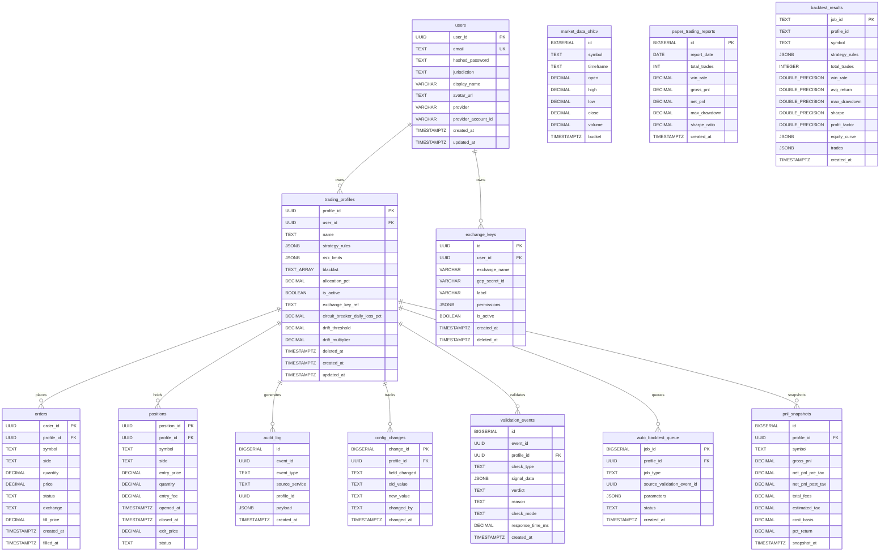

# Aion Trading Platform -- Data Model Reference

> Canonical reference for every table, column, enum, type alias, and time-series strategy
> in the Aion Trading Platform. All information is derived directly from the SQL migrations
> (`migrations/versions/001`--`008`) and the Python domain layer (`libs/core/`).

---

## Table of Contents

1. [Entity-Relationship Diagram](#entity-relationship-diagram)
2. [Table Definitions](#table-definitions)
3. [Financial Precision Audit](#financial-precision-audit)
4. [Enum Registry](#enum-registry)
5. [Type Alias Registry](#type-alias-registry)
6. [Migration History](#migration-history)
7. [Time-Series Data Strategy](#time-series-data-strategy)

---

## Entity-Relationship Diagram



---

## Table Definitions

### 1. `users`

**Source**: `migrations/versions/001_initial_schema.sql`, `migrations/versions/006_users_and_exchange_keys.sql`

User accounts. Originally created for password-based auth in Phase 1, then extended for OAuth (Google, GitHub) in Phase 2.

| Column | Type | Nullable | Default | Constraints | Business Meaning |
|--------|------|----------|---------|-------------|------------------|
| `user_id` | `UUID` | NO | `uuid_generate_v4()` | **PK** | Unique user identifier |
| `email` | `TEXT` | NO | -- | **UNIQUE** | Login email; unique across the system |
| `hashed_password` | `TEXT` | YES | -- | -- | Bcrypt hash. Nullable for OAuth-only users (migration 006) |
| `jurisdiction` | `TEXT` | YES | -- | -- | Tax/regulatory jurisdiction code. Nullable for OAuth-only users |
| `display_name` | `VARCHAR(255)` | NO | -- | -- | Human-readable name. Backfilled from email prefix for existing users |
| `avatar_url` | `TEXT` | YES | -- | -- | Profile image URL from OAuth provider |
| `provider` | `VARCHAR(50)` | NO | `'google'` | Part of **UNIQUE(provider, provider_account_id)** | OAuth provider name (`google`, `github`) |
| `provider_account_id` | `VARCHAR(255)` | YES | -- | Part of **UNIQUE(provider, provider_account_id)** | Provider-specific user ID |
| `created_at` | `TIMESTAMPTZ` | NO | `NOW()` | -- | Account creation timestamp |
| `updated_at` | `TIMESTAMPTZ` | NO | `NOW()` | -- | Last modification timestamp |

**Constraints**:
- `uq_provider_account` -- UNIQUE on `(provider, provider_account_id)` for OAuth deduplication.

---

### 2. `trading_profiles`

**Source**: `migrations/versions/001_initial_schema.sql`, `migrations/versions/007_profile_soft_delete.sql`

Each user owns one or more trading profiles. A profile encapsulates a complete trading strategy, risk configuration, and exchange binding.

| Column | Type | Nullable | Default | Constraints | Business Meaning |
|--------|------|----------|---------|-------------|------------------|
| `profile_id` | `UUID` | NO | `uuid_generate_v4()` | **PK** | Unique profile identifier |
| `user_id` | `UUID` | NO | -- | **FK -> users(user_id) ON DELETE CASCADE** | Owning user |
| `name` | `TEXT` | NO | -- | -- | Human-readable profile label |
| `strategy_rules` | `JSONB` | NO | -- | -- | JSON strategy configuration (indicators, thresholds, regime rules) |
| `risk_limits` | `JSONB` | NO | -- | -- | JSON risk parameters: `max_drawdown_pct`, `stop_loss_pct`, `circuit_breaker_daily_loss_pct`, `max_allocation_pct` |
| `blacklist` | `TEXT[]` | NO | `'{}'` | -- | Array of symbol pairs this profile must never trade |
| `allocation_pct` | `DECIMAL` | NO | -- | -- | Portfolio allocation percentage for this profile |
| `is_active` | `BOOLEAN` | NO | `FALSE` | -- | Whether the profile is actively trading |
| `exchange_key_ref` | `TEXT` | NO | -- | -- | Reference to the exchange credentials (see `exchange_keys`) |
| `circuit_breaker_daily_loss_pct` | `DECIMAL` | YES | -- | -- | Daily loss threshold for circuit breaker (e.g. `0.02` = 2%) |
| `drift_threshold` | `DECIMAL` | YES | -- | -- | Performance drift threshold for Sharpe comparison |
| `drift_multiplier` | `DECIMAL` | YES | -- | -- | Multiplier applied to stop-loss tolerance for drift halt calculation |
| `deleted_at` | `TIMESTAMPTZ` | YES | `NULL` | -- | Soft-delete timestamp. Non-null means profile is logically deleted |
| `created_at` | `TIMESTAMPTZ` | NO | `NOW()` | -- | Profile creation timestamp |
| `updated_at` | `TIMESTAMPTZ` | NO | `NOW()` | -- | Last modification timestamp |

**Indexes**:
- `idx_trading_profiles_active_not_deleted` -- Partial index on `(is_active, deleted_at)` WHERE `is_active = true AND deleted_at IS NULL`. Optimizes the most common query: "give me all live profiles."

---

### 3. `orders` (Hypertable)

**Source**: `migrations/versions/001_initial_schema.sql`

Every order placed by any trading profile. TimescaleDB hypertable partitioned on `created_at`.

| Column | Type | Nullable | Default | Constraints | Business Meaning |
|--------|------|----------|---------|-------------|------------------|
| `order_id` | `UUID` | NO | `uuid_generate_v4()` | **PK (order_id, created_at)** | Unique order identifier |
| `profile_id` | `UUID` | NO | -- | **FK -> trading_profiles(profile_id) ON DELETE RESTRICT** | Owning profile. RESTRICT prevents deleting a profile that has orders |
| `symbol` | `TEXT` | NO | -- | -- | Trading pair (e.g. `BTC/USDT`) |
| `side` | `TEXT` | NO | -- | -- | `BUY` or `SELL` (see `OrderSide` enum) |
| `quantity` | `DECIMAL` | NO | -- | -- | Order quantity in base asset units |
| `price` | `DECIMAL` | NO | -- | -- | Limit/requested price |
| `status` | `TEXT` | NO | -- | -- | Order lifecycle state (see `OrderStatus` enum) |
| `exchange` | `TEXT` | NO | -- | -- | Target exchange name |
| `fill_price` | `DECIMAL` | YES | -- | -- | Actual execution price. NULL until filled |
| `created_at` | `TIMESTAMPTZ` | NO | `NOW()` | **Part of composite PK** | Order submission timestamp. Hypertable partition key |
| `filled_at` | `TIMESTAMPTZ` | YES | -- | -- | Execution timestamp. NULL if not yet filled |

**Notes**:
- Composite primary key `(order_id, created_at)` is required by TimescaleDB -- the partition column must be part of any unique constraint.
- `ON DELETE RESTRICT` on `profile_id` prevents accidental deletion of profiles that have order history.

---

### 4. `positions`

**Source**: `migrations/versions/001_initial_schema.sql`

Tracks open and closed positions. Each position represents a discrete entry into a market.

| Column | Type | Nullable | Default | Constraints | Business Meaning |
|--------|------|----------|---------|-------------|------------------|
| `position_id` | `UUID` | NO | `uuid_generate_v4()` | **PK** | Unique position identifier |
| `profile_id` | `UUID` | NO | -- | **FK -> trading_profiles(profile_id) ON DELETE RESTRICT** | Owning profile |
| `symbol` | `TEXT` | NO | -- | -- | Trading pair |
| `side` | `TEXT` | NO | -- | -- | `BUY` (long) or `SELL` (short) |
| `entry_price` | `DECIMAL` | NO | -- | -- | Price at which the position was opened |
| `quantity` | `DECIMAL` | NO | -- | -- | Size in base asset units |
| `entry_fee` | `DECIMAL` | NO | -- | -- | Fee paid at entry (used in PnL calculation) |
| `opened_at` | `TIMESTAMPTZ` | NO | `NOW()` | -- | Position open timestamp |
| `closed_at` | `TIMESTAMPTZ` | YES | -- | -- | Position close timestamp. NULL while open |
| `exit_price` | `DECIMAL` | YES | -- | -- | Price at which the position was closed. NULL while open |
| `status` | `TEXT` | YES | `'OPEN'` | -- | `OPEN` or `CLOSED` (see `PositionStatus` enum) |

---

### 5. `audit_log` (Hypertable)

**Source**: `migrations/versions/002_audit_tables.sql`

Append-only event log for every significant system event. Used for debugging, compliance, and post-incident analysis.

| Column | Type | Nullable | Default | Constraints | Business Meaning |
|--------|------|----------|---------|-------------|------------------|
| `id` | `BIGSERIAL` | NO | auto | -- | Internal row ID (not a primary key -- hypertable) |
| `event_id` | `UUID` | NO | -- | -- | Unique event identifier for correlation |
| `event_type` | `TEXT` | NO | -- | -- | Event category (see `EventType` enum, 19 values) |
| `source_service` | `TEXT` | NO | -- | -- | Service that emitted the event (e.g. `executor`, `validation`, `pnl`) |
| `profile_id` | `UUID` | YES | -- | -- | Associated profile. NULL for system-wide events |
| `payload` | `JSONB` | NO | -- | -- | Full event data. Schema varies by `event_type` |
| `created_at` | `TIMESTAMPTZ` | NO | `NOW()` | -- | Event timestamp. Hypertable partition key |

**Notes**:
- No primary key constraint. TimescaleDB hypertable on `created_at`.
- `profile_id` is intentionally not a foreign key to avoid cascade issues and to allow events for deleted profiles to persist.

---

### 6. `config_changes`

**Source**: `migrations/versions/002_audit_tables.sql`

Tracks every configuration change to a trading profile for audit trail purposes.

| Column | Type | Nullable | Default | Constraints | Business Meaning |
|--------|------|----------|---------|-------------|------------------|
| `change_id` | `BIGSERIAL` | NO | auto | **PK** | Unique change record ID |
| `profile_id` | `UUID` | NO | -- | **FK -> trading_profiles(profile_id) ON DELETE CASCADE** | Profile that was modified |
| `field_changed` | `TEXT` | NO | -- | -- | Name of the field that was modified |
| `old_value` | `TEXT` | YES | -- | -- | Previous value (serialized to text) |
| `new_value` | `TEXT` | YES | -- | -- | New value (serialized to text) |
| `changed_by` | `TEXT` | NO | -- | -- | Identity of who made the change (user ID or `system`) |
| `changed_at` | `TIMESTAMPTZ` | NO | `NOW()` | -- | Timestamp of the change |

---

### 7. `validation_events` (Hypertable)

**Source**: `migrations/versions/003_validation_log.sql`

Records every validation check result (fast gate and async audit). Used for audit, drift analysis, and escalation tracking.

| Column | Type | Nullable | Default | Constraints | Business Meaning |
|--------|------|----------|---------|-------------|------------------|
| `id` | `BIGSERIAL` | NO | auto | -- | Internal row ID |
| `event_id` | `UUID` | NO | -- | -- | Correlation ID linking to the originating signal |
| `profile_id` | `UUID` | NO | -- | **FK -> trading_profiles(profile_id) ON DELETE CASCADE** | Profile being validated |
| `check_type` | `TEXT` | NO | -- | -- | Which check ran (see `ValidationCheck` enum) |
| `signal_data` | `JSONB` | NO | -- | -- | The signal payload that was validated |
| `verdict` | `TEXT` | NO | -- | -- | `GREEN`, `AMBER`, or `RED` (see `ValidationVerdict` enum) |
| `reason` | `TEXT` | YES | -- | -- | Human-readable explanation when verdict is not GREEN |
| `check_mode` | `TEXT` | NO | -- | -- | `FAST_GATE` or `ASYNC_AUDIT` (see `ValidationMode` enum) |
| `response_time_ms` | `DECIMAL` | NO | -- | -- | Execution time of the check in milliseconds |
| `created_at` | `TIMESTAMPTZ` | NO | `NOW()` | -- | Check execution timestamp. Hypertable partition key |

---

### 8. `auto_backtest_queue`

**Source**: `migrations/versions/003_validation_log.sql`

Job queue for automatically triggered backtests. A validation event (especially drift or escalation) can enqueue a backtest job.

| Column | Type | Nullable | Default | Constraints | Business Meaning |
|--------|------|----------|---------|-------------|------------------|
| `job_id` | `BIGSERIAL` | NO | auto | **PK** | Unique job ID |
| `profile_id` | `UUID` | NO | -- | **FK -> trading_profiles(profile_id) ON DELETE CASCADE** | Profile to backtest |
| `job_type` | `TEXT` | NO | -- | -- | Type of backtest job |
| `source_validation_event_id` | `UUID` | NO | -- | -- | The validation event that triggered this backtest |
| `parameters` | `JSONB` | NO | -- | -- | Backtest configuration (timeframe, symbols, date range) |
| `status` | `TEXT` | NO | `'pending'` | -- | Job state: `pending`, `running`, `completed`, `failed` |
| `created_at` | `TIMESTAMPTZ` | NO | `NOW()` | -- | Job creation timestamp |

---

### 9. `pnl_snapshots` (Hypertable)

**Source**: `migrations/versions/004_pnl_snapshots.sql`

Point-in-time profit and loss snapshots per profile and symbol. Includes tax estimates and fee breakdowns.

| Column | Type | Nullable | Default | Constraints | Business Meaning |
|--------|------|----------|---------|-------------|------------------|
| `id` | `BIGSERIAL` | NO | auto | -- | Internal row ID |
| `profile_id` | `UUID` | NO | -- | **FK -> trading_profiles(profile_id) ON DELETE CASCADE** | Owning profile |
| `symbol` | `TEXT` | NO | -- | -- | Trading pair |
| `gross_pnl` | `DECIMAL` | NO | -- | -- | Raw profit/loss before fees and taxes |
| `net_pnl_pre_tax` | `DECIMAL` | NO | -- | -- | PnL after fees, before taxes |
| `net_pnl_post_tax` | `DECIMAL` | NO | -- | -- | PnL after fees and estimated taxes |
| `total_fees` | `DECIMAL` | NO | -- | -- | Sum of entry and exit fees |
| `estimated_tax` | `DECIMAL` | NO | -- | -- | Estimated tax liability |
| `cost_basis` | `DECIMAL` | NO | -- | -- | Total cost of the position (entry_price * quantity) |
| `pct_return` | `DECIMAL` | NO | -- | -- | Percentage return: `net_post_tax / cost_basis` |
| `snapshot_at` | `TIMESTAMPTZ` | NO | `NOW()` | -- | Snapshot timestamp. Hypertable partition key |

---

### 10. `market_data_ohlcv` (Hypertable)

**Source**: `migrations/versions/004_pnl_snapshots.sql`

Aggregated candlestick data. Used by strategy evaluation, validation checks (CHECK_1 RSI recheck), and drift analysis.

| Column | Type | Nullable | Default | Constraints | Business Meaning |
|--------|------|----------|---------|-------------|------------------|
| `id` | `BIGSERIAL` | NO | auto | -- | Internal row ID |
| `symbol` | `TEXT` | NO | -- | -- | Trading pair |
| `timeframe` | `TEXT` | NO | -- | -- | Candle interval (e.g. `1m`, `5m`, `1h`, `1d`) |
| `open` | `DECIMAL` | NO | -- | -- | Opening price |
| `high` | `DECIMAL` | NO | -- | -- | Highest price in the interval |
| `low` | `DECIMAL` | NO | -- | -- | Lowest price in the interval |
| `close` | `DECIMAL` | NO | -- | -- | Closing price |
| `volume` | `DECIMAL` | NO | -- | -- | Volume traded in the interval |
| `bucket` | `TIMESTAMPTZ` | NO | -- | -- | Interval start timestamp. Hypertable partition key |

**Indexes**:
- `market_data_ohlcv_uniq_idx` -- UNIQUE on `(symbol, timeframe, bucket)`. Prevents duplicate candles for the same symbol/timeframe/bucket combination.

---

### 11. `paper_trading_reports`

**Source**: `migrations/versions/005_paper_trading.sql`

Daily aggregated reports from the paper trading simulator.

| Column | Type | Nullable | Default | Constraints | Business Meaning |
|--------|------|----------|---------|-------------|------------------|
| `id` | `BIGSERIAL` | NO | auto | **PK** | Internal row ID |
| `report_date` | `DATE` | NO | -- | -- | The trading day this report covers |
| `total_trades` | `INT` | NO | `0` | -- | Total number of trades executed |
| `win_rate` | `DECIMAL` | NO | `0.0` | -- | Fraction of profitable trades |
| `gross_pnl` | `DECIMAL` | NO | `0.0` | -- | Total gross PnL for the day |
| `net_pnl` | `DECIMAL` | NO | `0.0` | -- | Net PnL after fees |
| `max_drawdown` | `DECIMAL` | NO | `0.0` | -- | Maximum drawdown during the day |
| `sharpe_ratio` | `DECIMAL` | NO | `0.0` | -- | Daily Sharpe ratio |
| `created_at` | `TIMESTAMPTZ` | NO | `NOW()` | -- | Report generation timestamp |

**Indexes**:
- `idx_paper_trading_reports_date` -- UNIQUE on `(report_date)`. One report per day.

---

### 12. `exchange_keys`

**Source**: `migrations/versions/006_users_and_exchange_keys.sql`

Stores references to exchange API credentials held in GCP Secret Manager. **Never stores plaintext API keys** -- only the `gcp_secret_id` pointer.

| Column | Type | Nullable | Default | Constraints | Business Meaning |
|--------|------|----------|---------|-------------|------------------|
| `id` | `UUID` | NO | `uuid_generate_v4()` | **PK** | Unique key record ID |
| `user_id` | `UUID` | NO | -- | **FK -> users(user_id) ON DELETE CASCADE** | Owning user |
| `exchange_name` | `VARCHAR(100)` | NO | -- | Part of **UNIQUE(user_id, exchange_name, label)** | Exchange identifier (e.g. `binance`, `coinbase`) |
| `gcp_secret_id` | `VARCHAR(512)` | NO | -- | -- | GCP Secret Manager resource ID (or local Fernet reference) |
| `label` | `VARCHAR(255)` | YES | -- | Part of **UNIQUE(user_id, exchange_name, label)** | User-friendly label (e.g. "My Binance Main") |
| `permissions` | `JSONB` | YES | `'[]'` | -- | Permission array (e.g. `["read", "trade"]`) |
| `is_active` | `BOOLEAN` | NO | `true` | -- | Whether this key is currently usable |
| `created_at` | `TIMESTAMPTZ` | NO | `NOW()` | -- | Key registration timestamp |
| `deleted_at` | `TIMESTAMPTZ` | YES | -- | -- | Soft-delete timestamp |

**Indexes**:
- `idx_exchange_keys_user` -- On `(user_id)` WHERE `deleted_at IS NULL`. Filters out soft-deleted keys.

**Constraints**:
- `uq_user_exchange` -- UNIQUE on `(user_id, exchange_name, label)`. A user cannot have two keys with the same exchange and label.

---

### 13. `backtest_results`

**Source**: `migrations/versions/008_backtest_results.sql`

Stores completed backtest outputs. Used by drift detection (CHECK_4) to compare live performance against backtested expectations.

| Column | Type | Nullable | Default | Constraints | Business Meaning |
|--------|------|----------|---------|-------------|------------------|
| `job_id` | `TEXT` | NO | -- | **PK** | Unique job identifier (matches `auto_backtest_queue.job_id` by convention) |
| `profile_id` | `TEXT` | NO | `''` | -- | Profile that was backtested. **TEXT, not UUID** -- see precision audit |
| `symbol` | `TEXT` | NO | -- | -- | Symbol pair backtested |
| `strategy_rules` | `JSONB` | NO | `'{}'` | -- | Strategy configuration used for the backtest |
| `total_trades` | `INTEGER` | NO | `0` | -- | Total trades in the simulation |
| `win_rate` | `DOUBLE PRECISION` | NO | `0.0` | -- | Fraction of winning trades. **DEFECT: should be DECIMAL** |
| `avg_return` | `DOUBLE PRECISION` | NO | `0.0` | -- | Average return per trade. **DEFECT: should be DECIMAL** |
| `max_drawdown` | `DOUBLE PRECISION` | NO | `0.0` | -- | Maximum drawdown during the backtest. **DEFECT: should be DECIMAL** |
| `sharpe` | `DOUBLE PRECISION` | NO | `0.0` | -- | Sharpe ratio. **DEFECT: should be DECIMAL** |
| `profit_factor` | `DOUBLE PRECISION` | NO | `0.0` | -- | Gross profit / gross loss. **DEFECT: should be DECIMAL** |
| `equity_curve` | `JSONB` | NO | `'[]'` | -- | Array of equity values over time |
| `trades` | `JSONB` | NO | `'[]'` | -- | Array of individual trade records |
| `created_at` | `TIMESTAMPTZ` | NO | `NOW()` | -- | Backtest completion timestamp |

**Indexes**:
- `idx_backtest_results_profile` -- On `(profile_id)`.
- `idx_backtest_results_symbol` -- On `(symbol)`.
- `idx_backtest_results_created` -- On `(created_at DESC)`.

**Design Notes**:
- `profile_id` is `TEXT` (not `UUID`) and has no foreign key constraint. This is a design inconsistency -- it means backtest results can reference nonexistent profiles.
- The five `DOUBLE PRECISION` columns are flagged as precision defects. See the [Financial Precision Audit](#financial-precision-audit) section.

---

## Financial Precision Audit

Financial calculations require deterministic, arbitrary-precision arithmetic. IEEE 754 floating-point (`float` in Python, `DOUBLE PRECISION` in PostgreSQL) introduces rounding errors that compound over thousands of trades. This section catalogs every monetary or percentage field and its current precision status.

### Summary

| Layer | Correct (`DECIMAL` / `Decimal`) | Defective (`DOUBLE PRECISION` / `float`) | Total |
|-------|:-------------------------------:|:----------------------------------------:|:-----:|
| Database (SQL) | 30+ columns | 5 columns (`backtest_results`) | 35+ |
| Python dataclass (`PnLSnapshot`) | 0 fields | 7 fields | 7 |
| Python runtime (`float()` casts) | -- | 24+ call sites | 24+ |

### Database Layer Defects

All tables use `DECIMAL` for monetary and percentage columns **except** `backtest_results`:

| Table | Column | Current Type | Required Type | Severity |
|-------|--------|-------------|---------------|----------|
| `backtest_results` | `win_rate` | `DOUBLE PRECISION` | `DECIMAL` | Medium |
| `backtest_results` | `avg_return` | `DOUBLE PRECISION` | `DECIMAL` | **High** -- used in drift comparison |
| `backtest_results` | `max_drawdown` | `DOUBLE PRECISION` | `DECIMAL` | **High** -- used in risk checks |
| `backtest_results` | `sharpe` | `DOUBLE PRECISION` | `DECIMAL` | **High** -- used in drift detection (CHECK_4) |
| `backtest_results` | `profit_factor` | `DOUBLE PRECISION` | `DECIMAL` | Medium |

**Impact**: The `sharpe` column feeds directly into CHECK_4 drift detection (`services/validation/src/check_4_drift.py`). Floating-point drift in the stored value can cause false positives or false negatives when comparing against live Sharpe calculations.

### Python Layer Defects

#### `PnLSnapshot` dataclass (`services/pnl/src/calculator.py`)

Every field in the `PnLSnapshot` dataclass is declared as `float`:

| Field | Current Type | Required Type | Used In |
|-------|-------------|---------------|---------|
| `gross_pnl` | `float` | `Decimal` | PnL reporting, audit |
| `fees` | `float` | `Decimal` | PnL calculation |
| `net_pre_tax` | `float` | `Decimal` | PnL reporting |
| `net_post_tax` | `float` | `Decimal` | Portfolio valuation |
| `pct_return` | `float` | `Decimal` | Drift detection, dashboards |
| `tax_estimate` | `float` | `Decimal` | Tax reporting |
| `position_id` | `str` | `str` | OK (not monetary) |

#### `float()` Conversions in Hot Path

The following modules convert `Decimal` domain types to `float` for arithmetic, discarding precision:

| Module | File | Approximate `float()` Calls | Risk |
|--------|------|:---------------------------:|------|
| Risk Gate | `services/hot_path/src/risk_gate.py` | 4 | Position sizing errors |
| Circuit Breaker | `services/hot_path/src/circuit_breaker.py` | 1 | Threshold comparison drift |
| Abstention | `services/hot_path/src/abstention.py` | 1 | Whipsaw filter inaccuracy |
| PnL Calculator | `services/pnl/src/calculator.py` | 5 | Compounding rounding errors |
| CHECK_1 Strategy | `services/validation/src/check_1_strategy.py` | 3+ | RSI divergence false positives |
| CHECK_4 Drift | `services/validation/src/check_4_drift.py` | 5+ | Sharpe comparison inaccuracy |
| CHECK_6 Risk Level | `services/validation/src/check_6_risk_level.py` | 5+ | Risk limit bypass risk |
| Risk Service | `services/risk/src/__init__.py` | 4+ | Hard cap comparison drift |

### Remediation Priority

1. **P0** -- Migrate `backtest_results` columns to `DECIMAL`. These feed drift detection and risk checks.
2. **P0** -- Refactor `PnLSnapshot` to use `Decimal` throughout. PnL errors compound and affect tax estimates.
3. **P1** -- Eliminate `float()` casts in `risk_gate.py`, `circuit_breaker.py`, and `check_6_risk_level.py`. These are on the order execution critical path.
4. **P2** -- Eliminate remaining `float()` casts in validation checks and PnL calculator.

---

## Enum Registry

All enums are defined in `libs/core/enums.py`. Every enum inherits from `(str, Enum)` to ensure JSON serialization compatibility.

### `OrderSide`

Direction of an order.

| Value | Meaning |
|-------|---------|
| `BUY` | Long entry or short cover |
| `SELL` | Long exit or short entry |

### `OrderStatus`

Lifecycle state of an order.

| Value | Meaning |
|-------|---------|
| `PENDING` | Created but not yet submitted to exchange |
| `SUBMITTED` | Sent to exchange, awaiting confirmation |
| `CONFIRMED` | Exchange has acknowledged and filled the order |
| `ROLLED_BACK` | Order was reversed due to a post-trade check failure |
| `REJECTED` | Pre-trade validation or exchange rejected the order |
| `CANCELLED` | User or system cancelled the order before fill |

### `EventType`

Categories for `audit_log.event_type`. 19 values covering the full signal-to-execution lifecycle.

| Value | Category | Meaning |
|-------|----------|---------|
| `MARKET_TICK` | Data | New market tick received |
| `SIGNAL_GENERATED` | Signal | Strategy generated a trade signal |
| `SIGNAL_ABSTAINED` | Signal | Strategy chose to abstain (no trade) |
| `ORDER_APPROVED` | Execution | Order passed all pre-trade checks |
| `ORDER_REJECTED` | Execution | Order failed pre-trade validation |
| `ORDER_EXECUTED` | Execution | Order successfully filled on exchange |
| `ORDER_FAILED` | Execution | Order submission or fill failed |
| `CIRCUIT_BREAKER_TRIGGERED` | Risk | Daily loss circuit breaker activated |
| `BLACKLIST_BLOCKED` | Risk | Trade blocked by symbol blacklist |
| `VALIDATION_PROCEED` | Validation | Validation checks passed (GREEN) |
| `VALIDATION_BLOCK` | Validation | Validation checks blocked the trade (RED) |
| `VALIDATION_TIMEOUT` | Validation | Validation check exceeded time budget |
| `REGIME_CHANGE` | Market | Detected shift in market regime |
| `PNL_UPDATE` | PnL | New PnL snapshot calculated |
| `ALERT_AMBER` | Alert | Warning-level alert raised |
| `ALERT_RED` | Alert | Critical alert -- may trigger trading halt |
| `SYSTEM_ALERT` | Alert | System-level alert (infrastructure, connectivity) |
| `THRESHOLD_PROXIMITY` | Alert | A risk parameter is approaching its limit |
| `REGIME_DISAGREEMENT` | Market | Rule-based and HMM regime classifiers disagree |

### `Regime`

Market regime classification. Used by abstention logic and position sizing.

| Value | Meaning |
|-------|---------|
| `TRENDING_UP` | Sustained upward price movement |
| `TRENDING_DOWN` | Sustained downward price movement |
| `RANGE_BOUND` | Price oscillating within a horizontal channel |
| `HIGH_VOLATILITY` | Elevated volatility without clear direction. Triggers 30% position size reduction |
| `CRISIS` | Extreme market conditions. **Blocks all new trades** via abstention |

### `ValidationCheck`

Identifies which validation check produced a result.

| Value | Check Name | Mode | Description |
|-------|------------|------|-------------|
| `CHECK_1_STRATEGY` | Strategy Recheck | FAST_GATE | Verifies signal RSI against independent calculation |
| `CHECK_2_HALLUCINATION` | Hallucination Detection | ASYNC_AUDIT | Monitors LLM sentiment accuracy over rolling 20-event window |
| `CHECK_3_BIAS` | Directional Bias | ASYNC_AUDIT | Detects statistically significant buy/sell imbalance |
| `CHECK_4_DRIFT` | Performance Drift | ASYNC_AUDIT | Compares live Sharpe to backtest Sharpe |
| `CHECK_5_ESCALATION` | Escalation | ASYNC_AUDIT | Promotes repeated AMBERs to RED; publishes halt keys |
| `CHECK_6_RISK_LEVEL` | Risk Level | FAST_GATE | Validates order against portfolio risk limits |

### `ValidationVerdict`

Traffic-light outcome of a validation check.

| Value | Meaning | Action |
|-------|---------|--------|
| `GREEN` | Check passed | Proceed with trade |
| `AMBER` | Warning | Log warning; 5 AMBERs in 24h auto-escalate to RED (CHECK_5) |
| `RED` | Check failed | Block trade; may trigger trading halt |

### `ValidationMode`

Execution context for validation checks.

| Value | Meaning |
|-------|---------|
| `FAST_GATE` | Synchronous, on the critical path. Must complete within 35ms. Runs CHECK_1 + CHECK_6 in parallel |
| `ASYNC_AUDIT` | Asynchronous, post-decision. Runs CHECK_2 through CHECK_5. Does not block trade execution |

### `SignalDirection`

Output of strategy evaluation.

| Value | Meaning |
|-------|---------|
| `BUY` | Strategy recommends a long entry |
| `SELL` | Strategy recommends a short entry or long exit |
| `ABSTAIN` | Strategy has no actionable signal. Triggers abstention |

### `PositionStatus`

Lifecycle state of a position.

| Value | Meaning |
|-------|---------|
| `OPEN` | Position is currently held |
| `CLOSED` | Position has been exited |

---

## Type Alias Registry

Defined in `libs/core/types.py`. These type aliases provide semantic meaning to primitive types throughout the Python codebase.

| Alias | Underlying Type | Meaning |
|-------|----------------|---------|
| `Price` | `Decimal` | Asset price. Arbitrary precision |
| `Quantity` | `Decimal` | Order or position size. Arbitrary precision |
| `Percentage` | `Decimal` | Fractional percentage (e.g. `0.02` = 2%). Arbitrary precision |
| `ProfileId` | `str` | UUID string identifying a trading profile |
| `SymbolPair` | `str` | Trading pair identifier (e.g. `BTC/USDT`) |
| `ExchangeName` | `str` | Exchange identifier (e.g. `binance`) |
| `Timestamp` | `int` | Microsecond UTC timestamp. Integer to avoid float precision issues |

---

## Migration History

| Migration | File | Tables Created / Modified | Rationale |
|-----------|------|---------------------------|-----------|
| 001 | `migrations/versions/001_initial_schema.sql` | `users`, `trading_profiles`, `orders` (hypertable), `positions` | Core schema. Establishes user accounts, trading profiles with strategy/risk config, order tracking, and position management. Enables `uuid-ossp` extension |
| 002 | `migrations/versions/002_audit_tables.sql` | `audit_log` (hypertable), `config_changes` | Observability layer. Provides an append-only event log for every system event and a change-tracking table for profile configuration edits |
| 003 | `migrations/versions/003_validation_log.sql` | `validation_events` (hypertable), `auto_backtest_queue` | Validation infrastructure. Records every validation check result with timing data. Adds a job queue for automatically triggered backtests |
| 004 | `migrations/versions/004_pnl_snapshots.sql` | `pnl_snapshots` (hypertable), `market_data_ohlcv` (hypertable) | Financial data. Point-in-time PnL snapshots with tax/fee breakdown. OHLCV candlestick storage with unique constraint on (symbol, timeframe, bucket) |
| 005 | `migrations/versions/005_paper_trading.sql` | `paper_trading_reports` | Simulation reporting. Daily aggregate metrics from the paper trading simulator. Unique index on `report_date` enforces one report per day |
| 006 | `migrations/versions/006_users_and_exchange_keys.sql` | `users` (ALTER), `exchange_keys` | Phase 2 OAuth support. Adds `display_name`, `avatar_url`, `provider`, `provider_account_id` to users. Makes `hashed_password` and `jurisdiction` nullable for OAuth-only users. Adds `exchange_keys` table with GCP Secret Manager references |
| 007 | `migrations/versions/007_profile_soft_delete.sql` | `trading_profiles` (ALTER) | Soft delete. Adds `deleted_at` column and a partial index for efficient querying of active, non-deleted profiles |
| 008 | `migrations/versions/008_backtest_results.sql` | `backtest_results` | Backtest storage. Stores simulation results including equity curves and trade lists. **Note**: Uses `DOUBLE PRECISION` for 5 financial columns -- see precision audit |

---

## Time-Series Data Strategy

### Hypertable Overview

Aion uses [TimescaleDB](https://www.timescale.com/) hypertables for all high-volume, time-ordered data. TimescaleDB automatically partitions these tables into time-based chunks for efficient insertion and range queries.

| Table | Partition Column | Write Pattern | Query Pattern |
|-------|-----------------|---------------|---------------|
| `orders` | `created_at` | Burst writes during trading hours | Range scans for order history, status filtering |
| `audit_log` | `created_at` | Continuous append from all services | Range scans for debugging and compliance. Filtered by `event_type` and `profile_id` |
| `validation_events` | `created_at` | Burst writes per signal cycle | Aggregations for escalation (amber count in 24h), drift analysis |
| `pnl_snapshots` | `snapshot_at` | Periodic snapshots (per position update) | Range scans for PnL reporting, drift detection (7-day window) |
| `market_data_ohlcv` | `bucket` | Continuous ingest from market feeds | Point lookups by (symbol, timeframe, bucket). Range scans for indicator calculation |

### Composite Primary Keys

TimescaleDB requires the partition column to be included in any unique constraint. This is why `orders` uses a composite primary key `(order_id, created_at)` instead of just `(order_id)`.

### Querying Patterns

**Recent orders for a profile**:
```sql
SELECT * FROM orders
WHERE profile_id = :profile_id
  AND created_at > NOW() - INTERVAL '24 hours'
ORDER BY created_at DESC;
```

**PnL snapshots for drift detection (7-day window)**:
```sql
SELECT pct_return FROM pnl_snapshots
WHERE profile_id = :profile_id
  AND snapshot_at BETWEEN :week_ago AND :now
ORDER BY snapshot_at ASC;
```

**OHLCV candles for strategy recheck (CHECK_1)**:
```sql
SELECT close FROM market_data_ohlcv
WHERE symbol = :symbol
  AND timeframe = '5m'
ORDER BY bucket DESC
LIMIT 20;
```

**Validation event aggregation for escalation (CHECK_5)**:
```sql
SELECT COUNT(*) FROM validation_events
WHERE profile_id = :profile_id
  AND check_type = :check_type
  AND verdict = 'AMBER'
  AND created_at > NOW() - INTERVAL '24 hours';
```

### Retention Policy Considerations

No retention policies are currently configured in the migrations. For production, consider:

| Table | Suggested Retention | Rationale |
|-------|-------------------|-----------|
| `market_data_ohlcv` | 90 days for `1m`, unlimited for `1d` | Minute-level data grows fastest; daily data is compact |
| `audit_log` | 1 year | Compliance requirements; compress after 30 days |
| `validation_events` | 6 months | Needed for drift analysis; compress after 30 days |
| `pnl_snapshots` | Unlimited | Financial records; compress after 90 days |
| `orders` | Unlimited | Trade history; compress after 90 days |

TimescaleDB compression and retention policies can be added with:

```sql
-- Enable compression on audit_log (chunks older than 30 days)
ALTER TABLE audit_log SET (
    timescaledb.compress,
    timescaledb.compress_segmentby = 'profile_id',
    timescaledb.compress_orderby = 'created_at DESC'
);

SELECT add_compression_policy('audit_log', INTERVAL '30 days');

-- Drop chunks older than 1 year
SELECT add_retention_policy('audit_log', INTERVAL '1 year');
```
