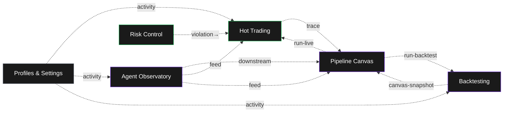

# Praxis — Information Architecture

This document maps **what surfaces exist**, **how they relate**, and **why the IA is shaped this way**. It is the grounding for every screen spec in `05-surface-specs/`.

---

## 1. The six surfaces

Praxis exposes six top-level surfaces, each tied to one of the three modes from `01-design-philosophy.md`. The IA is deliberately flat — six destinations, not nested menus — because trading workflows punish navigation depth.

| # | Surface | Mode | Primary user task | Backed by services |
|---|---|---|---|---|
| 1 | **Hot Trading** | HOT | Place/manage orders against live market data | `api_gateway`, `ingestion`, `hot_path`, `validation`, `execution`, `pnl` |
| 2 | **Agent Observatory** | COOL (Hot when live) | Watch AI agents reason; intervene if needed | `analyst`, `debate`, `ta_agent`, `regime_hmm`, `sentiment`, `slm_inference` |
| 3 | **Pipeline Canvas** | COOL | Compose / edit trading profile pipelines (the canvas) | `strategy`, `pipeline_compiler` (lib) |
| 4 | **Backtesting & Analytics** | COOL | Evaluate strategies historically; compare runs | `backtesting`, `analyst`, `archiver` |
| 5 | **Risk Control** | HOT | Monitor exposure; arm/disarm kill switch | `risk`, `pnl`, `rate_limiter`, kill switch (Redis) |
| 6 | **Profiles & Settings** | CALM | Configure profiles, exchange keys, tax, account | `api_gateway`, `tax`, auth |

> **Critical-path note (enterprise architect lens):** The split between Hot Trading and Risk Control is deliberate even though both are HOT mode. Risk Control is the *only* surface that must remain responsive when everything else is degraded — including when the user themselves is the problem. It gets its own surface, its own keyboard binding (`Cmd+Shift+K` for kill switch), and its own session-level resilience. Bundling it into Hot Trading would be a category error.

---

## 2. The navigation model

### 2.1 Top-level chrome

A persistent **left rail** (collapsible to icons) with the six surfaces, ordered by frequency of use:

```
┌──────┐
│  ⚡   │ Hot Trading       (default)
│  🤖   │ Agent Observatory
│  ⊕   │ Pipeline Canvas
│  📊   │ Backtesting
│  🛡   │ Risk Control
│  ⚙   │ Profiles & Settings
├──────┤
│  ?   │ Keyboard reference (modal)
│  ◯   │ Session/profile switcher
└──────┘
```

> Iconography is a placeholder — actual icons must be a single-stroke 1.5px outlined set, perfectly square at 20×20, optical-aligned. Lucide icons are an acceptable starting point but the final set should be custom-cut.

### 2.2 Surface-level chrome

Each surface gets a thin **top bar** (44px) carrying:
- breadcrumb (e.g., `Hot Trading > BTC-PERP`)
- session/profile selector (dropdown, shows active profile name)
- live status pills (connection, kill-switch state, regime indicator, last-tick latency)
- right-aligned: search (`Cmd+K`), notifications, user menu

The status pills are the *only* place the kill-switch state appears outside Risk Control — visible on every surface, always. If the kill switch is armed, every surface dims its background by 4%.

### 2.3 Command palette (Cmd+K)

A unified palette covering:
- navigation ("go to BTC-PERP", "open profile X")
- actions ("place market order", "arm kill switch", "run backtest")
- agent queries ("what is the regime agent saying about ETH right now?")

This is the "Bloomberg function code" of Praxis. Every action documentable in the palette must also be exposed in its native UI — the palette is a power-user accelerator, not a hidden feature.

---

## 3. Cross-surface linkage rules

These are the IA rules that enforce P4 ("the canvas is the source of truth") from the philosophy doc:

| From | To | Triggered by | Why |
|---|---|---|---|
| Hot Trading order row | Pipeline Canvas node that fired it | click "trace" on order | every order is a pipeline output; the user must be one click from the cause |
| Agent Observatory signal | Canvas node consuming it | click "downstream" on signal | agent outputs feed the strategy_eval node; show that wiring |
| Backtest result | Canvas snapshot at run time | click "view canvas as run" | strategies evolve; you must be able to inspect the *exact* canvas the test ran |
| Risk violation | Hot Trading + violating order | click on violation entry | violations are evidence; the user shouldn't grep for context |
| Profile in settings | Last 7 days of activity | click "activity" | profiles are configurations + history together |

**No surface should be a dead end.** Every signal, order, agent output, or profile must link to its upstream source and downstream consumer. The IA is a graph, the rail is just an entry point.

---

## 4. State display contract

A common header pattern across all surfaces:

```
┌─────────────────────────────────────────────────────────────────┐
│  ⚡ Hot Trading > BTC-PERP        Profile: Aggressive-v3       │
│  ◉ live  ⚠ regime: choppy  ⏱ 12ms  🛡 armed-soft             │
└─────────────────────────────────────────────────────────────────┘
```

Pills, left-to-right, each surface picks the relevant subset:

| Pill | Meaning | Visual |
|---|---|---|
| `◉ live` / `◯ replay` | live data vs. backtest replay vs. paper | green dot / gray ring |
| `⚠ regime: choppy` | output of regime_hmm | amber if non-trending |
| `⏱ 12ms` | tick-to-render latency | green <50ms, amber 50–200, red >200 |
| `🛡 armed-soft` | kill-switch state | normal / amber (soft) / red (hard) |
| `🤖 5 agents` | active agent count | neutral, click to expand |
| `⚖ +0.84` | live PnL | bid-green if +, ask-red if − |

These pills are clickable. Clicking `regime: choppy` opens a drawer summarizing the regime model's current state and the last 24h of regime transitions, sourced from the `regime_hmm` service. This is the contract: **every chrome element either does nothing or is a drill-in to a meaningful surface.**

---

## 5. Density modes

Each surface supports three density modes (toggle in top-right of surface):

| Mode | Hot Trading | Cool surfaces | Calm surfaces |
|---|---|---|---|
| **Compact** | row 24px, font 12px | row 32px, font 13px | row 44px, font 14px |
| **Standard** (default) | row 28px, font 13px | row 40px, font 14px | row 52px, font 15px |
| **Comfortable** | row 36px, font 14px | row 48px, font 14px | row 64px, font 16px |

Persisted per-user, per-surface. The default lands at "Standard" because users will discover the toggle if they want denser; we don't want to start them at "compact" and lose them in the first session.

---

## 6. Anti-patterns (explicit IA rejections)

These are choices we are deliberately *not* making, and why:

| Pattern | Why we reject it |
|---|---|
| **Tabs inside surfaces for sub-views** | Tabs hide state. Every meaningful sub-view should be its own surface or a peer panel. |
| **Modal dialogs for primary workflows** | Modals interrupt; trading is a flow. Reserve modals for true "are-you-sure" moments and rare configural choices. |
| **Notification toasts for critical events** | Toasts disappear. Critical events (fills, violations, kill-switch trips) get persistent inline rows + audible cue (opt-in). |
| **Per-symbol detail pages** | Symbols are dimensions, not pages. The same Hot Trading surface re-binds to the selected symbol; the URL carries it. Saves users from "which BTC tab am I in?". |
| **Wizards for new profiles** | Wizards bury power. The Pipeline Canvas itself is the profile editor; a "new profile" is just an empty canvas with optional templates. |
| **Hamburger menus on desktop** | We have screen real estate. The left rail is permanent. Mobile is a separate concern (see §7). |

---

## 7. Mobile / smaller viewport notes

Praxis is desktop-first. Mobile considerations:

- **Hot Trading** mobile is *monitor-only* — view positions, view orders, view PnL, kill switch. **No order entry on mobile.** This is a deliberate safety stance; mobile order entry on a derivatives platform invites fat-finger trades.
- **Risk Control** mobile is the kill switch and a one-screen exposure summary, nothing else.
- **Cool surfaces** degrade gracefully but are not optimized for mobile. Canvas editing is unusable below ~1024px and we don't pretend otherwise.
- **Calm surfaces** are responsive — settings and profiles can be edited from a phone.

This is opinionated. The alternative (full mobile parity) is what every consumer crypto app does and it's why mobile crypto trading produces so many regret-trades. Praxis is for users who plan their trades and execute them deliberately, mostly from a workstation.

---

## 8. URL & session model

URLs are the canonical state. Examples:

```
/hot/BTC-PERP                          — Hot Trading bound to BTC-PERP
/agents/observatory?focus=regime_hmm   — Observatory with regime agent expanded
/canvas/Aggressive-v3                  — canvas for profile "Aggressive-v3"
/backtests/run-9342                    — specific backtest run
/risk                                  — risk dashboard
/settings/profiles/Aggressive-v3       — settings for that profile
```

All filters, time ranges, and selected agents serialize into query params. This makes URLs shareable between teammates, archivable in incident reports, and reproducible.

---

## 9. The IA as a graph (mermaid)



The Canvas is intentionally the highest-degree node — it is the hub. This is the IA echo of P4.
