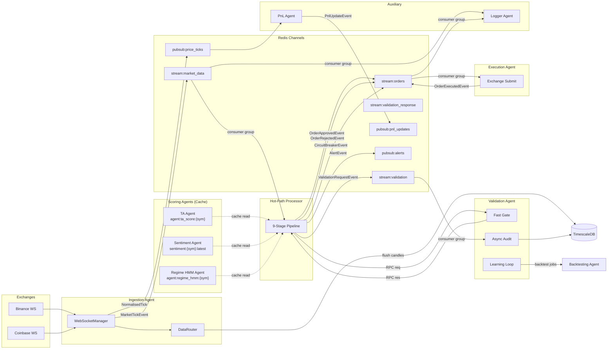
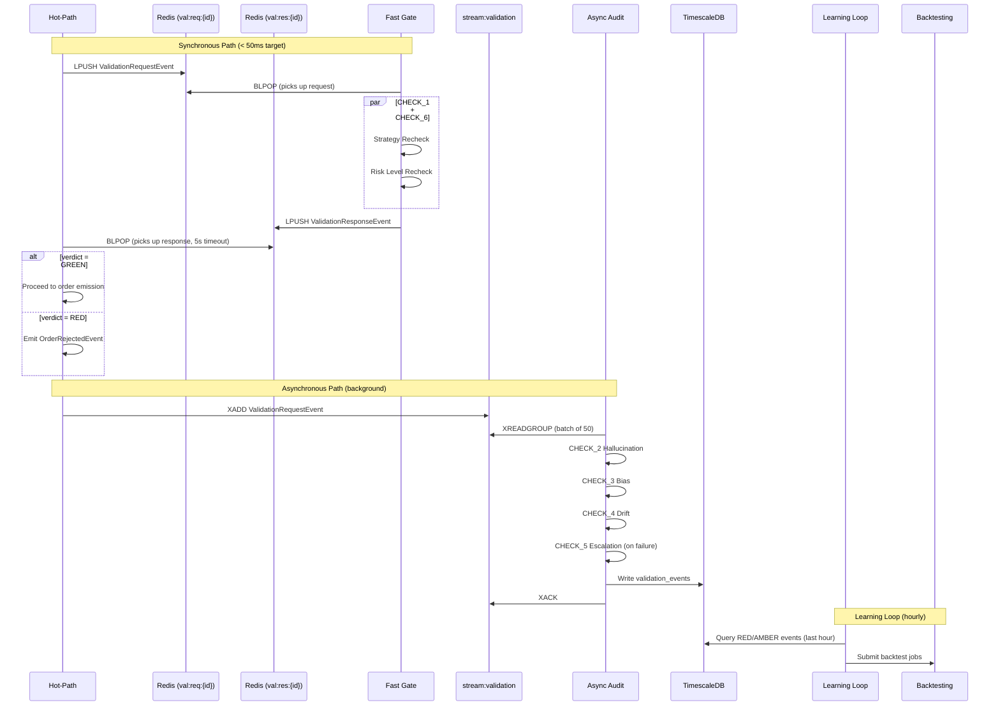
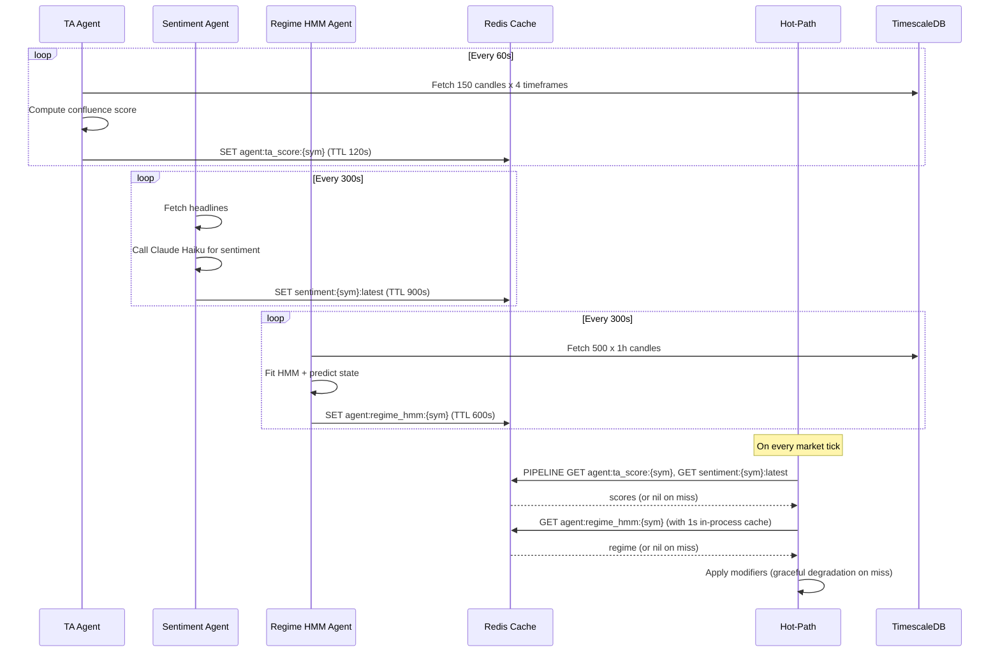

# Event System

> How events flow through Praxis -- from raw market ticks to executed orders -- with delivery guarantees, schema definitions, and failure handling at every stage.

All inter-agent communication in Praxis passes through Redis. The system uses three distinct messaging patterns (Streams, Pub/Sub, and RPC via Lists), each chosen for specific delivery and latency requirements. Every event is serialized with msgpack and conforms to a versioned Pydantic schema.

---

## Table of Contents

- [Redis Channel Registry](#redis-channel-registry)
  - [Streams](#streams)
  - [Pub/Sub Channels](#pubsub-channels)
  - [RPC Channels](#rpc-channels)
  - [Cache Keys](#cache-keys)
- [Event Schema Catalog](#event-schema-catalog)
  - [BaseEvent](#baseevent)
  - [MarketTickEvent](#markettickevent)
  - [SignalEvent](#signalevent)
  - [OrderApprovedEvent](#orderapprovedevent)
  - [OrderRejectedEvent](#orderrejectedevent)
  - [OrderExecutedEvent](#orderexecutedevent)
  - [ValidationRequestEvent](#validationrequestevent)
  - [ValidationResponseEvent](#validationresponseevent)
  - [PnlUpdateEvent](#pnlupdateevent)
  - [CircuitBreakerEvent](#circuitbreakerevent)
  - [AlertEvent](#alertevent)
  - [ThresholdProximityEvent](#thresholdproximityevent)
- [Data Flow Diagrams](#data-flow-diagrams)
  - [End-to-End Trading Flow](#end-to-end-trading-flow)
  - [Validation Flow](#validation-flow)
  - [Scoring Agent Cache Flow](#scoring-agent-cache-flow)
- [Message Ordering and Delivery Guarantees](#message-ordering-and-delivery-guarantees)
- [Serialization](#serialization)
- [Backpressure and Failure Handling](#backpressure-and-failure-handling)

---

## Redis Channel Registry

### Streams

Streams provide ordered, persistent, at-least-once delivery via consumer groups. Each stream has a well-defined set of publishers and consumers.

| Channel | Defined In | Publishers | Consumers | Consumer Group(s) | Schema |
|---|---|---|---|---|---|
| `stream:market_data` | `libs/messaging/channels.py` | Ingestion Agent | Hot-Path Processor, Logger Agent | `hot_path_group`, `logger_group` | `MarketTickEvent` |
| `stream:orders` | `libs/messaging/channels.py` | Hot-Path Processor, Execution Agent | Execution Agent, Logger Agent | `execution_group`, `logger_group` | `OrderApprovedEvent`, `OrderRejectedEvent`, `OrderExecutedEvent`, `CircuitBreakerEvent` |
| `stream:validation` | `libs/messaging/channels.py` | Hot-Path Processor | Validation Agent (async audit) | `async_val_group` | `ValidationRequestEvent` |
| `stream:validation_response` | `libs/messaging/channels.py` | Validation Agent | Hot-Path Processor | `hot_path_val_group` | `ValidationResponseEvent` |
| `stream:dlq` | `libs/messaging/channels.py` | Any agent (on processing failure) | Operations tooling | -- | Raw failed payloads with error metadata |

### Pub/Sub Channels

Pub/Sub channels provide broadcast, fire-and-forget delivery. Messages are not persisted. If a subscriber is not connected at publish time, the message is lost.

| Channel | Defined In | Publishers | Subscribers | Schema |
|---|---|---|---|---|
| `pubsub:price_ticks` | `libs/messaging/channels.py` | Ingestion Agent | PnL Agent | `NormalisedTick` (msgpack) |
| `pubsub:pnl_updates` | `libs/messaging/channels.py` | PnL Agent | WebSocket gateway | `PnlUpdateEvent` |
| `pubsub:alerts` | `libs/messaging/channels.py` | Hot-Path Processor (regime disagreement) | Alerting infrastructure | `AlertEvent` |
| `pubsub:system_alerts` | `libs/messaging/channels.py` | Ingestion Agent, various | Logger Agent, alerting infrastructure | `AlertEvent` |
| `pubsub:threshold_proximity` | `libs/messaging/channels.py` | Hot-Path Processor | WebSocket gateway | `ThresholdProximityEvent` |
| `pubsub:agent_telemetry` | `libs/messaging/channels.py` | All agents (via `TelemetryPublisher`) | WebSocket gateway, SSE endpoint | `AgentTelemetryEvent` (agent_id, event_type, payload) |
| `pubsub:hitl_pending` | `libs/messaging/channels.py` | Hot-Path HITL Gate | WebSocket gateway → Frontend HITL store | `HITLApprovalRequest` |

### RPC Channels

The fast-gate validation path uses ephemeral Redis lists as a synchronous request-response mechanism.

| Key Pattern | Direction | TTL | Schema |
|---|---|---|---|
| `val:req:{request_uuid}` | Hot-Path -> Validation Agent | 5 seconds | `ValidationRequestEvent` |
| `val:res:{request_uuid}` | Validation Agent -> Hot-Path | 5 seconds | `ValidationResponseEvent` |
| `hitl:pending:{event_id}` | Hot-Path HITL Gate -> Redis KV | `HITL_TIMEOUT_S + 30s` | `HITLApprovalRequest` (full context) |
| `hitl:response:{event_id}` | API Gateway -> Hot-Path HITL Gate | Implicit (BLPOP) | `{"status": "APPROVED"/"REJECTED", "reviewer": user_id, "reason": str}` |

- The Hot-Path pushes a request with `LPUSH` and blocks on the response key with `BLPOP` (5-second timeout).
- The Validation Agent pops the request with `BLPOP`, runs CHECK_1 + CHECK_6, and pushes the response with `LPUSH`.
- Both keys auto-expire after 5 seconds to prevent key leaks from crashed consumers.
- HITL follows the same pattern: Hot-Path publishes to `pubsub:hitl_pending` (broadcast to frontend), stores context in `hitl:pending:{event_id}`, then blocks on `BLPOP hitl:response:{event_id}` (default 60s timeout). The API Gateway endpoint `POST /api/hitl/respond` does the `LPUSH` when the user approves/rejects.

### Cache Keys

Scoring agents write to Redis with a TTL. The Hot-Path reads these keys on demand.

| Key Pattern | Writer | Reader | TTL | Format |
|---|---|---|---|---|
| `agent:ta_score:{symbol}` | TA Confluence Agent | Hot-Path (Agent Modifier) | 120s | `{"score": <float>}` |
| `sentiment:{symbol}:latest` | Sentiment Agent | Hot-Path (Agent Modifier) | 900s | `{"score": <float>, "confidence": <float>, "source": "<str>"}` |
| `agent:regime_hmm:{symbol}` | Regime HMM Agent | Hot-Path (Regime Dampener) | 600s | `{"regime": "<Regime enum value>"}` |

---

## Event Schema Catalog

All events inherit from `BaseEvent`. Schemas are defined in `libs/core/schemas.py` as frozen Pydantic v2 models (`ConfigDict(frozen=True)`).

### BaseEvent

The base class for all events in the system.

| Field | Type | Default | Description |
|---|---|---|---|
| `event_id` | `UUID` | Auto-generated (monotonic) | Unique event identifier. Uses a fast monotonic ID generator: `{pid}+{counter}` encoded as a UUID-shaped string. No syscalls. |
| `event_type` | `EventType` (enum) | -- | Discriminator for event routing and deserialization |
| `timestamp_us` | `int` | -- | Event timestamp in microseconds since epoch |
| `source_service` | `str` | -- | Name of the service that created this event |
| `schema_version` | `int` | `1` | Schema version for forward/backward compatibility |

**Defined in:** `libs/core/schemas.py`

---

### MarketTickEvent

Raw market data from an exchange.

| Field | Type | Default | Description |
|---|---|---|---|
| `event_type` | `Literal[MARKET_TICK]` | `MARKET_TICK` | -- |
| `symbol` | `SymbolPair` (str) | -- | Trading pair (e.g., `"BTC/USDT"`) |
| `exchange` | `str` | -- | Source exchange (e.g., `"binance"`, `"coinbase"`) |
| `price` | `Decimal` | -- | Current trade price |
| `volume` | `Decimal` | -- | Trade volume |

**Example payload:**

```json
{
  "event_id": "00000000-0000-4001-8000-000000000042",
  "event_type": "MARKET_TICK",
  "timestamp_us": 1710849600000000,
  "source_service": "ingestion",
  "schema_version": 1,
  "symbol": "BTC/USDT",
  "exchange": "binance",
  "price": "67542.31",
  "volume": "0.0523"
}
```

---

### SignalEvent

A trading signal generated by the Hot-Path strategy evaluator.

| Field | Type | Default | Description |
|---|---|---|---|
| `event_type` | `Literal[SIGNAL_GENERATED]` | `SIGNAL_GENERATED` | -- |
| `profile_id` | `str` | -- | Trading profile that generated this signal |
| `symbol` | `SymbolPair` (str) | -- | Trading pair |
| `direction` | `Literal["BUY", "SELL", "ABSTAIN"]` | -- | Signal direction |
| `confidence` | `float` | -- | Signal confidence after all modifiers, in `[0.0, 1.0]` |

**Example payload:**

```json
{
  "event_id": "00000000-0000-4001-8000-000000000099",
  "event_type": "SIGNAL_GENERATED",
  "timestamp_us": 1710849601234567,
  "source_service": "hot-path",
  "schema_version": 1,
  "profile_id": "profile_abc123",
  "symbol": "ETH/USDT",
  "direction": "BUY",
  "confidence": 0.873
}
```

---

### OrderApprovedEvent

An order that has passed all Hot-Path validation stages and is ready for execution.

| Field | Type | Default | Description |
|---|---|---|---|
| `event_type` | `Literal[ORDER_APPROVED]` | `ORDER_APPROVED` | -- |
| `profile_id` | `str` | -- | Owning trading profile |
| `symbol` | `SymbolPair` (str) | -- | Trading pair |
| `side` | `OrderSide` (`"BUY"` or `"SELL"`) | -- | Order side |
| `quantity` | `Decimal` | -- | Order quantity |
| `price` | `Decimal` | -- | Target price at time of approval |

**Example payload:**

```json
{
  "event_id": "00000000-0000-4001-8000-000000000100",
  "event_type": "ORDER_APPROVED",
  "timestamp_us": 1710849602000000,
  "source_service": "hot-path",
  "schema_version": 1,
  "profile_id": "profile_abc123",
  "symbol": "ETH/USDT",
  "side": "BUY",
  "quantity": "1.5000",
  "price": "3421.50"
}
```

---

### OrderRejectedEvent

An order that was rejected at any stage of the pipeline.

| Field | Type | Default | Description |
|---|---|---|---|
| `event_type` | `Literal[ORDER_REJECTED]` | `ORDER_REJECTED` | -- |
| `profile_id` | `str` | -- | Owning trading profile |
| `symbol` | `SymbolPair` (str) | -- | Trading pair |
| `reason` | `str` | -- | Human-readable rejection reason (e.g., `"Check 1 Failed: strategy recheck mismatch"`) |

**Example payload:**

```json
{
  "event_id": "00000000-0000-4001-8000-000000000101",
  "event_type": "ORDER_REJECTED",
  "timestamp_us": 1710849602500000,
  "source_service": "hot-path",
  "schema_version": 1,
  "profile_id": "profile_abc123",
  "symbol": "ETH/USDT",
  "reason": "Check 6 Failed: risk level exceeds maximum allocation"
}
```

---

### OrderExecutedEvent

Confirmation that an order was filled on the exchange.

| Field | Type | Default | Description |
|---|---|---|---|
| `event_type` | `Literal[ORDER_EXECUTED]` | `ORDER_EXECUTED` | -- |
| `order_id` | `UUID` | -- | Reference to the original order |
| `profile_id` | `str` | -- | Owning trading profile |
| `symbol` | `SymbolPair` (str) | -- | Trading pair |
| `side` | `OrderSide` (`"BUY"` or `"SELL"`) | -- | Order side |
| `fill_price` | `Decimal` | -- | Actual fill price (may differ from approved price due to slippage) |
| `quantity` | `Decimal` | -- | Filled quantity |

**Example payload:**

```json
{
  "event_id": "00000000-0000-4001-8000-000000000102",
  "event_type": "ORDER_EXECUTED",
  "timestamp_us": 1710849603000000,
  "source_service": "execution",
  "schema_version": 1,
  "order_id": "00000000-0000-4001-8000-000000000100",
  "profile_id": "profile_abc123",
  "symbol": "ETH/USDT",
  "side": "BUY",
  "fill_price": "3421.75",
  "quantity": "1.5000"
}
```

---

### ValidationRequestEvent

A request for the Validation Agent to check a signal or order.

| Field | Type | Default | Description |
|---|---|---|---|
| `event_type` | `Literal[VALIDATION_PROCEED, VALIDATION_BLOCK]` | `VALIDATION_PROCEED` | -- |
| `profile_id` | `str` | -- | Profile being validated |
| `symbol` | `SymbolPair` (str) | -- | Trading pair |
| `check_type` | `ValidationCheck` (enum) | -- | Which check to perform: `CHECK_1_STRATEGY`, `CHECK_2_HALLUCINATION`, `CHECK_3_BIAS`, `CHECK_4_DRIFT`, `CHECK_5_ESCALATION`, `CHECK_6_RISK_LEVEL` |
| `payload` | `dict` | -- | Arbitrary data needed by the specific check (signal details, indicators, etc.) |

**Example payload:**

```json
{
  "event_id": "00000000-0000-4001-8000-000000000110",
  "event_type": "VALIDATION_PROCEED",
  "timestamp_us": 1710849602100000,
  "source_service": "hot-path",
  "schema_version": 1,
  "profile_id": "profile_abc123",
  "symbol": "ETH/USDT",
  "check_type": "CHECK_1_STRATEGY",
  "payload": {
    "direction": "BUY",
    "confidence": 0.873,
    "rule_matched": "ema_crossover_bullish"
  }
}
```

---

### ValidationResponseEvent

The Validation Agent's response to a validation request.

| Field | Type | Default | Description |
|---|---|---|---|
| `event_type` | `Literal[VALIDATION_PROCEED, VALIDATION_BLOCK]` | `VALIDATION_PROCEED` | -- |
| `verdict` | `ValidationVerdict` (`"GREEN"`, `"AMBER"`, `"RED"`) | -- | Validation outcome |
| `check_type` | `ValidationCheck` (enum) | -- | Which check was performed |
| `mode` | `ValidationMode` (`"FAST_GATE"` or `"ASYNC_AUDIT"`) | -- | Whether this was a synchronous or asynchronous check |
| `reason` | `str` or `null` | `null` | Explanation when verdict is not GREEN |
| `response_time_ms` | `float` | -- | Time taken to process this validation |

**Example payload (GREEN):**

```json
{
  "event_id": "00000000-0000-4001-8000-000000000111",
  "event_type": "VALIDATION_PROCEED",
  "timestamp_us": 1710849602130000,
  "source_service": "validation",
  "schema_version": 1,
  "verdict": "GREEN",
  "check_type": "CHECK_1_STRATEGY",
  "mode": "FAST_GATE",
  "reason": null,
  "response_time_ms": 12.4
}
```

**Example payload (RED):**

```json
{
  "event_id": "00000000-0000-4001-8000-000000000112",
  "event_type": "VALIDATION_BLOCK",
  "timestamp_us": 1710849602135000,
  "source_service": "validation",
  "schema_version": 1,
  "verdict": "RED",
  "check_type": "CHECK_6_RISK_LEVEL",
  "mode": "FAST_GATE",
  "reason": "Check 6 Failed: current allocation 94% exceeds limit 90%",
  "response_time_ms": 28.7
}
```

---

### PnlUpdateEvent

Real-time P&L update for a profile's position.

| Field | Type | Default | Description |
|---|---|---|---|
| `event_type` | `Literal[PNL_UPDATE]` | `PNL_UPDATE` | -- |
| `profile_id` | `str` | -- | Owning trading profile |
| `symbol` | `SymbolPair` (str) | -- | Trading pair |
| `gross_pnl` | `Decimal` | -- | Unrealized P&L before fees and tax |
| `net_pnl` | `Decimal` | -- | Unrealized P&L after estimated fees and tax |
| `pct_return` | `float` | -- | Percentage return on the position |

**Example payload:**

```json
{
  "event_id": "00000000-0000-4001-8000-000000000200",
  "event_type": "PNL_UPDATE",
  "timestamp_us": 1710849610000000,
  "source_service": "pnl",
  "schema_version": 1,
  "profile_id": "profile_abc123",
  "symbol": "ETH/USDT",
  "gross_pnl": "156.75",
  "net_pnl": "141.08",
  "pct_return": 3.07
}
```

---

### CircuitBreakerEvent

Emitted when a profile's circuit breaker trips due to excessive daily losses.

| Field | Type | Default | Description |
|---|---|---|---|
| `event_type` | `Literal[CIRCUIT_BREAKER_TRIGGERED]` | `CIRCUIT_BREAKER_TRIGGERED` | -- |
| `profile_id` | `str` | -- | Profile whose circuit breaker tripped |
| `reason` | `str` | -- | Explanation of why the breaker tripped |

**Example payload:**

```json
{
  "event_id": "00000000-0000-4001-8000-000000000300",
  "event_type": "CIRCUIT_BREAKER_TRIGGERED",
  "timestamp_us": 1710849620000000,
  "source_service": "hot-path",
  "schema_version": 1,
  "profile_id": "profile_abc123",
  "reason": "Daily realized loss -3.2% exceeds limit 3.0%"
}
```

---

### AlertEvent

Operational alert for human operators.

| Field | Type | Default | Description |
|---|---|---|---|
| `event_type` | `Literal[ALERT_AMBER, ALERT_RED, SYSTEM_ALERT, REGIME_DISAGREEMENT]` | -- | Alert severity / category |
| `message` | `str` | -- | Human-readable alert description |
| `level` | `str` | -- | Alert level: `"AMBER"`, `"RED"`, or other |
| `profile_id` | `str` or `null` | `null` | Associated profile, if applicable. `null` for system-wide alerts. |

**Example payload (regime disagreement):**

```json
{
  "event_id": "00000000-0000-4001-8000-000000000400",
  "event_type": "REGIME_DISAGREEMENT",
  "timestamp_us": 1710849625000000,
  "source_service": "hot-path",
  "schema_version": 1,
  "message": "Regime disagreement for BTC/USDT: rule-based=TRENDING_UP, HMM=HIGH_VOLATILITY",
  "level": "AMBER",
  "profile_id": "profile_abc123"
}
```

**Example payload (system alert):**

```json
{
  "event_id": "00000000-0000-4001-8000-000000000401",
  "event_type": "SYSTEM_ALERT",
  "timestamp_us": 1710849630000000,
  "source_service": "ingestion",
  "schema_version": 1,
  "message": "[binance] Max retries exceeded (10). SYSTEM_ALERT",
  "level": "RED",
  "profile_id": null
}
```

---

### ThresholdProximityEvent

Notification that an indicator is approaching a trigger threshold (used for frontend display).

| Field | Type | Default | Description |
|---|---|---|---|
| `event_type` | `Literal[THRESHOLD_PROXIMITY]` | `THRESHOLD_PROXIMITY` | -- |
| `profile_id` | `str` | -- | Owning trading profile |
| `symbol` | `SymbolPair` (str) | -- | Trading pair |
| `indicator_name` | `str` | -- | Name of the indicator approaching its threshold (e.g., `"RSI"`, `"MACD_histogram"`) |
| `current_value` | `float` | -- | Current indicator value |
| `trigger_threshold` | `float` | -- | Configured threshold that would trigger a signal |
| `proximity_pct` | `float` | -- | How close the current value is to the threshold, as a percentage |

**Example payload:**

```json
{
  "event_id": "00000000-0000-4001-8000-000000000500",
  "event_type": "THRESHOLD_PROXIMITY",
  "timestamp_us": 1710849635000000,
  "source_service": "hot-path",
  "schema_version": 1,
  "profile_id": "profile_abc123",
  "symbol": "BTC/USDT",
  "indicator_name": "RSI",
  "current_value": 68.5,
  "trigger_threshold": 70.0,
  "proximity_pct": 2.14
}
```

---

## Data Flow Diagrams

### End-to-End Trading Flow

This diagram traces a market tick from ingestion through to order execution, showing every channel and agent involved.



### Validation Flow

This diagram shows the two validation paths in detail: the synchronous fast gate and the asynchronous audit.



### Scoring Agent Cache Flow

Shows how scoring agents independently populate Redis caches that the Hot-Path reads synchronously during pipeline execution.



---

## Message Ordering and Delivery Guarantees

### Redis Streams: At-Least-Once Delivery

| Property | Behavior |
|---|---|
| **Ordering** | Total order per stream. `XADD` returns monotonically increasing IDs (`{ms_timestamp}-{seq}`). |
| **Consumer groups** | Each group maintains an independent cursor. Multiple groups on the same stream each receive every message. |
| **Delivery within a group** | Each message is delivered to exactly one consumer in the group. |
| **Acknowledgment** | Messages remain in the pending entries list (PEL) until the consumer calls `XACK`. |
| **Re-delivery** | Unacknowledged messages can be claimed by other consumers (via `XCLAIM` or `XAUTOCLAIM`) or re-delivered to the original consumer on reconnection. |
| **Consumer group creation** | Idempotent via `XGROUP CREATE ... MKSTREAM`. `BUSYGROUP` errors are silently ignored. Agents can start in any order. |

**Implementation (from `libs/messaging/_streams.py`):**

```python
# Publishing: XADD with msgpack payload
message_id = await redis.xadd(channel, {"payload": encode_event(event)})

# Consuming: XREADGROUP with ">" for new messages only
results = await redis.xreadgroup(group, consumer, {channel: ">"}, count=10, block=100)

# Acknowledging: XACK removes from pending entries list
await redis.xack(channel, group, *message_ids)
```

### Redis Pub/Sub: At-Most-Once Delivery

| Property | Behavior |
|---|---|
| **Ordering** | Delivery order matches publish order per channel. |
| **Persistence** | None. Messages are not stored. |
| **Subscriber requirement** | Subscribers must be connected at publish time to receive the message. |
| **Fan-out** | All connected subscribers receive every message on the channel. |
| **Failure mode** | If a subscriber disconnects and reconnects, all messages published during the gap are lost. |

This pattern is used for data that is either **ephemeral** (price ticks for real-time display) or **supplementary** (alerts that are also logged elsewhere).

### RPC via Redis Lists: Request-Response with Timeout

| Property | Behavior |
|---|---|
| **Ordering** | Single request-response pair per key. No ordering concerns. |
| **Delivery** | Exactly-once within the TTL window. |
| **Timeout** | `BLPOP` with 5-second timeout. If no response arrives, the Hot-Path treats the validation as timed out. |
| **Key cleanup** | Both request and response keys have a 5-second TTL. No manual cleanup needed. |
| **Failure mode** | If the Validation Agent crashes mid-request, the Hot-Path times out after 5 seconds. The orphaned request key expires automatically. |

---

## Serialization

All events are serialized using **msgpack** for compact binary encoding and fast (de)serialization. The implementation is in `libs/messaging/_serialisation.py`.

### Encoding (`encode_event`)

The encoder uses a two-tier approach for performance:

1. **Fast path:** Iterates over `event.__dict__` directly, converting enums to `.value`, UUIDs to strings, and everything else as-is. Appends `__type__` (the class name) to the dict. Packs with `msgpack.packb(raw, use_bin_type=True, default=str)`.

2. **Fallback:** If the fast path throws an exception (e.g., complex nested types), falls back to `event.model_dump(mode="json")` (Pydantic serialization) before msgpack packing.

### Decoding (`decode_event`)

1. Unpack the msgpack bytes with `msgpack.unpackb(data, raw=False)`.
2. Extract `__type__` from the dict to determine the event class.
3. Check `schema_version`. If it is not `1`, raise `SchemaVersionMismatchError`.
4. Look up the event class in a name-to-class mapping and call `model_validate(raw)` (Pydantic v2 validation).

### Event Type Registry

The `EVENT_MAP` in `_serialisation.py` maps `EventType` enum values to Pydantic model classes:

| EventType Enum Value | Model Class |
|---|---|
| `MARKET_TICK` | `MarketTickEvent` |
| `SIGNAL_GENERATED` | `SignalEvent` |
| `ORDER_APPROVED` | `OrderApprovedEvent` |
| `ORDER_REJECTED` | `OrderRejectedEvent` |
| `ORDER_EXECUTED` | `OrderExecutedEvent` |
| `VALIDATION_PROCEED` | `ValidationRequestEvent` |
| `VALIDATION_BLOCK` | `ValidationRequestEvent` |
| `PNL_UPDATE` | `PnlUpdateEvent` |
| `CIRCUIT_BREAKER_TRIGGERED` | `CircuitBreakerEvent` |
| `ALERT_AMBER` | `AlertEvent` |
| `ALERT_RED` | `AlertEvent` |
| `SYSTEM_ALERT` | `AlertEvent` |
| `THRESHOLD_PROXIMITY` | `ThresholdProximityEvent` |

Deserialization uses the `__type__` class name (not the enum value) for lookup, with a separate class-name-to-model mapping.

---

## Backpressure and Failure Handling

### Stream Backpressure

Redis Streams do not enforce a maximum length by default. Praxis relies on the following mechanisms to manage backpressure:

| Mechanism | Description |
|---|---|
| **Batch consumption** | Consumers read in configurable batches (`count` parameter). Hot-Path and Logger read up to 100 events per call. Async Audit reads up to 50. |
| **Block timeout** | `XREADGROUP` blocks for a configurable duration (`block_ms`) before returning empty. This prevents tight polling loops. |
| **Processing rate** | The Hot-Path processes ticks as fast as the 9-stage pipeline allows. If ticks arrive faster than processing, they queue in `stream:market_data`. The stream grows until consumers catch up. |
| **Archiver Agent** | Daily cron job migrates historical data to GCS, keeping TimescaleDB and Redis lean. |

### Dead Letter Queue (DLQ)

When an agent fails to process a message, the message can be forwarded to `stream:dlq` for manual investigation and replay.

**DLQ entry format (from `libs/messaging/_dlq.py`):**

| Field | Type | Description |
|---|---|---|
| `original_channel` | `str` | The stream the message originally came from |
| `error` | `str` | Error description from the failed processing attempt |
| `payload` | `bytes` | The original msgpack-encoded event data |

**Operations:**

```python
# Send a failed message to DLQ
await dlq.send_to_dlq(
    original_channel="stream:market_data",
    event_data=raw_bytes,
    error="SchemaVersionMismatchError: Unsupported schema version: 2"
)

# Replay messages from DLQ back to a target stream
await dlq.replay_from_dlq(target_channel="stream:market_data", count=10)
```

### Consumer Crash Recovery

When a consumer crashes or disconnects, the following recovery mechanisms apply:

| Scenario | Recovery |
|---|---|
| **Consumer crashes mid-batch (before ACK)** | Messages remain in the pending entries list (PEL). On restart, the consumer can re-read pending messages. Other consumers in the group can claim them via `XCLAIM`. |
| **Consumer group has multiple consumers** | Redis automatically rebalances pending messages among surviving consumers. |
| **Decode failure** | If `decode_event` fails (e.g., unknown `__type__`, schema version mismatch), the message is appended to the events list as `(message_id, None)`. Callers skip `None` events. The message should be sent to the DLQ for investigation. |
| **Consumer group does not exist yet** | `_ensure_group` creates the group idempotently. Agents can start in any order without coordination. |

### Failure Scenarios by Agent

| Agent | Failure Scenario | Behavior |
|---|---|---|
| **Ingestion Agent** | Exchange WebSocket disconnects | Exponential backoff reconnection (`min(2^n, 30s)`), max 10 retries, then SYSTEM_ALERT |
| **Ingestion Agent** | One exchange down, other is up | `is_partially_healthy()` returns true; other exchange continues unaffected |
| **Hot-Path** | Scoring agent cache miss (expired TTL) | Adjustment = 0.0; signal proceeds with base confidence only |
| **Hot-Path** | Validation RPC timeout (5s) | Treated as validation timeout; event type `VALIDATION_TIMEOUT` |
| **Hot-Path** | Regime HMM cache miss | Rule-based regime only; HMM contribution = None |
| **Validation Agent** | Fast gate exceeds 35ms | Warning logged; response still returned (not hard-rejected) |
| **Validation Agent** | Async audit check fails | Escalated via CHECK_5 with AMBER/RED severity; logged to `validation_events` table |
| **Sentiment Agent** | LLM API call fails | Retry up to 2 times; fallback to neutral score (0.0, confidence 0.5, source "llm_error") |
| **Sentiment Agent** | LLM returns unparseable JSON | Regex fallback extraction; if that fails, neutral fallback |
| **Regime HMM Agent** | Insufficient price data (< 100 observations) | Model is not fitted; returns None; cache is not written |
| **TA Agent** | Indicators still priming | `score()` returns None; cache key is not written |
| **Logger Agent** | Audit DB write fails | Error logged; stream processing continues; messages are still ACKed |
| **Any agent** | Redis connection lost | Reconnection handled by `redis.asyncio` client; pending messages re-delivered by consumer group |

### Schema Version Compatibility

The `schema_version` field on `BaseEvent` (currently `1`) enables forward compatibility:

- `decode_event` checks `schema_version` before deserializing. If the version is not `1`, it raises `SchemaVersionMismatchError`.
- This allows a future version bump where new consumers understand both v1 and v2, while old consumers explicitly reject messages they cannot handle rather than silently corrupting data.
- Schema version mismatches should be routed to the DLQ for investigation.
