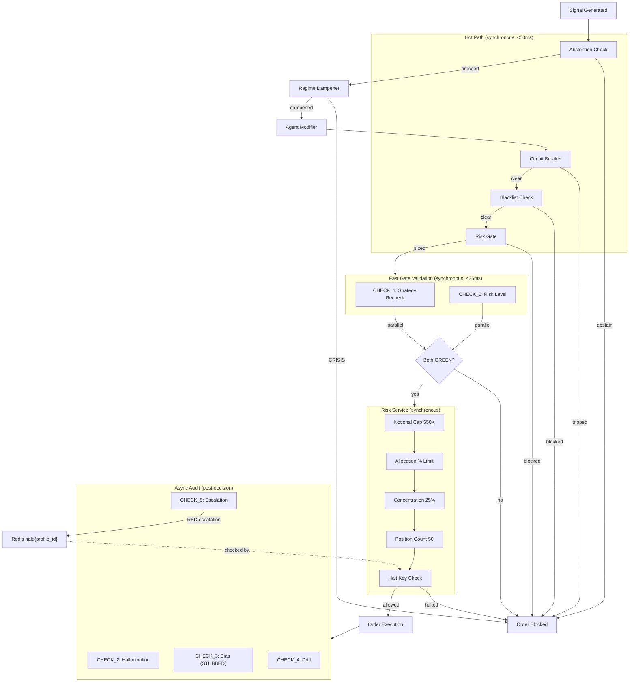
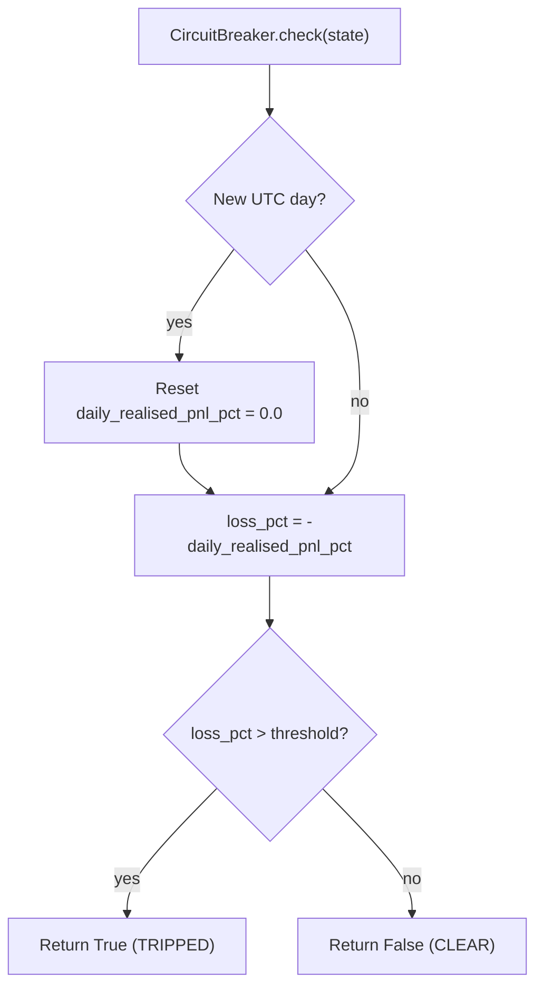
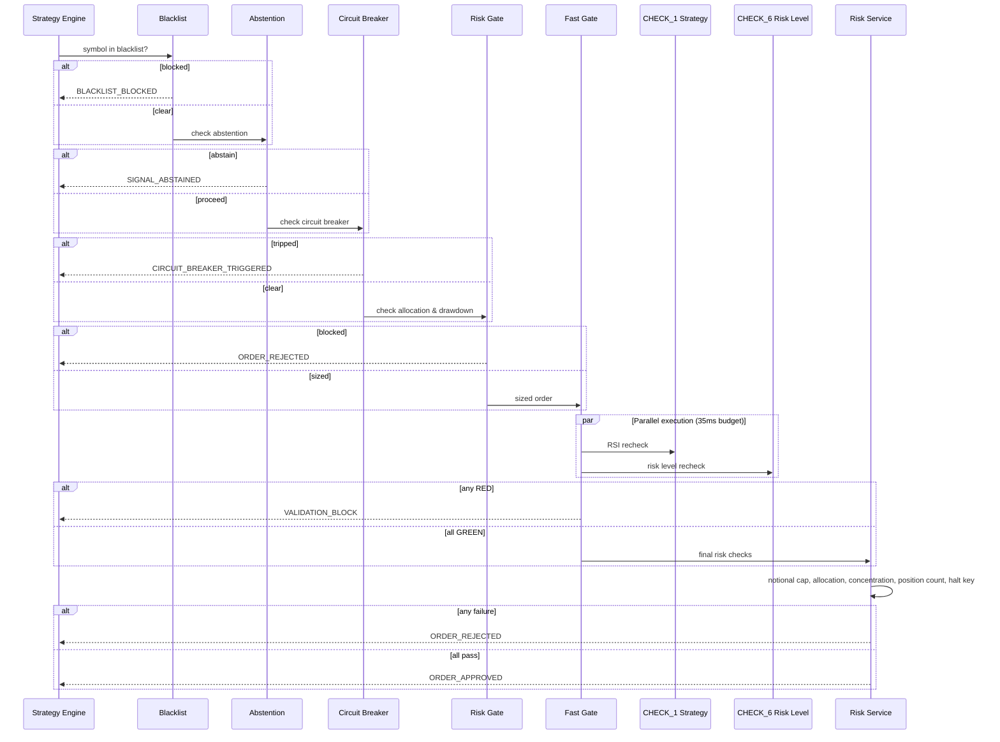

# Aion Trading Platform -- Risk Management Reference

> Complete reference for every risk control, validation check, circuit breaker, and safety
> mechanism in the Aion Trading Platform. Covers both implemented and missing controls.
> All information is derived from source code in `services/hot_path/`, `services/validation/`,
> `services/risk/`, and `services/pnl/`.

---

## Table of Contents

1. [Risk Architecture Overview](#risk-architecture-overview)
2. [Risk Parameter Catalog](#risk-parameter-catalog)
3. [Circuit Breakers](#circuit-breakers)
4. [Pre-Trade Validation](#pre-trade-validation)
5. [Post-Trade Reconciliation](#post-trade-reconciliation)
6. [Confidence Multiplier System](#confidence-multiplier-system)
7. [Kill Switch -- NOT IMPLEMENTED](#kill-switch----not-implemented)
8. [Loss Prevention](#loss-prevention)
9. [Implementation Gaps](#implementation-gaps)

---

## Risk Architecture Overview

Risk controls in Aion are organized into three layers that execute at different points in the trade lifecycle:



### Layer Summary

| Layer | Location | Timing | Purpose |
|-------|----------|--------|---------|
| **Hot Path** | `services/hot_path/src/` | Synchronous, pre-decision | Fast rejection of obviously invalid trades |
| **Fast Gate** | `services/validation/src/fast_gate.py` | Synchronous, pre-decision, 35ms budget | Independent verification of signal and risk limits |
| **Risk Service** | `services/risk/src/__init__.py` | Synchronous, pre-execution | System-wide hard caps and concentration limits |
| **Async Audit** | `services/validation/src/check_2` through `check_5` | Asynchronous, post-decision | Statistical monitoring, drift detection, escalation |

---

## Risk Parameter Catalog

Every configurable risk parameter in the system, where it is defined, its default, and which module enforces it.

### Profile-Level Parameters (stored in `trading_profiles`)

| Parameter | Column / JSON Path | Type | Default | Valid Range | Enforcing Module |
|-----------|--------------------|------|---------|-------------|------------------|
| Max allocation % | `risk_limits.max_allocation_pct` | `Decimal` | `1.0` (100%) | `0.0` -- `1.0` | `services/hot_path/src/risk_gate.py`, `services/validation/src/check_6_risk_level.py`, `services/risk/src/__init__.py` |
| Max drawdown % | `risk_limits.max_drawdown_pct` | `Decimal` | `0.10` (10%) | `0.0` -- `1.0` | `services/hot_path/src/risk_gate.py`, `services/validation/src/check_6_risk_level.py` |
| Stop-loss % | `risk_limits.stop_loss_pct` | `Decimal` | `0.05` (5%) | `0.0` -- `1.0` | `services/validation/src/check_6_risk_level.py` |
| Circuit breaker daily loss % | `circuit_breaker_daily_loss_pct` | `Decimal` | `0.02` (2%) | `0.0` -- `1.0` | `services/hot_path/src/circuit_breaker.py` |
| Drift threshold | `drift_threshold` | `Decimal` | `0.15` (15%) | `0.0` -- `1.0` | `services/validation/src/check_4_drift.py` |
| Drift multiplier | `drift_multiplier` | `Decimal` | `3.0` | `>= 1.0` | `services/validation/src/check_4_drift.py` |
| Symbol blacklist | `blacklist` | `TEXT[]` | `'{}'` (empty) | Any symbol pairs | `services/hot_path/src/blacklist.py` |
| Allocation % | `allocation_pct` | `Decimal` | -- (required) | `0.0` -- `100.0` | Portfolio budget calculation |

### System-Wide Hard Caps (defined in `services/risk/src/__init__.py`)

| Parameter | Constant | Value | Enforcing Module |
|-----------|----------|-------|------------------|
| Max single order notional | `MAX_SINGLE_ORDER_USD` | `$50,000` | `RiskService.check_order()` |
| Max position concentration | `MAX_POSITION_CONCENTRATION_PCT` | `25%` | `RiskService.check_order()` |
| Max open positions per profile | `MAX_OPEN_POSITIONS_PER_PROFILE` | `50` | `RiskService.check_order()` |
| Absolute quantity hard cap | (inline constant) | `10,000 units` | `services/validation/src/check_6_risk_level.py` |

### Validation Timing Parameters

| Parameter | Value | Enforcing Module |
|-----------|-------|------------------|
| Fast Gate deadline | `35ms` | `services/validation/src/fast_gate.py` (warning logged, not enforced as hard cutoff) |
| CHECK_1 Redis cache TTL | `1 second` | `services/validation/src/check_1_strategy.py` |
| CHECK_5 halt key TTL | `24 hours` (86400s) | `services/validation/src/check_5_escalation.py` |
| CHECK_5 amber escalation threshold | `5 AMBERs in 24h` | `services/validation/src/check_5_escalation.py` |

### Abstention Thresholds

| Parameter | Value | Enforcing Module |
|-----------|-------|------------------|
| Minimum ATR (whipsaw filter) | `0.3% of current price` | `services/hot_path/src/abstention.py` |
| Crisis regime | Blocks all trades | `services/hot_path/src/abstention.py` |
| ABSTAIN signal direction | Blocks trade | `services/hot_path/src/abstention.py` |

---

## Circuit Breakers

### Daily Loss Circuit Breaker

**Source**: `services/hot_path/src/circuit_breaker.py`

The primary circuit breaker monitors daily realized PnL as a percentage of portfolio value. When losses exceed the configured threshold, all new trades for that profile are blocked for the remainder of the trading day.

| Property | Value |
|----------|-------|
| **Trigger condition** | `daily_realised_pnl_pct` (negative) exceeds `circuit_breaker_daily_loss_pct` |
| **Default threshold** | 2% daily loss |
| **Scope** | Per profile |
| **What it halts** | All new order placement for the affected profile |
| **Reset mechanism** | Automatic at UTC midnight. The breaker tracks the last check date per profile and resets `daily_realised_pnl_pct` to `0.0` when a new UTC date is detected |
| **State storage** | In-memory class variable `_last_reset_date: dict` (keyed by `profile_id`) |

**Execution flow**:



**Known limitations**:
- State is in-memory. If the process restarts mid-day, the daily PnL counter resets to zero and the breaker loses its history.
- No persistence to Redis or database for cross-instance state sharing.
- `float()` conversion of the threshold introduces minor precision risk (see `docs/data-model.md`, Financial Precision Audit).

### Drawdown Circuit Breaker (via Risk Gate)

**Source**: `services/hot_path/src/risk_gate.py`

The Risk Gate blocks trades when the current drawdown exceeds the profile's `max_drawdown_pct`. This functions as a secondary circuit breaker.

| Property | Value |
|----------|-------|
| **Trigger condition** | `current_drawdown_pct > max_drawdown_pct` |
| **Default threshold** | 10% (`risk_limits.max_drawdown_pct`) |
| **Reset mechanism** | None -- drawdown must recover organically or profile must be reconfigured |

### Drawdown Circuit Breaker (via CHECK_6)

**Source**: `services/validation/src/check_6_risk_level.py`

CHECK_6 independently validates the same drawdown limit. This provides defense-in-depth: even if the hot path risk gate fails or is bypassed, the validation layer catches the violation.

| Property | Value |
|----------|-------|
| **Trigger condition** | `current_drawdown_pct >= max_drawdown_pct` |
| **Scope** | Per profile |
| **Note** | Uses `>=` (inclusive) while Risk Gate uses `>` (exclusive) -- the validation layer is slightly more conservative |

### Escalation-Triggered Halt

**Source**: `services/validation/src/check_5_escalation.py`

When CHECK_5 detects a pattern of repeated warnings or a critical failure, it publishes a halt key to Redis that acts as a circuit breaker.

| Property | Value |
|----------|-------|
| **Trigger conditions** | (1) Any check result containing `RED` in reason; (2) 5 or more `AMBER` results for the same check type within 24 hours |
| **Halt mechanism** | Sets Redis key `halt:{profile_id}` with 24-hour TTL |
| **What it halts** | All trades for the profile. Checked by `RiskService.check_order()` before every order |
| **Reset mechanism** | Automatic after 24 hours (Redis TTL expiry). No manual override exists |
| **Side effects** | Publishes `ALERT_RED` event via PubSub on `PUBSUB_SYSTEM_ALERTS` channel |

---

## Pre-Trade Validation

Pre-trade checks execute in a strict sequence. If any check fails, the order is blocked and subsequent checks are skipped.

### Execution Order



### Check Details

#### Layer 1: Hot Path Checks

**1. Blacklist Check**

| Property | Value |
|----------|-------|
| **Source** | `services/hot_path/src/blacklist.py` |
| **Input** | `ProfileState`, symbol string |
| **Logic** | `symbol in state.blacklist` -- O(1) set membership check |
| **Output** | `True` if blocked, `False` if clear |
| **Audit event** | `BLACKLIST_BLOCKED` |

**2. Abstention Check**

| Property | Value |
|----------|-------|
| **Source** | `services/hot_path/src/abstention.py` |
| **Input** | `ProfileState`, `SignalResult`, `NormalisedTick`, `EvaluatedIndicators` |
| **Logic** | Returns `True` (abstain) if ANY of the following conditions are met |

| Condition | Threshold | Rationale |
|-----------|-----------|-----------|
| ATR < 0.3% of price | `inds.atr < (price * 0.003)` | Whipsaw protection -- market is too quiet for reliable signals |
| Regime is CRISIS | `state.regime == Regime.CRISIS` | Extreme conditions -- no trades allowed |
| Signal direction is ABSTAIN | `signal.direction == SignalDirection.ABSTAIN` | Strategy explicitly chose not to trade |

**3. Circuit Breaker**

See [Circuit Breakers](#circuit-breakers) section above.

**4. Risk Gate (Position Sizing)**

| Property | Value |
|----------|-------|
| **Source** | `services/hot_path/src/risk_gate.py` |
| **Input** | `ProfileState`, `SignalResult`, `NormalisedTick` |
| **Output** | `RiskGateResult(blocked, suggested_quantity, reason)` |

**Blocking conditions**:

| Condition | Check |
|-----------|-------|
| Allocation limit reached | `current_allocation_pct >= max_allocation_pct` |
| Drawdown limit exceeded | `current_drawdown_pct > max_drawdown_pct` |

**Dynamic position sizing** (when not blocked):

```
base_qty = max_allocation_pct * signal.confidence

if drawdown > (max_drawdown / 2):
    base_qty *= 0.5    # 50% reduction

if regime == HIGH_VOLATILITY:
    base_qty *= 0.7    # 30% reduction

# Both reductions can stack: 0.5 * 0.7 = 0.35 (65% total reduction)
```

#### Layer 2: Fast Gate Validation

**Source**: `services/validation/src/fast_gate.py`

CHECK_1 and CHECK_6 run in **parallel** using `asyncio.gather()`. Both must return `passed=True` for the order to proceed. The Fast Gate logs a warning if total execution exceeds 35ms but does not enforce a hard timeout.

**CHECK_1: Strategy Recheck**

| Property | Value |
|----------|-------|
| **Source** | `services/validation/src/check_1_strategy.py` |
| **Purpose** | Independent verification that the signal's RSI matches a wider calculation |
| **Logic** | Fetches 20 candles of 5m OHLCV from TimescaleDB, computes 14-period RSI using Wilder's smoothing, compares against the signal's "hot" RSI |
| **Pass condition** | RSI divergence <= 25% |
| **Fail condition** | RSI divergence > 25% |
| **Cache** | Redis key `fast_gate:chk1:{profile_id}:{symbol}`, TTL 1 second. Burst protection to avoid redundant DB queries |
| **Fail-open** | If the database is unreachable, falls back to the hot RSI value (trusts the signal) |

**CHECK_6: Risk Level Recheck**

| Property | Value |
|----------|-------|
| **Source** | `services/validation/src/check_6_risk_level.py` |
| **Purpose** | Independent verification of portfolio risk limits from the database |
| **Sub-checks** | Four sequential checks (a) through (d) |

| Sub-check | Condition | Default Limit | Fail Reason |
|-----------|-----------|---------------|-------------|
| (a) Max allocation % | `order_value / (allocation_pct * 10,000) > max_allocation_pct` | 100% | Order exceeds budget allocation |
| (b) Stop-loss tolerance | `order_stop_loss > stop_loss_pct` | 5% | Stop-loss wider than profile allows |
| (c) Max drawdown | `current_drawdown >= max_drawdown_pct` | 10% | Drawdown at or above limit |
| (d) Hard quantity cap | `quantity > 10,000` | 10,000 units | Absolute safety guard |

**Fail-closed**: If the profile cannot be loaded from the database, the check **blocks** the order.

#### Layer 3: Risk Service

**Source**: `services/risk/src/__init__.py`

Stateless risk limit checker that provides system-wide defense-in-depth. Called synchronously before order placement.

| Check | Order | Condition | Limit | Scope |
|-------|:-----:|-----------|-------|-------|
| Notional cap | 1 | `order_value > MAX_SINGLE_ORDER_USD` | $50,000 | System-wide |
| Allocation % | 2 | `order_value / portfolio_value > max_allocation_pct` | From profile `risk_limits` | Per profile |
| Concentration | 3 | `(existing_exposure + order_value) / portfolio_value > 25%` | 25% | Per symbol per profile |
| Position count | 4 | `len(open_positions) >= 50` | 50 positions | Per profile |
| Halt key | 5 | Redis key `halt:{profile_id}` exists | -- | Per profile |

**Portfolio value calculation**: `allocation_pct * 10,000` (treated as USD budget).

---

## Post-Trade Reconciliation

### Async Audit Checks (CHECK_2 through CHECK_5)

After a trade is approved and submitted to the exchange, the async audit layer runs statistical checks. These do not block the current trade but can trigger trading halts for future trades.

**CHECK_2: Hallucination Detection**

| Property | Value |
|----------|-------|
| **Source** | `services/validation/src/check_2_hallucination.py` |
| **Purpose** | Detects when LLM sentiment signals are consistently wrong |
| **Scope** | Only runs for signals with `is_llm_sentiment = True` |
| **Window** | Rolling 20-event buffer per profile |
| **Logic** | For each sentiment signal, verifies if the predicted direction matched actual price movement over a 30-minute window |
| **Fail condition** | More than 60% of signals in the window were misaligned |
| **Fail-open** | If market data is unavailable, assumes the signal was correct |

**CHECK_3: Directional Bias -- STUBBED**

| Property | Value |
|----------|-------|
| **Source** | `services/validation/src/check_3_bias.py` |
| **Status** | **STUBBED implementation -- not production-ready** |
| **Purpose** | Detect statistically significant buy/sell imbalance |
| **Logic** | Tracks buy/sell counts per profile. After 100 signals, computes a binomial z-score (assuming neutral 50/50 baseline). Flags if z > 2.5 |
| **Limitations** | (1) Resets counter after every 100-signal check, losing history. (2) Assumes 50/50 neutral baseline which may not be appropriate for trend-following strategies. (3) No AMBER path -- only GREEN or RED. (4) No persistence -- state is lost on restart |

**CHECK_4: Performance Drift**

| Property | Value |
|----------|-------|
| **Source** | `services/validation/src/check_4_drift.py` |
| **Purpose** | Detects when live performance degrades significantly compared to backtest expectations |
| **Metric** | Sharpe ratio comparison: live (7-day rolling from `pnl_snapshots`) vs backtest (from `backtest_results` or payload) |
| **Calculation** | `drop_pct = (backtest_sharpe - live_sharpe) / backtest_sharpe` |

| Verdict | Condition | Threshold |
|---------|-----------|-----------|
| GREEN | `drop_pct < 7.5%` | -- |
| AMBER | `7.5% <= drop_pct < 15%` | `halt_threshold * 0.50` |
| RED | `drop_pct >= 15%` | `halt_threshold` (default `0.15`) |

**Notes**:
- If either live or backtest Sharpe is unavailable, the check passes (fail-open).
- If backtest Sharpe is <= 0, the check passes (cannot compute meaningful drift).
- The 7-day live Sharpe is computed from `pct_return` values in `pnl_snapshots`. Minimum 2 snapshots required.

**CHECK_5: Escalation**

| Property | Value |
|----------|-------|
| **Source** | `services/validation/src/check_5_escalation.py` |
| **Purpose** | Aggregates warnings from checks 2-5 and escalates repeated issues to trading halts |
| **Logic** | Evaluates results from other checks after they complete |

| Input Condition | Action |
|----------------|--------|
| Result reason contains `RED` | Immediate trading halt |
| Result reason contains `AMBER` | Add to 24-hour rolling history |
| 5+ AMBERs for same check type in 24h | Auto-escalate to RED, trigger halt |

**Halt mechanism**:
1. Logs a `CRITICAL` message.
2. Publishes an `ALERT_RED` event via PubSub to `PUBSUB_SYSTEM_ALERTS`.
3. Sets Redis key `halt:{profile_id}` with value = reason and TTL = 24 hours.
4. The Risk Service checks this key before every order (`RiskService.check_order()`, step 5).

---

## Confidence Multiplier System

The confidence multiplier system adjusts position sizes based on signal quality and market conditions. It spans multiple modules.

### Design Overview

```
Final Quantity = base_qty * drawdown_dampener * regime_dampener
```

Where:
- `base_qty = max_allocation_pct * signal.confidence`
- `signal.confidence` is in range `[0.0, 1.0]`

### Signal Confidence Construction

Signal confidence starts at a base value from the strategy engine and is modified by agent modifiers:

| Modifier | Source | Adjustment | Clamp |
|----------|--------|------------|-------|
| Technical Analysis (TA) | Strategy engine | +/- 20 percentage points | `[0.0, 1.0]` |
| Sentiment | LLM sentiment agent | +/- 15 percentage points | `[0.0, 1.0]` |

The adjustments are **additive** and the final confidence is clamped to `[0.0, 1.0]`.

### Drawdown Dampener

**Source**: `services/hot_path/src/risk_gate.py`

| Condition | Multiplier | Effect |
|-----------|:----------:|--------|
| `drawdown <= max_drawdown / 2` | `1.0` | No reduction |
| `drawdown > max_drawdown / 2` | `0.5` | 50% position size reduction |

### Regime Dampener

**Source**: `services/hot_path/src/risk_gate.py`

Uses a dual-regime classification system (rule-based + Hidden Markov Model). The more conservative of the two classifications is used.

| Regime | Multiplier | Effect |
|--------|:----------:|--------|
| `TRENDING_UP` | `1.0` | No reduction |
| `TRENDING_DOWN` | `1.0` | No reduction |
| `RANGE_BOUND` | `1.0` | No reduction |
| `HIGH_VOLATILITY` | `0.7` | 30% position size reduction |
| `CRISIS` | `0.0` | **Trade blocked entirely** (via abstention, not regime dampener) |

### Combined Worst Case

When both dampeners activate simultaneously:

```
base_qty * 0.5 (drawdown) * 0.7 (high volatility) = base_qty * 0.35
```

A signal with confidence 0.8 and max allocation of 10%:
- Normal: `0.10 * 0.80 = 0.080` (8% of portfolio)
- High drawdown + high volatility: `0.10 * 0.80 * 0.50 * 0.70 = 0.028` (2.8% of portfolio)

### Implementation Status

| Component | Status | Notes |
|-----------|--------|-------|
| Base confidence from strategy | Implemented | In strategy evaluation engine |
| TA modifier (+/- 20pp) | Designed | Applied in strategy engine |
| Sentiment modifier (+/- 15pp) | Designed | Applied in strategy engine |
| Drawdown dampener | **Implemented** | `services/hot_path/src/risk_gate.py` |
| Regime dampener (HIGH_VOLATILITY) | **Implemented** | `services/hot_path/src/risk_gate.py` |
| CRISIS blocking | **Implemented** | `services/hot_path/src/abstention.py` |
| Dual regime (rule-based + HMM) | **Designed** | Regime value arrives in `ProfileState.regime`; dual-source logic is upstream |

---

## Kill Switch -- NOT IMPLEMENTED

**Status: Not implemented. No code exists for a manual or automated emergency shutdown.**

A kill switch would provide the ability to immediately halt all trading across all profiles (or a subset) in response to an infrastructure failure, market flash crash, or security incident. This is distinct from the per-profile circuit breaker and escalation halt, which are automatic and scoped to individual profiles.

### What Exists Today

| Mechanism | Scope | Automatic? | Manual Override? |
|-----------|-------|:----------:|:----------------:|
| Circuit breaker | Per profile | Yes | No |
| Escalation halt (Redis `halt:{profile_id}`) | Per profile | Yes | No (24h TTL only) |
| Risk Service halt key check | Per profile | Yes | No |

### What Is Missing

| Capability | Description | Priority |
|------------|-------------|----------|
| Global kill switch | A single Redis key or database flag that halts ALL trading across ALL profiles immediately | **P0 -- Critical** |
| Manual halt override | Admin API endpoint to set/clear the halt flag for a specific profile or globally | **P0 -- Critical** |
| Graceful position unwind | On kill switch activation, optionally close all open positions at market price | **P1 -- High** |
| Kill switch dashboard | UI to view halt status, trigger manual halts, and review halt history | **P1 -- High** |
| Dead man's switch | If the system fails to send a heartbeat within N seconds, automatically halt trading | **P2 -- Medium** |

### Recommended Implementation

```python
# Pseudocode for a global kill switch check in RiskService
GLOBAL_HALT_KEY = "halt:global"

async def check_global_halt(self) -> RiskCheckResult:
    if self._redis:
        halt_reason = await self._redis.get(GLOBAL_HALT_KEY)
        if halt_reason:
            return RiskCheckResult(
                allowed=False,
                reason=f"GLOBAL HALT: {halt_reason.decode()}"
            )
    return RiskCheckResult(allowed=True)
```

---

## Loss Prevention

### Daily Loss Limits

| Mechanism | Threshold | Scope | Source |
|-----------|-----------|-------|--------|
| Circuit breaker | `circuit_breaker_daily_loss_pct` (default 2%) | Per profile | `services/hot_path/src/circuit_breaker.py` |
| Max drawdown block | `max_drawdown_pct` (default 10%) | Per profile | `services/hot_path/src/risk_gate.py` |
| Max drawdown block (redundant) | `max_drawdown_pct` (default 10%) | Per profile | `services/validation/src/check_6_risk_level.py` |

### Consecutive Loss Handling

There is **no explicit consecutive-loss counter** in the current implementation. Loss streaks are handled indirectly through:

1. **Drawdown dampener**: As cumulative losses increase drawdown, position sizes are automatically reduced by 50% once drawdown exceeds half the limit. This is a reactive mechanism, not a proactive consecutive-loss counter.

2. **Circuit breaker**: If daily losses exceed 2%, all trading stops for the day. This catches rapid consecutive losses within a single day.

3. **Escalation (CHECK_5)**: If validation checks produce repeated AMBER results (which can correlate with poor performance), 5 AMBERs in 24 hours trigger a trading halt.

**Gap**: No mechanism directly tracks or reacts to N consecutive losing trades. A profile could sustain many small losing trades that individually stay below the circuit breaker threshold but collectively erode capital.

### Portfolio-Level Aggregation

| What Is Aggregated | Where | Scope |
|-------------------|-------|-------|
| Daily PnL | `CircuitBreaker._last_reset_date` (in-memory) | Per profile |
| Current drawdown | `ProfileState.current_drawdown_pct` | Per profile |
| Current allocation | `ProfileState.current_allocation_pct` | Per profile |
| Symbol concentration | `RiskService.check_order()` | Per symbol per profile |
| Open position count | `RiskService.check_order()` | Per profile |

**Gap**: There is no cross-profile aggregation. If a user has 5 profiles all trading the same asset, total exposure across profiles is not checked. Each profile's concentration limit is independent.

### Position-Level Stop-Loss Enforcement -- NOT IMPLEMENTED

**Status: Not implemented.**

While the `risk_limits` JSONB contains a `stop_loss_pct` field and CHECK_6 validates that an order's declared stop-loss does not exceed the profile limit, there is **no runtime mechanism that monitors open positions and automatically closes them when the stop-loss price is reached**.

The current `stop_loss_pct` check in CHECK_6 is a pre-trade validation only -- it verifies the order payload declares a stop-loss within the allowed range. It does not create or enforce a stop-loss order on the exchange.

---

## Implementation Gaps

Summary of all identified gaps, ordered by severity.

| Gap | Severity | Description | Affected Area |
|-----|----------|-------------|---------------|
| No global kill switch | **P0** | Cannot halt all trading instantly across all profiles | `services/risk/src/__init__.py` |
| No manual halt override | **P0** | Cannot manually set or clear per-profile halt flags | Admin API (does not exist) |
| No position-level stop-loss enforcement | **P0** | Open positions have no automatic exit at stop-loss price | Execution layer |
| No cross-profile concentration check | **P1** | Multiple profiles can accumulate unbounded exposure to the same asset | `services/risk/src/__init__.py` |
| CHECK_3 Bias is stubbed | **P1** | Directional bias detection resets after 100 signals, no persistence | `services/validation/src/check_3_bias.py` |
| No consecutive-loss counter | **P1** | Many small losses can erode capital without triggering any breaker | `services/hot_path/src/` |
| Circuit breaker state is in-memory only | **P2** | Process restart resets daily PnL counter to zero | `services/hot_path/src/circuit_breaker.py` |
| Fast Gate deadline is soft | **P2** | 35ms exceeded logs a warning but does not timeout the checks | `services/validation/src/fast_gate.py` |
| Float precision in risk path | **P2** | 24+ `float()` casts in risk-critical code paths | See `docs/data-model.md` Financial Precision Audit |
| No dead man's switch | **P2** | System failure does not automatically halt trading | Infrastructure layer |
| Escalation halt has no manual clear | **P3** | Must wait 24h TTL; no admin endpoint to clear | `services/validation/src/check_5_escalation.py` |
