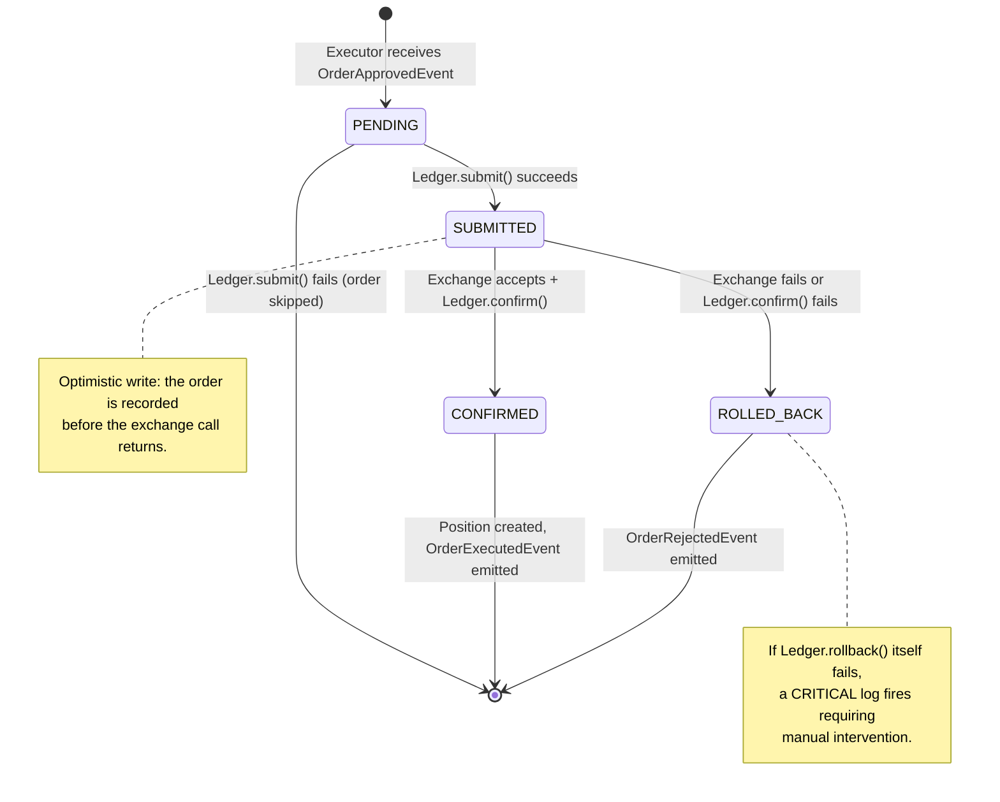
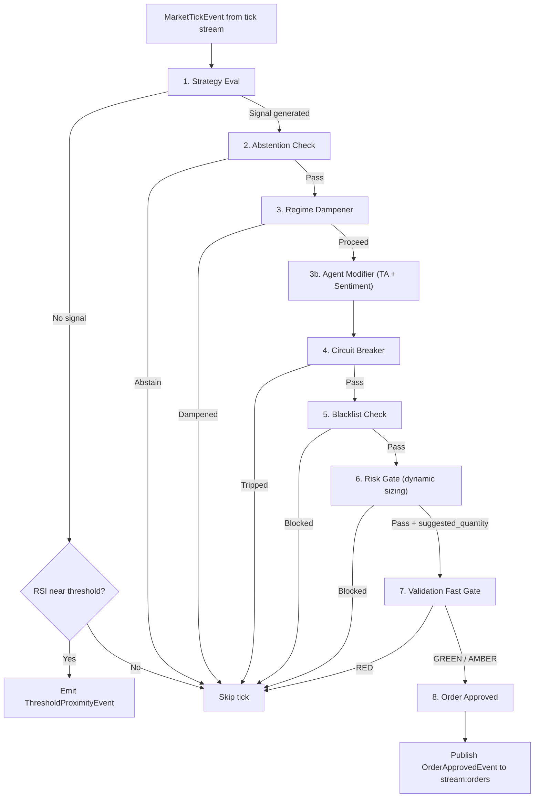
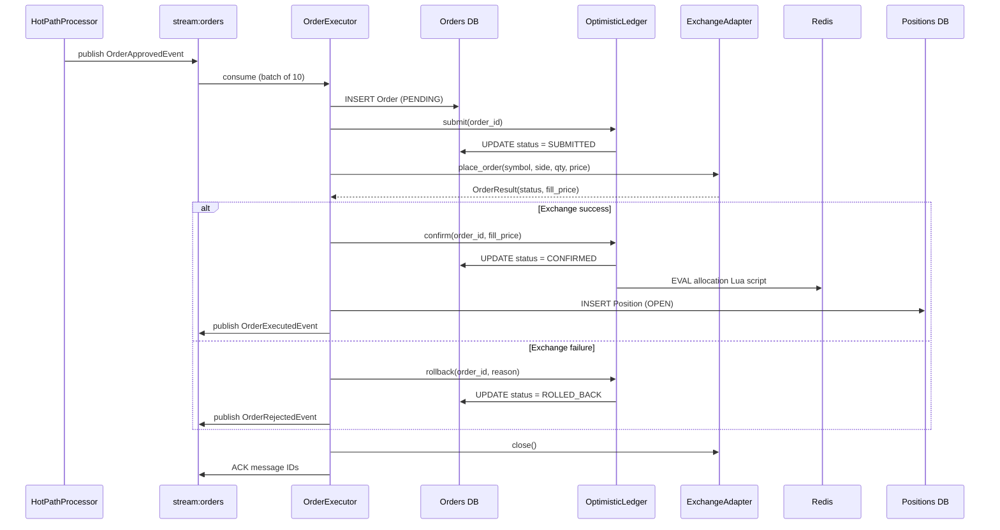

# Trading Engine

> Signal-to-position execution pipeline: how the Aion Trading Platform evaluates market data, approves orders through a 9-stage hot-path, executes them on exchanges, and reconciles the resulting positions.

## Table of Contents

- [Order Lifecycle](#order-lifecycle)
- [Order Types](#order-types)
- [9-Stage Hot-Path Pipeline](#9-stage-hot-path-pipeline)
- [Risk Gate and Position Sizing](#risk-gate-and-position-sizing)
- [Execution Flow](#execution-flow)
- [Position Management](#position-management)
- [Exchange Connector Interface](#exchange-connector-interface)
- [Rate Limiting](#rate-limiting)
- [Reconciliation](#reconciliation)

---

## Order Lifecycle

Every order passes through a deterministic state machine. Transitions are enforced by the `OptimisticLedger` (`services/execution/src/ledger.py`), which wraps each mutation in an error-checked database write and returns a boolean success flag.



### State Definitions

| State | Meaning | Set By |
|-------|---------|--------|
| `PENDING` | Order record created in database, not yet sent to exchange | `OrderExecutor` on event consumption |
| `SUBMITTED` | Ledger acknowledged the order; exchange call is in flight | `OptimisticLedger.submit()` |
| `CONFIRMED` | Exchange accepted the order and fill price is recorded | `OptimisticLedger.confirm()` |
| `ROLLED_BACK` | Exchange rejected the order or a post-exchange ledger failure occurred | `OptimisticLedger.rollback()` |
| `REJECTED` | Exchange-side rejection (mapped from CCXT `rejected` status) | Exchange adapter status mapping |
| `CANCELLED` | Order was cancelled (mapped from CCXT `canceled` status) | Exchange adapter status mapping |

### Transition Triggers

| From | To | Trigger |
|------|----|---------|
| `(none)` | `PENDING` | `OrderApprovedEvent` consumed from `stream:orders` |
| `PENDING` | `SUBMITTED` | `OptimisticLedger.submit(order_id)` returns `True` |
| `SUBMITTED` | `CONFIRMED` | `adapter.place_order()` returns `SUBMITTED` or `CONFIRMED` status, then `OptimisticLedger.confirm()` returns `True` |
| `SUBMITTED` | `ROLLED_BACK` | Any exception during exchange call, or `OptimisticLedger.confirm()` returns `False` |

---

## Order Types

Both exchange adapters currently submit **limit orders** via CCXT's `create_order` with `type='limit'`. The order price comes from the tick price at the moment the hot-path approves the signal.

| Order Type | Supported | Implementation Detail |
|------------|-----------|----------------------|
| **Limit** | Yes | Default for both Binance and Coinbase adapters. Price and quantity are explicit. |
| **Market** | Not yet | Adapters accept a `price` parameter; market orders would require passing `type='market'` and omitting `price`. Not currently wired. |

**Source**: `libs/exchange/_binance.py:55-61`, `libs/exchange/_coinbase.py:47-54`

---

## 9-Stage Hot-Path Pipeline

The `HotPathProcessor` (`services/hot_path/src/processor.py`) consumes `MarketTickEvent` messages from the tick stream, evaluates each tick against every active profile, and emits `OrderApprovedEvent` messages for orders that pass all gates.



### Stage Details

| Stage | Module | Purpose |
|-------|--------|---------|
| 1. Strategy Eval | `strategy_eval.StrategyEvaluator` | Evaluates indicators (RSI, MACD, ATR) against profile thresholds. Returns a `SignalResult` with direction and confidence, or `None`. |
| 1b. Proximity Check | Inline in processor | If no signal fires but RSI is within the proximity band of a threshold, emits a `ThresholdProximityEvent` for downstream pre-fetching. |
| 2. Abstention | `abstention.AbstentionChecker` | Filters out low-quality signals based on profile-specific abstention rules. |
| 3. Regime Dampener | `regime_dampener.RegimeDampener` | Async dual-regime check (Redis + PubSub). Returns `proceed` flag and a `confidence_multiplier` applied to the signal. |
| 3b. Agent Modifier | `agent_modifier.AgentModifier` | Adjusts signal confidence using technical analysis and sentiment scores stored in Redis. |
| 4. Circuit Breaker | `circuit_breaker.CircuitBreaker` | Blocks all orders for a profile if recent loss thresholds are exceeded. |
| 5. Blacklist | `blacklist.BlacklistChecker` | Blocks orders for symbols on the profile's blacklist. |
| 6. Risk Gate | `risk_gate.RiskGate` | Allocation and drawdown limits plus dynamic position sizing (see next section). |
| 7. Validation Fast Gate | `validation_client.ValidationClient` | External validation service call. A `RED` verdict blocks the trade. |
| 8. Order Approved | Inline in processor | Constructs and publishes `OrderApprovedEvent` with the quantity from the Risk Gate. |

The processor consumes up to **100 messages per heartbeat** with a 50ms block timeout. All consumed message IDs are acknowledged in batch after processing.

---

## Risk Gate and Position Sizing

**Source**: `services/hot_path/src/risk_gate.py`

The Risk Gate is the final sizing and risk check before an order is approved. It operates synchronously on in-memory profile state.

### Blocking Conditions

The gate blocks the order entirely (returns `blocked=True`, `suggested_quantity=0.0`) when either condition is met:

| Condition | Field Checked | Blocks When |
|-----------|--------------|-------------|
| Allocation limit | `state.current_allocation_pct >= risk_limits.max_allocation_pct` | Current allocation has reached the profile's maximum |
| Drawdown limit | `state.current_drawdown_pct > risk_limits.max_drawdown_pct` | Current drawdown exceeds the profile's maximum |

### Dynamic Position Sizing

When the order is not blocked, the gate calculates a `suggested_quantity`:

```
base_qty = max_allocation_pct * signal.confidence
```

Two reduction modifiers are applied sequentially:

| Modifier | Condition | Effect |
|----------|-----------|--------|
| Drawdown dampener | `current_drawdown_pct > max_drawdown_pct / 2` | Reduces `base_qty` by 50% |
| Volatility dampener | `regime == HIGH_VOLATILITY` | Reduces `base_qty` by 30% |

Both modifiers can stack. For example, if a profile is in a high-volatility regime and past half its drawdown limit, the effective quantity is `base_qty * 0.5 * 0.7 = 35%` of the original calculation.

The final quantity is floored at `0.0`.

---

## Execution Flow

This section traces a single order from signal to persisted position. All steps reference the `OrderExecutor` in `services/execution/src/executor.py` unless noted otherwise.

### Step-by-step

1. **Hot-Path emits signal** -- The `HotPathProcessor` (`services/hot_path/src/processor.py`) publishes an `OrderApprovedEvent` to `stream:orders` containing the profile ID, symbol, side (BUY/SELL), quantity (from Risk Gate), and price (from the tick).

2. **Executor consumes event** -- `OrderExecutor.run()` reads up to 10 events per batch from `stream:orders` using a Redis consumer group (`executor_group`).

3. **Adapter resolution** -- `_resolve_adapter()` loads the profile's exchange credentials from GCP Secret Manager. The exchange name is derived from the key reference convention `usr-{uid}-{exchange}-keys`. If keys are missing, the adapter falls back to testnet mode.

4. **Order record created (PENDING)** -- An `Order` model is written to the orders table with `status=PENDING`, a new UUID, and the current UTC timestamp.

5. **Optimistic ledger submit (PENDING -> SUBMITTED)** -- `OptimisticLedger.submit(order_id)` transitions the order to `SUBMITTED`. If this fails, the order is skipped and an audit event is written.

6. **Exchange call** -- `adapter.place_order()` sends a limit order to the exchange via CCXT. The adapter returns an `OrderResult` with the exchange-assigned order ID and status.

7. **Ledger confirm (SUBMITTED -> CONFIRMED)** -- On success, `OptimisticLedger.confirm()` writes the fill price and transitions to `CONFIRMED`. The ledger also atomically increments the profile's allocation counter in Redis via a Lua script (key: `risk:allocation:{profile_id}`, TTL: 24 hours).

8. **Position created** -- A new `Position` record is written with status `OPEN`, including the entry price, quantity, and calculated entry fee. Fee rates are exchange-specific:

   | Exchange | Taker Fee Rate |
   |----------|---------------|
   | Binance | 0.10% |
   | Coinbase | 0.60% |
   | Default fallback | 0.20% |

   Entry fee formula: `fee_rate * quantity * fill_price`

9. **OrderExecutedEvent emitted** -- Published to `stream:orders` with the fill price, quantity, and microsecond timestamp.

10. **Failure path** -- Any exception during steps 6-7 triggers `OptimisticLedger.rollback()`, which transitions the order to `ROLLED_BACK`. An `OrderRejectedEvent` is emitted. If rollback itself fails, a `CRITICAL` log fires indicating manual intervention is required.

11. **Cleanup** -- The exchange adapter is closed after every order attempt (`adapter.close()`), regardless of success or failure.

12. **Acknowledgement** -- After processing all events in the batch, message IDs are acknowledged to the Redis consumer group.



---

## Position Management

### Position Creation

Positions are created immediately after order confirmation (step 8 above). Each confirmed order produces exactly one `Position` record with status `OPEN`.

**Position fields** (from `libs/core/models.py`):

| Field | Type | Description |
|-------|------|-------------|
| `position_id` | UUID | Unique identifier, generated at creation |
| `profile_id` | UUID | The trading profile that owns this position |
| `symbol` | string | Trading pair (e.g., `BTC/USDT`) |
| `side` | BUY / SELL | Direction of the position |
| `entry_price` | Decimal | Fill price from the exchange (or approved price as fallback) |
| `quantity` | Decimal | Filled quantity |
| `entry_fee` | float | Calculated as `fee_rate * quantity * fill_price` |
| `opened_at` | datetime | UTC timestamp of position creation |
| `status` | PositionStatus | `OPEN` at creation |

### Allocation Tracking

After each confirmed order, the `OptimisticLedger` updates a per-profile allocation counter in Redis using an atomic Lua script:

- **Key**: `risk:allocation:{profile_id}`
- **Operation**: Increment `allocated_qty` by the order's quantity
- **TTL**: 86,400 seconds (24 hours)
- **Atomicity**: The Lua script reads, increments, and writes in a single Redis `EVAL` call to prevent race conditions

This counter feeds back into the Risk Gate's allocation limit check on the next tick cycle.

### Position Sizing Summary

The quantity attached to each position is determined by the Risk Gate's dynamic sizing algorithm:

```
final_qty = max_allocation_pct
            * signal_confidence
            * regime_dampener.confidence_multiplier
            * (0.5 if drawdown > half limit, else 1.0)
            * (0.7 if HIGH_VOLATILITY regime, else 1.0)
```

Note: The `confidence_multiplier` from the Regime Dampener (stage 3) is applied to the signal confidence before it reaches the Risk Gate. The Agent Modifier (stage 3b) may further adjust confidence.

---

## Exchange Connector Interface

### Abstract Contract

**Source**: `libs/exchange/_base.py`

All exchange adapters implement the `ExchangeAdapter` abstract base class:

```python
class ExchangeAdapter(ABC):
    name: ExchangeName
    is_connected: bool

    async def connect_websocket(self, symbols: List[SymbolPair], callback) -> None
    async def place_order(self, profile_id, symbol, side, qty, price) -> OrderResult
    async def get_balance(self, profile_id) -> Any
    async def cancel_order(self, order_id: str) -> None
    async def get_order_status(self, order_id: str) -> OrderStatus
    async def close(self) -> None
```

**`OrderResult` dataclass** (returned by `place_order`):

| Field | Type | Description |
|-------|------|-------------|
| `order_id` | `str` | Exchange-assigned order identifier |
| `status` | `OrderStatus` | Mapped status (see mapping table below) |
| `fill_price` | `Optional[Price]` | Fill price if available at submission time |
| `filled_quantity` | `Optional[Quantity]` | Filled quantity if available at submission time |

### CCXT Status Mapping

Both adapters map CCXT order statuses to internal `OrderStatus` values identically:

| CCXT Status | Internal Status |
|-------------|----------------|
| `open` | `SUBMITTED` |
| `closed` | `CONFIRMED` |
| `canceled` | `CANCELLED` |
| `rejected` | `REJECTED` |
| *(unknown)* | `PENDING` |

### Binance Adapter

**Source**: `libs/exchange/_binance.py`

| Property | Value |
|----------|-------|
| CCXT class | `ccxt.pro.binance` |
| Rate limiting | `enableRateLimit: True` (CCXT built-in) |
| Testnet | `set_sandbox_mode(True)` when `testnet=True` |
| Order type | Limit |
| WebSocket | `watch_tickers(symbols)` with exponential backoff reconnect (1s base, 30s cap) |
| Tick normaliser | `normalise_binance_tick()` in `libs/exchange/_normaliser.py` |
| Taker fee | 0.10% |

### Coinbase Adapter

**Source**: `libs/exchange/_coinbase.py`

| Property | Value |
|----------|-------|
| CCXT class | `ccxt.pro.coinbase` |
| Rate limiting | `enableRateLimit: True` (CCXT built-in) |
| Testnet | `set_sandbox_mode(True)` when `testnet=True` |
| Order type | Limit |
| WebSocket | `watch_tickers(symbols)` with exponential backoff reconnect (1s base, 30s cap) |
| Tick normaliser | `normalise_coinbase_tick()` in `libs/exchange/_normaliser.py` |
| Taker fee | 0.60% |

### Tick Normalisation

**Source**: `libs/exchange/_normaliser.py`

Both normalisers produce a `NormalisedTick` from CCXT's raw ticker dictionary. The mapping is identical across exchanges:

| NormalisedTick Field | CCXT Source Field | Notes |
|---------------------|-------------------|-------|
| `symbol` | `symbol` | Falls back to `'UNKNOWN'` |
| `exchange` | Hardcoded per adapter | `'BINANCE'` or `'COINBASE'` |
| `timestamp` | `timestamp * 1000` | Converted from milliseconds to microseconds |
| `price` | `last` | Cast to `Decimal` |
| `volume` | `baseVolume` | Cast to `Decimal` |
| `bid` | `bid` | `Optional[Decimal]`, `None` if absent |
| `ask` | `ask` | `Optional[Decimal]`, `None` if absent |

### WebSocket Reconnection

Both adapters implement identical reconnection logic:

- On `NetworkError` or unexpected exceptions: wait, then retry
- Backoff: exponential, starting at **1 second**, doubling each attempt, capped at **30 seconds**
- On successful read: backoff resets to 1 second
- On `ExchangeClosedByUser`: connection loop exits cleanly

---

## Rate Limiting

Rate limiting operates at two layers.

### Layer 1: CCXT Built-in Rate Limiting

Both adapters initialize their CCXT exchange instance with `enableRateLimit: True`. CCXT automatically throttles REST API calls to stay within each exchange's documented rate limits. This is the **only active enforcement** in the current implementation.

### Layer 2: Application-Level Rate Limiter (Stub)

**Source**: `libs/exchange/_rate_limiter_client.py`

The `RateLimiterClient` is designed as a sliding-window rate limiter backed by Redis. It exposes a single method:

```python
async def check_and_reserve(self, exchange: ExchangeName, profile_id: ProfileId) -> RateLimitResult
```

**Current status: stub.** The method always returns `RateLimitResult(allowed=True)`. The Redis key structure (`rate_limit:{exchange}:{profile_id}`) and the `RateLimitResult` dataclass (with `allowed: bool` and `retry_after_ms: Optional[int]`) are in place, but the sliding-window Lua script has not been implemented.

**`RateLimitResult` fields**:

| Field | Type | Description |
|-------|------|-------------|
| `allowed` | `bool` | Whether the request should proceed. Currently always `True`. |
| `retry_after_ms` | `Optional[int]` | Milliseconds to wait before retrying. Currently always `None`. |

> **Warning**: Until the application-level rate limiter is implemented, the platform relies entirely on CCXT's built-in throttling. This provides no per-profile isolation -- a high-frequency profile cannot be independently throttled without the application-level layer.

---

## Reconciliation

**Source**: `services/execution/src/reconciler.py`

The `BalanceReconciler` runs as a periodic cron (default: every **5 minutes**) that compares exchange balances against the database ledger for each active profile.

### Reconciliation Process

1. **Iterate active profiles** -- Fetches all profiles from the profile repository. Skips profiles with `exchange_key_ref == "paper"` (paper-trading accounts).

2. **Fetch exchange balances** -- Resolves the exchange adapter using the profile's stored credentials and calls `adapter.get_balance()`. Parses the CCXT balance format into a `{currency: total_amount}` dictionary.

3. **Aggregate database positions** -- Queries all `OPEN` positions for the profile. Aggregates quantities by base currency (extracted from the symbol pair, e.g., `BTC` from `BTC/USDT`). BUY positions add to the total; SELL positions subtract.

4. **Calculate drift** -- For each currency with database positions, computes:

   ```
   drift = |exchange_qty - db_qty| / |db_qty|
   ```

5. **Alert on drift > 0.1%** -- If any currency exceeds the 0.1% threshold:
   - A `CRITICAL` log is emitted with per-currency drift details
   - An `AlertEvent` with `level=RED` is published to the system alerts PubSub channel for potential trading halt consideration

6. **Cleanup** -- The exchange adapter is closed after each profile's reconciliation, regardless of outcome.

### Drift Threshold

| Threshold | Action |
|-----------|--------|
| <= 0.1% | Info log, reconciliation passed |
| > 0.1% | Critical log + `ALERT_RED` event published to `PUBSUB_SYSTEM_ALERTS` |

---

## File Reference

| Component | Path |
|-----------|------|
| Hot-Path Processor | `services/hot_path/src/processor.py` |
| Risk Gate | `services/hot_path/src/risk_gate.py` |
| Order Executor | `services/execution/src/executor.py` |
| Optimistic Ledger | `services/execution/src/ledger.py` |
| Balance Reconciler | `services/execution/src/reconciler.py` |
| Exchange Adapter (ABC) | `libs/exchange/_base.py` |
| Binance Adapter | `libs/exchange/_binance.py` |
| Coinbase Adapter | `libs/exchange/_coinbase.py` |
| Rate Limiter Client | `libs/exchange/_rate_limiter_client.py` |
| Tick Normaliser | `libs/exchange/_normaliser.py` |
| Order / Position Models | `libs/core/models.py` |
| OrderStatus Enum | `libs/core/enums.py` |
